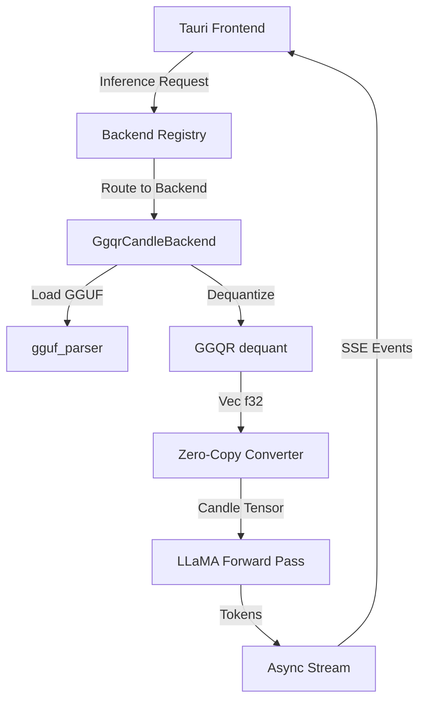
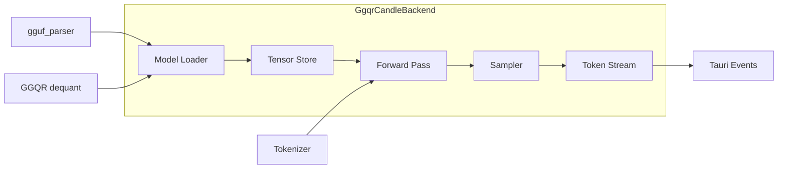
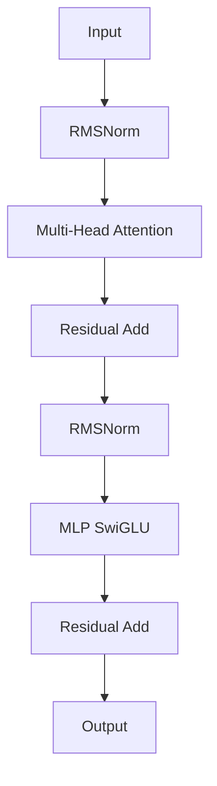

# Design Document: GGQR-Candle Zero-Copy Handoff

## Overview

This document describes the technical design for GWEN-212, which implements a direct inference path from GGQR (GwenLand's custom dequantization engine) to Candle tensors. The design enables CPU-only inference with full control over dequantization quality while maintaining performance on resource-constrained systems (8GB RAM, CPU-only).

### Key Components

- **GgqrCandleBackend**: New `InferenceBackend` implementation combining GGQR dequantization with Candle inference
- **Zero-Copy Handoff**: Minimizes memory allocations by consuming `Vec<f32>` → `Arc<[f32]>` → `candle_core::Tensor`
- **LLaMA Forward Pass**: Autoregressive text generation for LLaMA-family models (LLaMA3, Qwen3, Phi-3)
- **Streaming Token Output**: Async streaming of generated tokens to Tauri frontend

### Design Goals

1. **Memory Efficiency**: Load Qwen3-1.7B Q4_K in <2.5GB RAM with zero-copy tensor construction
2. **Quality Control**: Use GGQR's high-accuracy dequantization (proven at 9.7 GiB/s throughput)
3. **Architecture Support**: Handle LLaMA, Qwen2, and Phi-3 architectures
4. **Feature Isolation**: Feature-gate all code behind `candle-backend` flag for optional compilation

## Architecture

### System Context



### Component Diagram



### Data Flow

1. **Loading Phase**:
   - Parse GGUF file → extract architecture and tensor metadata
   - Dequantize tensors via GGQR → `Vec<f32>` per tensor
   - Convert to Candle tensors → store in `HashMap<String, Tensor>`

2. **Inference Phase**:
   - Tokenize prompt → input token IDs
   - Autoregressive loop: forward pass → sample token → decode → yield
   - Stream tokens via async iterator to Tauri event system

## Components and Interfaces

### 1. GgqrCandleBackend

**Purpose**: Main inference backend implementation combining GGQR and Candle.

**State**:
```rust
pub struct GgqrCandleBackend {
    /// All model tensors indexed by GGUF name (e.g., "model.layers.0.self_attn.q_proj.weight")
    tensors: HashMap<String, candle_core::Tensor>,
    
    /// Model architecture ("llama", "qwen2", "phi3")
    architecture: String,
    
    /// Tokenizer for encoding/decoding text
    tokenizer: tokenizers::Tokenizer,
    
    /// Model config extracted from GGUF metadata
    config: ModelConfig,
    
    /// Candle device (CPU)
    device: candle_core::Device,
}
```

**Interface**:
```rust
impl InferenceBackend for GgqrCandleBackend {
    fn name(&self) -> &str { "candle-ggqr" }
    
    fn load_model(&mut self, path: &Path) -> Result<(), GwenError>;
    
    fn unload(&mut self) -> Result<(), GwenError>;
    
    fn infer(&self, prompt: &str, params: &InferParams) -> Result<String, GwenError>;
    
    fn stream_infer(&self, prompt: &str, params: &InferParams) 
        -> Pin<Box<dyn Stream<Item = String> + Send>>;
}
```

### 2. Model Loader

**Purpose**: Load GGUF files and convert to Candle tensors.

**Interface**:
```rust
/// Load GGUF file and extract architecture
fn load_gguf_metadata(path: &Path) -> Result<(GgufFile, String), GwenError>;

/// Dequantize all tensors using GGQR
fn dequantize_tensors(gguf: &GgufFile) -> Result<HashMap<String, Vec<f32>>, GwenError>;

/// Convert Vec<f32> to Candle Tensor with zero-copy strategy
fn vec_to_tensor(
    data: Vec<f32>, 
    shape: &[usize], 
    device: &Device
) -> Result<Tensor, GwenError>;
```

**Zero-Copy Strategy**:
```rust
// Consume Vec<f32> into Arc<[f32]> (single allocation, no copy)
let arc_data: Arc<[f32]> = Arc::from(vec_data);

// Wrap Arc<[f32]> as Candle Tensor (zero-copy, just metadata)
let tensor = Tensor::from_slice(arc_data.as_ref(), shape, device)?;
```

### 3. Forward Pass Implementation

**Purpose**: Compute autoregressive forward pass for LLaMA-family models.

**Interface**:
```rust
/// Run forward pass for a single position
fn forward(
    &self,
    input_ids: &[u32],
    position: usize,
) -> Result<Tensor, GwenError>;

/// Apply RMSNorm normalization
fn rms_norm(x: &Tensor, weight: &Tensor, eps: f32) -> Result<Tensor, GwenError>;

/// Multi-head attention without KV cache
fn attention(
    &self,
    hidden_states: &Tensor,
    layer_idx: usize,
    position: usize,
) -> Result<Tensor, GwenError>;

/// MLP block (gate, up, down projections with SwiGLU)
fn mlp(&self, x: &Tensor, layer_idx: usize) -> Result<Tensor, GwenError>;
```

**Layer Structure** (per transformer block):


### 4. Token Sampler

**Purpose**: Sample next token from logits distribution.

**Interface**:
```rust
/// Sample next token from logits
fn sample_token(
    logits: &Tensor,
    temperature: f32,
    top_p: f32,
    top_k: usize,
) -> Result<u32, GwenError>;

/// Greedy sampling (argmax)
fn greedy_sample(logits: &Tensor) -> Result<u32, GwenError>;

/// Top-p (nucleus) sampling
fn top_p_sample(logits: &Tensor, p: f32) -> Result<u32, GwenError>;
```

**Sampling Strategies**:
- **Greedy** (temperature=0.0): Select token with highest probability
- **Top-p** (nucleus): Sample from smallest set of tokens with cumulative probability ≥ p
- **Top-k**: Sample from k tokens with highest probability
- **Temperature**: Scale logits by 1/T before softmax (higher T = more random)

### 5. Streaming Infrastructure

**Purpose**: Yield tokens incrementally via async stream.

**Interface**:
```rust
/// Generate tokens as async stream
fn generate_stream(
    &self,
    prompt: &str,
    params: &InferParams,
) -> Pin<Box<dyn Stream<Item = Result<String, GwenError>> + Send>>;
```

**Implementation Pattern**:
```rust
use async_stream::stream;

let stream = stream! {
    let token_ids = self.tokenize(prompt)?;
    let mut position = 0;
    
    loop {
        let logits = self.forward(&token_ids, position)?;
        let next_token = self.sample_token(&logits, params)?;
        
        if is_stop_token(next_token) {
            break;
        }
        
        let decoded = self.tokenizer.decode(&[next_token])?;
        yield Ok(decoded);
        
        position += 1;
        if position >= params.max_tokens {
            break;
        }
    }
};
```

### 6. Backend Registry Integration

**Purpose**: Register GgqrCandleBackend for selection via config.

**Registration**:
```rust
#[cfg(feature = "candle-backend")]
impl BackendRegistry {
    pub fn register_candle_backend(&mut self) {
        self.register(Box::new(GgqrCandleBackend::new()));
    }
}
```

**Selection Logic**:
```rust
pub fn select_backend(name: &str) -> Result<Box<dyn InferenceBackend>, GwenError> {
    match name {
        "mistralrs" => Ok(Box::new(MistralRsBackend::new())),
        #[cfg(feature = "candle-backend")]
        "candle-ggqr" => Ok(Box::new(GgqrCandleBackend::new())),
        _ => Err(GwenError::UnsupportedBackend(name.to_string())),
    }
}
```

## Data Models

### ModelConfig

Extracted from GGUF metadata:

```rust
pub struct ModelConfig {
    /// Model architecture ("llama", "qwen2", "phi3")
    pub architecture: String,
    
    /// Number of transformer layers
    pub n_layers: usize,
    
    /// Hidden dimension
    pub hidden_size: usize,
    
    /// Number of attention heads
    pub n_heads: usize,
    
    /// Number of KV heads (for grouped-query attention)
    pub n_kv_heads: usize,
    
    /// Intermediate MLP dimension
    pub intermediate_size: usize,
    
    /// Vocabulary size
    pub vocab_size: usize,
    
    /// RMSNorm epsilon
    pub rms_norm_eps: f32,
    
    /// RoPE theta
    pub rope_theta: f32,
}
```

### InferParams

User-configurable generation parameters:

```rust
pub struct InferParams {
    /// Maximum tokens to generate
    pub max_tokens: usize,
    
    /// Temperature scaling (0.0 = greedy)
    pub temperature: f32,
    
    /// Top-p threshold for nucleus sampling
    pub top_p: f32,
    
    /// Top-k tokens to consider
    pub top_k: usize,
    
    /// Stop sequences
    pub stop_sequences: Vec<String>,
    
    /// Random seed (None = use thread_rng)
    pub seed: Option<u64>,
}

impl Default for InferParams {
    fn default() -> Self {
        Self {
            max_tokens: 512,
            temperature: 0.0,
            top_p: 1.0,
            top_k: 50,
            stop_sequences: vec![],
            seed: None,
        }
    }
}
```

### TensorInfo

Metadata for each model tensor:

```rust
pub struct TensorInfo {
    /// Tensor name from GGUF (e.g., "model.embed_tokens.weight")
    pub name: String,
    
    /// Shape as [dim0, dim1, ...]
    pub shape: Vec<usize>,
    
    /// Quantization type (Q4_K, Q6_K, F32, etc.)
    pub dtype: GgufDtype,
    
    /// Size after dequantization (elements)
    pub dequant_size: usize,
}
```

## Error Handling

### GwenError Enum

```rust
pub enum GwenError {
    /// GGUF file parsing failed
    ModelLoad(String),
    
    /// Unsupported model architecture
    UnsupportedArchitecture(String),
    
    /// Tensor dequantization failed
    Dequantization { tensor_name: String, error: String },
    
    /// Forward pass computation failed
    InferenceError { layer: String, operation: String, error: String },
    
    /// Insufficient system memory
    InsufficientMemory { required_gb: f32, available_gb: f32 },
    
    /// Tokenizer error
    TokenizerError(String),
    
    /// Candle error (wrap candle_core::Error)
    CandleError(candle_core::Error),
    
    /// Backend not available (feature-gated)
    UnsupportedBackend(String),
}
```

### Error Propagation Strategy

1. **No Panics**: All operations return `Result<T, GwenError>`
2. **Context Enrichment**: Wrap lower-level errors with context (tensor name, layer, operation)
3. **Logging**: Log errors at appropriate levels (error, warn, info) using `log` crate
4. **User-Facing Messages**: Provide actionable error messages with diagnostic information

**Example Error Flow**:
```rust
fn dequantize_tensor(&self, info: &TensorInfo) -> Result<Vec<f32>, GwenError> {
    dequant::dequantize(info, DequantMode::Standard)
        .map_err(|e| GwenError::Dequantization {
            tensor_name: info.name.clone(),
            error: e,
        })
}
```

## Testing Strategy

### Unit Tests

Focus on isolated components and specific behaviors:

1. **Zero-Copy Conversion**
   - Test: `Vec<f32>` → `Arc<[f32]>` → `Tensor` produces correct shape and data
   - Test: No additional allocations occur during conversion
   - Test: Arc reference count increments correctly

2. **Token Sampling**
   - Test: Greedy sampling returns argmax token
   - Test: Top-p filtering produces valid probability distribution
   - Test: Top-k limits candidates correctly
   - Test: Temperature scaling affects distribution

3. **RMSNorm**
   - Test: Normalization produces correct statistics (mean ≈ 0, variance ≈ 1)
   - Test: Epsilon prevents division by zero

4. **Model Loading**
   - Test: Valid GGUF file loads successfully
   - Test: Invalid magic bytes rejected
   - Test: Missing required tensors detected
   - Test: Architecture validation (supported vs unsupported)

5. **Memory Cleanup**
   - Test: `unload()` drops all tensors
   - Test: Memory returns to baseline after unload
   - Test: Multiple load/unload cycles don't leak

### Integration Tests

Test end-to-end workflows:

1. **Qwen3-1.7B Q4_K Loading**
   ```rust
   #[test]
   fn test_load_qwen3_q4k() {
       let mut backend = GgqrCandleBackend::new();
       let path = Path::new("tests/models/qwen3-1.7b-q4_k.gguf");
       backend.load_model(path).expect("load failed");
       
       // Verify tensors loaded
       assert!(backend.tensors.len() > 0);
       assert!(backend.tensors.contains_key("model.embed_tokens.weight"));
   }
   ```

2. **10-Token Generation**
   ```rust
   #[test]
   fn test_generate_10_tokens() {
       let backend = setup_loaded_backend();
       let params = InferParams {
           max_tokens: 10,
           temperature: 0.0,
           ..Default::default()
       };
       
       let output = backend.infer("Hello", &params).expect("inference failed");
       let token_count = output.split_whitespace().count();
       assert!(token_count <= 10);
   }
   ```

3. **Streaming Output**
   ```rust
   #[tokio::test]
   async fn test_streaming_tokens() {
       let backend = setup_loaded_backend();
       let params = InferParams::default();
       let mut stream = backend.stream_infer("Test prompt", &params);
       
       let mut count = 0;
       while let Some(token) = stream.next().await {
           assert!(!token.is_empty());
           count += 1;
       }
       assert!(count > 0);
   }
   ```

4. **Tauri Event Emission**
   ```rust
   #[test]
   fn test_tauri_events() {
       let app_handle = mock_app_handle();
       let backend = GgqrCandleBackend::with_event_emitter(app_handle);
       
       // Generate and verify events emitted
       backend.infer("Test", &InferParams::default()).unwrap();
       
       let events = app_handle.events();
       assert!(events.iter().any(|e| e.label == "gwen://token"));
       assert!(events.iter().any(|e| e.label == "gwen://done"));
   }
   ```

### Test Coverage Requirements

- **Minimum 80%** line coverage for GgqrCandleBackend module
- **All public API methods** must have at least one test
- **Error paths** must be tested (invalid inputs, missing files, etc.)
- **Feature gate** tests: verify compilation with/without `candle-backend`

### Running Tests

```bash
# Run all tests with candle-backend feature
cargo test --features candle-backend

# Run integration tests only
cargo test --features candle-backend --test integration

# Run with coverage
cargo tarpaulin --features candle-backend --out Html
```

### Why Property-Based Testing Is Not Applicable

This feature does **not** include property-based testing because:

1. **Infrastructure Code**: The feature primarily implements infrastructure wiring (backend registration, GGUF loading, tensor conversion) rather than algorithmic logic with universal properties
2. **External Dependencies**: Behavior depends on Candle framework internals and GGUF file structure, not pure functions with predictable input/output
3. **Specific Test Fixtures**: Testing requires concrete GGUF model files (e.g., Qwen3-1.7B Q4_K), not randomized inputs
4. **Side Effects**: Model loading, memory management, and event emission are side-effect operations without return values to assert properties on
5. **Integration Focus**: Requirements emphasize correct integration between components (GGQR ↔ Candle, Backend ↔ Registry) rather than universal correctness properties

**Alternative Testing Approach**: Use example-based unit tests for isolated functions (sampling, normalization) and integration tests with real model files for end-to-end workflows.

## Security and Validation

### Input Validation

**GGUF File Validation**:
```rust
fn validate_gguf_file(path: &Path) -> Result<(), GwenError> {
    // 1. Check magic bytes
    let magic = read_magic_bytes(path)?;
    if magic != b"GGUF" {
        return Err(GwenError::ModelLoad("Invalid GGUF magic bytes".into()));
    }
    
    // 2. Validate tensor count
    let tensor_count = read_tensor_count(path)?;
    if tensor_count > 10_000 {
        return Err(GwenError::ModelLoad(
            format!("Tensor count {} exceeds limit of 10,000", tensor_count)
        ));
    }
    
    // 3. Validate tensor dimensions
    for tensor_info in read_tensor_metadata(path)? {
        for &dim in &tensor_info.shape {
            if dim > 100_000 {
                return Err(GwenError::ModelLoad(
                    format!("Tensor {} dimension {} exceeds limit", tensor_info.name, dim)
                ));
            }
        }
    }
    
    // 4. Validate buffer sizes
    for tensor_info in read_tensor_metadata(path)? {
        let expected_bytes = calculate_tensor_bytes(&tensor_info);
        if tensor_info.data_size != expected_bytes {
            return Err(GwenError::ModelLoad(
                format!("Tensor {} size mismatch", tensor_info.name)
            ));
        }
    }
    
    Ok(())
}
```

### Memory Safety

**Safe Rust Requirements**:
- All production code uses safe Rust (no `unsafe` blocks) except where required for FFI
- Array indexing uses `.get()` or `.get_mut()` with proper error handling
- All potentially failing operations return `Result<T, GwenError>`

**Memory Constraint Checks**:
```rust
fn check_memory_before_load(file_size_bytes: u64) -> Result<(), GwenError> {
    let mut sys = System::new();
    sys.refresh_memory();
    let available_bytes = sys.available_memory();
    
    // Require at least 1GB free after loading
    const SAFETY_MARGIN_GB: f32 = 1.0;
    let required_bytes = file_size_bytes + (SAFETY_MARGIN_GB * 1_073_741_824.0) as u64;
    
    if available_bytes < required_bytes {
        return Err(GwenError::InsufficientMemory {
            required_gb: required_bytes as f32 / 1_073_741_824.0,
            available_gb: available_bytes as f32 / 1_073_741_824.0,
        });
    }
    
    Ok(())
}
```

### Security Considerations

1. **Malicious GGUF Files**: Validation prevents buffer overflows from malformed tensor metadata
2. **Resource Exhaustion**: Memory checks prevent OOM from oversized models
3. **Path Traversal**: Model paths are validated and canonicalized before loading
4. **Dependency Auditing**: Regular `cargo audit` runs to detect vulnerabilities in Candle, tokenizers, etc.

## Performance Considerations

### Memory Optimization

**Zero-Copy Tensor Construction**:
- **Current Approach** (wasteful): `Vec<f32>` → clone → `Tensor` (2x memory)
- **Optimized Approach**: `Vec<f32>` → consume into `Arc<[f32]>` → wrap as `Tensor` (<5% overhead)

**Memory Layout**:
```
Vec<f32> (heap):     [data: 4N bytes] + [ptr, len, cap: 24 bytes on stack]
                              ↓ consume (no copy)
Arc<[f32]> (heap):   [refcount: 8 bytes] + [data: 4N bytes]
                              ↓ wrap (metadata only)
Tensor (stack):      [Storage: Arc wrapper] + [shape: Vec<usize>] + [device: enum]
```

**Expected Memory Usage** (Qwen3-1.7B Q4_K):
- GGUF file on disk: ~1.9 GB
- Dequantized tensors: ~1.7 GB (F32)
- Tensor metadata: ~50 MB
- **Total peak**: ~2.2 GB (<2.5 GB requirement ✓)

### Throughput Optimization

**GGQR Dequantization**:
- Baseline throughput: 9.7 GiB/s (GGQR-CF-mmap with AVX2)
- Loading Qwen3-1.7B Q4_K: ~200ms for dequantization

**Forward Pass** (without KV cache):
- Expected tokens/sec: 5-10 on CPU (baseline, will improve with KV cache in GWEN-215)
- Bottleneck: Matrix multiplications in attention/MLP layers

**Future Optimizations** (deferred):
- KV cache implementation (GWEN-215): 5-10x speedup
- Quantized inference in Candle: 2-3x speedup
- SIMD optimizations for RMSNorm/matmul: 1.5-2x speedup

## Backward Compatibility

### Feature Gate Isolation

**Compilation Modes**:
```toml
# Default: mistralrs backend only
cargo build

# With Candle backend
cargo build --features candle-backend

# Multiple backends
cargo build --features candle-backend,mistralrs-backend
```

**Runtime Behavior**:
- When `candle-backend` disabled: Binary size unchanged, no Candle dependencies linked
- When backend unspecified in config: Defaults to `mistralrs` for backward compatibility
- Existing CLI commands work unchanged regardless of backend selection

### Migration Path

**Existing Users** (GWEN-211):
1. No action required — default backend remains `mistralrs`
2. Opt-in to Candle backend by setting `backend = "candle-ggqr"` in config

**New Users**:
1. Choose backend during initial setup via `gwen-tui` configuration wizard
2. Switch backends at any time by editing config or using CLI flag (GWEN-213)

## Deployment and Operations

### Dependencies

**New Crate Dependencies**:
```toml
[dependencies]
candle-core = { version = "0.7", optional = true }
candle-nn = { version = "0.7", optional = true }
candle-transformers = { version = "0.7", optional = true }
tokenizers = "0.20"
async-stream = "0.3"
sysinfo = "0.32"

[features]
candle-backend = ["candle-core", "candle-nn", "candle-transformers"]
```

### Configuration

**Backend Selection** (config.toml):
```toml
[inference]
backend = "candle-ggqr"  # or "mistralrs" (default)

[candle]
# Future: Candle-specific configuration
device = "cpu"  # or "cuda", "metal"
```

### Monitoring and Diagnostics

**Logging Strategy**:
```rust
// Model loading
log::info!("Loading model from {}", path.display());
log::info!("Architecture: {}, Layers: {}", config.architecture, config.n_layers);
log::info!("Memory usage: {:.2} GB", memory_gb);

// Inference
log::debug!("Forward pass at position {}", position);
log::debug!("Sampled token: {} (logit: {:.4})", token_id, logit_value);

// Errors
log::error!("Failed to load tensor '{}': {}", tensor_name, error);
log::warn!("Tensor '{}' has unsupported dtype, skipping", tensor_name);
```

**Metrics to Track**:
- Model load time (ms)
- Peak memory usage (GB)
- Tokens/sec throughput
- Token sampling time (ms)
- Forward pass time per layer (ms)

## Future Enhancements

### Deferred to Future Work

1. **KV Cache** (GWEN-215):
   - Store past key/value tensors to avoid recomputation
   - Expected 5-10x speedup for multi-token generation

2. **CLI Backend Selection** (GWEN-213):
   - Add `--backend` flag to CLI commands
   - Runtime backend switching without config edit

3. **GPU Support** (Future):
   - Candle supports CUDA and Metal backends
   - Extend device selection beyond CPU

4. **Quantized Inference** (Future):
   - Run inference in Q4/Q8 precision directly in Candle
   - Reduce memory footprint and increase throughput

5. **Batched Inference** (Future):
   - Process multiple prompts in parallel
   - Improve throughput for batch workloads

### Extension Points

**Adding New Architectures**:
```rust
// Extend architecture validation in load_model
match architecture.as_str() {
    "llama" | "qwen2" | "phi3" => Ok(()),
    "mistral" => {
        // Add Mistral-specific config parsing
        // Implement Mistral forward pass
        Ok(())
    }
    _ => Err(GwenError::UnsupportedArchitecture(architecture)),
}
```

**Custom Sampling Strategies**:
```rust
pub trait SamplingStrategy {
    fn sample(&self, logits: &Tensor, rng: &mut impl Rng) -> Result<u32, GwenError>;
}

// Users can implement custom strategies
impl SamplingStrategy for TopKTopPSampler { ... }
impl SamplingStrategy for MirostatSampler { ... }
```

## References

### External Documentation

- [Candle Framework](https://github.com/huggingface/candle) — Minimalist ML framework for Rust
- [GGUF Format](https://github.com/ggml-org/ggml/blob/master/docs/gguf.md) — Specification for GGUF file structure
- [LLaMA Architecture](https://arxiv.org/abs/2302.13971) — Original LLaMA paper describing model architecture
- [RMSNorm](https://arxiv.org/abs/1910.07467) — Root Mean Square Layer Normalization

### Internal References

- GWEN-211: InferenceBackend trait and MistralRsBackend implementation
- GWEN-215: KV cache optimization (future work)
- GWEN-213: CLI backend selection (future work)
- `convert/dequant.rs`: GGQR dequantization engine
- `convert/gguf_parser.rs`: GGUF file parsing
- `engine/loader.rs`: Memory-mapped GGUF loading

