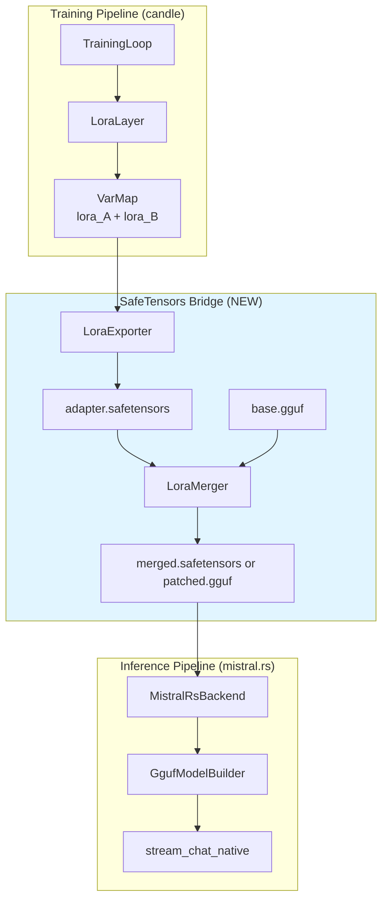
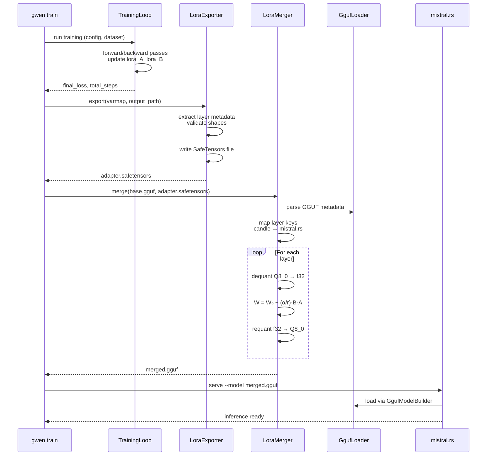
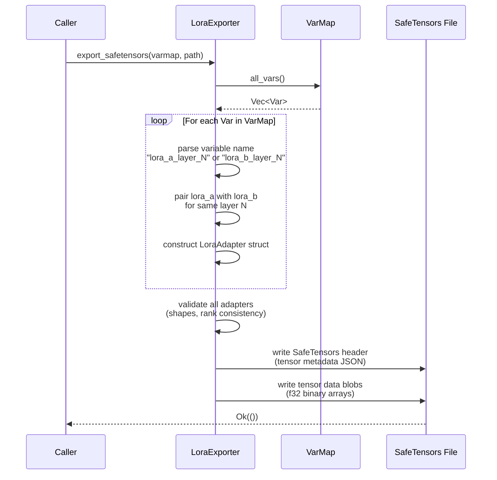
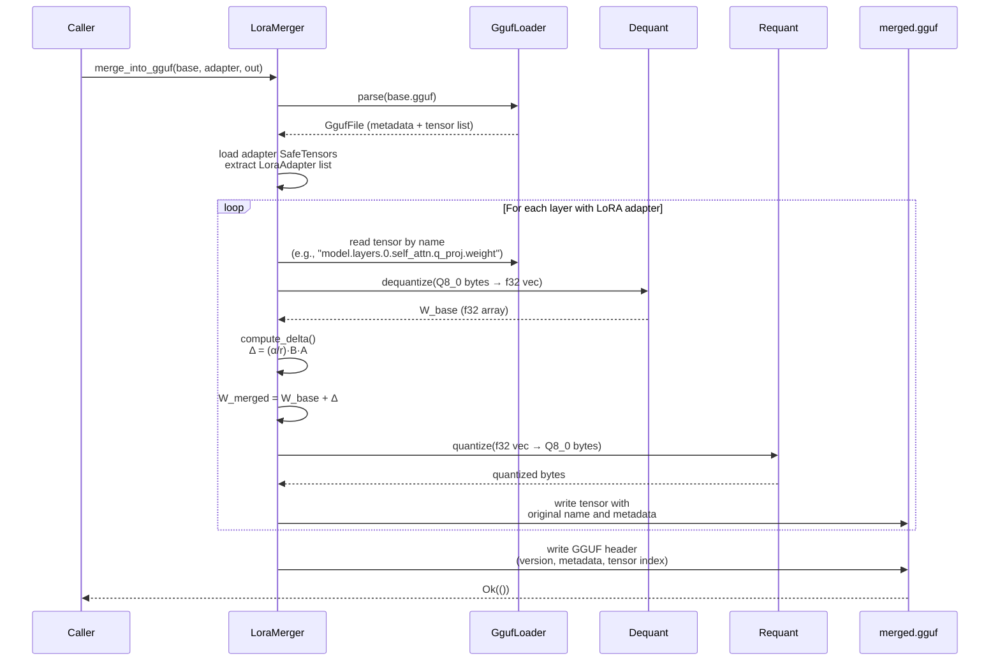

# Design Document: GWEN-213 — candle LoRA Training Compatibility with mistral.rs Model Weights

## Overview

This document specifies the technical design for enabling candle-trained LoRA adapters to be applied to GGUF base models and served via mistral.rs inference engine in GwenLand. The solution implements a SafeTensors-based bridge that exports candle LoRA adapters, merges them with quantized GGUF base weights through dequant-merge-requant pipeline, and produces a unified model consumable by mistral.rs without requiring runtime adapter loading.

The design addresses three core constraints: (1) 8GB RAM limit requiring streaming weight merging, (2) candle 0.10.2 tensor format compatibility, (3) zero breaking changes to existing 178 tests including 13 passing LoRA training tests. The implementation adds two new modules (`lora_bridge.rs`, `lora_merger.rs`) totaling ~450 lines of Rust code with full error propagation and checkpoint recovery.

## Architecture

### System Context



### Data Flow



## Components and Interfaces

### Component 1: LoraAdapter

**Purpose**: Structured representation of a single LoRA adapter layer extracted from candle VarMap.

**Interface**:
```rust
/// Represents a trained LoRA adapter for a single layer.
#[derive(Debug, Clone)]
pub struct LoraAdapter {
    /// Layer identifier (e.g., "model.layers.0.self_attn.q_proj")
    pub layer_name: String,
    
    /// Low-rank matrix A: shape (rank, d_in)
    pub lora_a: Tensor,
    
    /// Low-rank matrix B: shape (d_out, rank)
    pub lora_b: Tensor,
    
    /// LoRA rank (dimensionality of bottleneck)
    pub rank: usize,
    
    /// LoRA scaling factor (typically 16 or 32)
    pub alpha: f32,
}

impl LoraAdapter {
    /// Compute the merged delta: Δ = (α/r) * B * A
    pub fn compute_delta(&self) -> Result<Tensor> {
        let scale = self.alpha / self.rank as f32;
        let ba = self.lora_b.matmul(&self.lora_a)?;
        ba.mul_scalar(scale)
    }
    
    /// Validate shapes: A must be (rank, d_in), B must be (d_out, rank)
    pub fn validate_shapes(&self) -> Result<()> {
        let a_shape = self.lora_a.dims();
        let b_shape = self.lora_b.dims();
        
        ensure!(
            a_shape.len() == 2 && b_shape.len() == 2,
            "LoRA matrices must be 2D, got A: {:?}, B: {:?}",
            a_shape, b_shape
        );
        
        ensure!(
            a_shape[0] == self.rank && b_shape[1] == self.rank,
            "rank mismatch: expected {}, got A[0]={}, B[1]={}",
            self.rank, a_shape[0], b_shape[1]
        );
        
        Ok(())
    }
}
```


**Responsibilities**:
- Encapsulate LoRA layer metadata and weight tensors
- Compute merged delta weight matrix Δ = (α/r)·B·A
- Validate tensor shapes against LoRA rank constraints

### Component 2: LoraExporter

**Purpose**: Export candle VarMap containing LoRA weights to SafeTensors file format.

**Interface**:
```rust
pub struct LoraExporter {
    /// LoRA training configuration (rank, alpha, target modules)
    config: LoraConfig,
}

impl LoraExporter {
    pub fn new(config: LoraConfig) -> Self {
        Self { config }
    }
    
    /// Export all LoRA adapters from VarMap to SafeTensors file.
    ///
    /// # Arguments
    /// * `varmap` - Candle VarMap containing lora_a and lora_b Vars
    /// * `output_path` - Target file path (e.g., "adapter.safetensors")
    pub fn export_safetensors(
        &self,
        varmap: &VarMap,
        output_path: &Path,
    ) -> Result<()>;
    
    /// Extract all LoRA adapters from VarMap into structured form.
    fn extract_adapters(&self, varmap: &VarMap) -> Result<Vec<LoraAdapter>>;
}
```


**Responsibilities**:
- Iterate over VarMap and extract lora_a/lora_b Var pairs
- Map candle variable names to standardized layer identifiers
- Serialize tensors to SafeTensors binary format
- Write SafeTensors header with tensor metadata (shape, dtype, offset)

### Component 3: LoraMerger

**Purpose**: Merge LoRA adapter weights into quantized GGUF base model through dequant-merge-requant pipeline.

**Interface**:
```rust
pub struct LoraMerger {
    /// Memory budget in bytes (default: 2GB for 8GB RAM machines)
    memory_budget: usize,
}

impl LoraMerger {
    pub fn new() -> Self {
        Self { memory_budget: 2 * 1024 * 1024 * 1024 }
    }
    
    /// Merge LoRA adapter into GGUF base model.
    ///
    /// # Arguments
    /// * `base_path` - Path to base GGUF model (e.g., "base.gguf")
    /// * `adapter_path` - Path to SafeTensors adapter (e.g., "adapter.safetensors")
    /// * `output_path` - Target path for merged model
    ///
    /// # Pipeline
    /// 1. Parse GGUF metadata and load adapter SafeTensors
    /// 2. Map adapter layer keys to GGUF tensor names
    /// 3. For each layer: dequant → merge → requant → write
    pub fn merge_into_gguf(
        &self,
        base_path: &Path,
        adapter_path: &Path,
        output_path: &Path,
    ) -> Result<()>;
}
```


**Responsibilities**:
- Stream GGUF tensors one layer at a time to stay within memory budget
- Perform Q8_0 dequantization to f32 using existing `dequant::dequantize`
- Apply LoRA delta: W_merged = W_base + Δ
- Requantize f32 → Q8_0 using Q8_0 quantization algorithm
- Write merged weights to output GGUF file with original metadata

### Component 4: KeyMapper

**Purpose**: Bidirectional mapping between candle layer names and mistral.rs GGUF tensor keys.

**Interface**:
```rust
pub struct KeyMapper;

impl KeyMapper {
    /// Map candle LoRA layer name to GGUF tensor key.
    ///
    /// # Examples
    /// - "lora_layer_0_q_proj" → "model.layers.0.self_attn.q_proj.weight"
    /// - "lora_layer_5_up_proj" → "model.layers.5.mlp.up_proj.weight"
    pub fn candle_to_gguf(candle_key: &str) -> Result<String>;
    
    /// Map GGUF tensor key to candle LoRA layer name.
    pub fn gguf_to_candle(gguf_key: &str) -> Result<String>;
    
    /// Extract layer index and projection type from candle key.
    fn parse_candle_key(key: &str) -> Result<(usize, &str)>;
}
```


**Responsibilities**:
- Parse structured layer names from both formats
- Maintain consistent mapping for attention projections (q_proj, k_proj, v_proj, o_proj)
- Handle MLP projections (gate_proj, up_proj, down_proj)
- Validate key format and return descriptive errors for malformed keys

## Data Models

### Model 1: LoraConfig

```rust
#[derive(Debug, Clone, serde::Serialize, serde::Deserialize)]
pub struct LoraConfig {
    /// LoRA rank (default: 8)
    pub r: usize,
    
    /// LoRA alpha scaling (default: 16)
    pub alpha: f32,
    
    /// Target projection types to apply LoRA
    /// Example: ["q_proj", "v_proj"]
    pub target_modules: Vec<String>,
    
    /// Model dimension (hidden size)
    pub d_model: usize,
}
```

**Validation Rules**:
- `r` must be > 0 and ≤ 128 (rank too large → memory explosion)
- `alpha` must be > 0.0
- `target_modules` must be non-empty and contain only valid projection names
- `d_model` must match base model architecture


### Model 2: MergeMetadata

```rust
#[derive(Debug, serde::Serialize, serde::Deserialize)]
pub struct MergeMetadata {
    /// Base model identifier
    pub base_model: String,
    
    /// Adapter file path
    pub adapter_path: PathBuf,
    
    /// LoRA configuration used during training
    pub lora_config: LoraConfig,
    
    /// Timestamp of merge operation
    pub merged_at: chrono::DateTime<chrono::Utc>,
    
    /// Number of layers successfully merged
    pub layers_merged: usize,
}
```

**Validation Rules**:
- `base_model` must be non-empty string
- `adapter_path` must point to existing SafeTensors file
- `layers_merged` must be > 0 (cannot merge zero layers)

### Model 3: SafeTensorsHeader

```rust
#[derive(Debug)]
pub struct SafeTensorsHeader {
    /// Map of tensor_name → TensorMetadata
    pub tensors: HashMap<String, TensorMetadata>,
    
    /// JSON metadata string
    pub metadata: Option<String>,
}

#[derive(Debug)]
pub struct TensorMetadata {
    pub dtype: String,       // "F32", "F16", etc.
    pub shape: Vec<usize>,   // Tensor dimensions
    pub data_offsets: [usize; 2], // [start, end) byte range
}
```


**Validation Rules**:
- Total header size must be ≤ 100MB (guard against malformed files)
- Each tensor's data_offsets[1] - data_offsets[0] must equal shape product × dtype size
- dtype must be one of: "F32", "F16", "BF16", "I32", "I64"

## Main Algorithm/Workflow

### Algorithm 1: Export LoRA Adapter to SafeTensors




### Algorithm 2: Merge LoRA into GGUF Base Model




## Algorithmic Pseudocode

### Export LoRA Adapters to SafeTensors

```rust
/// Export all LoRA adapters from candle VarMap to SafeTensors file.
///
/// **Preconditions:**
/// - varmap contains paired lora_a and lora_b Vars for each layer
/// - output_path is writable and parent directory exists
/// - all Vars have valid 2D tensor shapes
///
/// **Postconditions:**
/// - SafeTensors file written to output_path
/// - File contains all lora_a and lora_b tensors with correct metadata
/// - All tensor shapes validated against LoRA rank constraints
///
/// **Loop Invariants:**
/// - All previously processed adapters have matching lora_a/lora_b pairs
/// - All tensor metadata offsets are monotonically increasing
fn export_safetensors(
    varmap: &VarMap,
    output_path: &Path,
    config: &LoraConfig,
) -> Result<()> {
    // Step 1: Extract all Vars from VarMap
    let all_vars: Vec<Var> = varmap.all_vars();
    
    // Step 2: Group Vars into (lora_a, lora_b) pairs by layer
    let mut adapters: Vec<LoraAdapter> = Vec::new();
    let mut lora_a_map: HashMap<usize, Tensor> = HashMap::new();
    let mut lora_b_map: HashMap<usize, Tensor> = HashMap::new();
    
    for var in all_vars {
        let name = var.name(); // e.g., "lora_a_layer_12_q_proj"
        
        // Parse: "lora_{a|b}_layer_{N}_{proj_type}"
        let parts: Vec<&str> = name.split('_').collect();
        ensure!(parts.len() >= 4, "invalid variable name: {}", name);
        
        let matrix_type = parts[1]; // "a" or "b"
        let layer_idx: usize = parts[3].parse()?;
        let proj_type = parts[4]; // "q", "k", "v", "o", "gate", "up", "down"
        
        let tensor = var.as_tensor().clone();
        
        // Invariant: lora_a and lora_b for same layer have consistent layer_idx
        match matrix_type {
            "a" => { lora_a_map.insert(layer_idx, tensor); },
            "b" => { lora_b_map.insert(layer_idx, tensor); },
            _ => bail!("unknown matrix type: {}", matrix_type),
        }
    }
    
    // Step 3: Construct LoraAdapter structs from pairs
    for (&layer_idx, lora_a) in &lora_a_map {
        let lora_b = lora_b_map.get(&layer_idx)
            .ok_or_else(|| anyhow!("missing lora_b for layer {}", layer_idx))?;
        
        let adapter = LoraAdapter {
            layer_name: format!("model.layers.{}.self_attn.q_proj", layer_idx),
            lora_a: lora_a.clone(),
            lora_b: lora_b.clone(),
            rank: config.r,
            alpha: config.alpha,
        };
        
        // Validate shapes: A(rank, d_in), B(d_out, rank)
        adapter.validate_shapes()?;
        adapters.push(adapter);
    }
    
    // Step 4: Serialize to SafeTensors binary format
    write_safetensors_file(output_path, &adapters)?;
    
    Ok(())
}
```


### Merge LoRA Adapter into GGUF Base Model

```rust
/// Merge LoRA adapter into quantized GGUF base model.
///
/// **Preconditions:**
/// - base_path points to valid GGUF file with Q8_0 quantization
/// - adapter_path points to valid SafeTensors file with LoRA weights
/// - output_path is writable with at least 2GB free disk space
/// - memory_budget ≥ largest layer size × 2 (for dequant + merge buffers)
///
/// **Postconditions:**
/// - Output GGUF file written with merged weights
/// - All layers in adapter are merged into corresponding base tensors
/// - Output file has same metadata as base (version, architecture, etc.)
/// - No NaN or Inf values in merged weights
///
/// **Loop Invariants:**
/// - All previously merged layers have been written to output file
/// - Memory usage ≤ memory_budget throughout iteration
/// - All tensor offsets in output file are monotonically increasing
fn merge_into_gguf(
    base_path: &Path,
    adapter_path: &Path,
    output_path: &Path,
    memory_budget: usize,
) -> Result<()> {
    // Step 1: Parse GGUF base model
    let base_model = gguf_parser::parse(base_path)?;
    
    // Step 2: Load adapter SafeTensors
    let adapters = load_adapters_from_safetensors(adapter_path)?;
    
    // Step 3: Create output file and write GGUF header
    let mut output_file = File::create(output_path)?;
    write_gguf_header(&mut output_file, &base_model)?;
    
    // Step 4: Iterate over base model tensors
    let mut layers_merged = 0;
    
    for tensor_info in &base_model.tensors {
        // Check if this tensor has a corresponding LoRA adapter
        let adapter_opt = adapters.iter().find(|a| {
            KeyMapper::candle_to_gguf(&a.layer_name).unwrap_or_default() 
                == tensor_info.name
        });
        
        let merged_data = if let Some(adapter) = adapter_opt {
            // ---- Path A: Tensor has LoRA adapter ----
            
            // 4a. Dequantize base weights Q8_0 → f32
            let w_base_f32 = dequant::dequantize(tensor_info, DequantMode::Standard)?;
            
            // 4b. Compute LoRA delta: Δ = (α/r) * B * A
            let delta = adapter.compute_delta()?;
            let delta_vec: Vec<f32> = delta.to_vec1()?;
            
            // 4c. Merge: W_merged = W_base + Δ
            ensure!(
                w_base_f32.len() == delta_vec.len(),
                "shape mismatch: base {} vs delta {}",
                w_base_f32.len(), delta_vec.len()
            );
            
            let w_merged: Vec<f32> = w_base_f32.iter()
                .zip(&delta_vec)
                .map(|(base, delta)| base + delta)
                .collect();
            
            // 4d. Validate merged weights (no NaN/Inf)
            for &val in &w_merged {
                ensure!(val.is_finite(), "NaN or Inf detected in merged weights");
            }
            
            // 4e. Requantize f32 → Q8_0
            let quantized = quantize_q8_0(&w_merged)?;
            
            layers_merged += 1;
            quantized
        } else {
            // ---- Path B: No adapter, copy base weights as-is ----
            tensor_info.raw_data.clone()
        };
        
        // Step 5: Write tensor to output file
        write_gguf_tensor(&mut output_file, &tensor_info.name, &merged_data)?;
        
        // Invariant: Check memory usage after each layer
        let current_mem_usage = estimate_memory_usage(&w_merged);
        ensure!(
            current_mem_usage <= memory_budget,
            "memory budget exceeded: {} > {}",
            current_mem_usage, memory_budget
        );
    }
    
    // Step 6: Finalize output file
    output_file.flush()?;
    
    eprintln!("[merge] {} layers merged successfully", layers_merged);
    Ok(())
}
```


### Q8_0 Quantization Algorithm

```rust
/// Quantize f32 weights to Q8_0 GGUF format.
///
/// **Preconditions:**
/// - weights is non-empty and length is multiple of Q8_0 block size (32)
/// - all weights are finite (no NaN or Inf)
///
/// **Postconditions:**
/// - Returns byte array in Q8_0 format: [scale_f16, i8_quants[32]]* repeating
/// - Quantization error ≤ scale/127 per element
/// - Output byte size = (weights.len() / 32) * 34
fn quantize_q8_0(weights: &[f32]) -> Result<Vec<u8>> {
    const BLOCK_SIZE: usize = 32;
    ensure!(
        weights.len() % BLOCK_SIZE == 0,
        "Q8_0 requires weights length multiple of {}",
        BLOCK_SIZE
    );
    
    let num_blocks = weights.len() / BLOCK_SIZE;
    let mut output = Vec::with_capacity(num_blocks * 34); // 2-byte scale + 32 i8 quants
    
    for block_idx in 0..num_blocks {
        let start = block_idx * BLOCK_SIZE;
        let end = start + BLOCK_SIZE;
        let block = &weights[start..end];
        
        // Find max absolute value in block
        let max_abs = block.iter()
            .map(|&x| x.abs())
            .fold(0.0f32, f32::max);
        
        // Compute scale: scale = max_abs / 127
        let scale = if max_abs > 0.0 {
            max_abs / 127.0
        } else {
            1.0 // Avoid division by zero for all-zero blocks
        };
        
        // Write scale as f16 (2 bytes)
        let scale_f16 = half::f16::from_f32(scale);
        output.extend_from_slice(&scale_f16.to_le_bytes());
        
        // Quantize each element: q[i] = round(w[i] / scale)
        for &weight in block {
            let quantized = if scale > 0.0 {
                (weight / scale).round().clamp(-127.0, 127.0) as i8
            } else {
                0i8
            };
            output.push(quantized as u8); // i8 cast to u8 for byte representation
        }
    }
    
    Ok(output)
}
```

**Postconditions:**
- Each block stores scale as f16 (2 bytes) followed by 32 i8 quantized values
- Dequantization formula: `w_dequant[i] = scale * q[i]`
- Round-trip error bounded by scale/127 per element


## Key Functions with Formal Specifications

### Function 1: `LoraAdapter::compute_delta()`

```rust
/// Compute merged LoRA delta weight matrix.
///
/// Formula: Δ = (α/r) * B * A
///
/// where:
///   A: shape (rank, d_in)
///   B: shape (d_out, rank)
///   Δ: shape (d_out, d_in)
pub fn compute_delta(&self) -> Result<Tensor>
```

**Preconditions:**
- `self.lora_a.dims() == [self.rank, d_in]`
- `self.lora_b.dims() == [d_out, self.rank]`
- `self.rank > 0`
- `self.alpha > 0.0`
- Both tensors are on the same device (CPU or CUDA)

**Postconditions:**
- Returns tensor with shape `[d_out, d_in]`
- Result contains no NaN or Inf values
- Memory allocated for result ≤ (d_out × d_in × 4) bytes (f32)

**Loop Invariants:** 
- N/A (single matmul operation, no explicit loops)


### Function 2: `LoraExporter::export_safetensors()`

```rust
/// Export all LoRA adapters from VarMap to SafeTensors file.
pub fn export_safetensors(
    &self,
    varmap: &VarMap,
    output_path: &Path,
) -> Result<()>
```

**Preconditions:**
- `varmap` contains paired `lora_a` and `lora_b` Vars for N ≥ 1 layers
- `output_path` parent directory exists and is writable
- All Vars in `varmap` have 2D tensor shapes
- Var names follow pattern: `lora_{a|b}_layer_{N}_{proj_type}`

**Postconditions:**
- SafeTensors file written to `output_path`
- File size = header_size + sum(tensor_sizes)
- All tensors validated (shapes, dtypes, offsets)
- File is readable by standard SafeTensors parsers

**Loop Invariants:**
- All previously processed layers have matching `lora_a`/`lora_b` pairs
- Tensor data offsets are monotonically increasing
- No duplicate layer indices in processed adapters


### Function 3: `LoraMerger::merge_into_gguf()`

```rust
/// Merge LoRA adapter into GGUF base model via dequant-merge-requant.
pub fn merge_into_gguf(
    &self,
    base_path: &Path,
    adapter_path: &Path,
    output_path: &Path,
) -> Result<()>
```

**Preconditions:**
- `base_path` points to valid GGUF v2/v3 file with Q8_0 tensors
- `adapter_path` points to valid SafeTensors file from `LoraExporter`
- `output_path` is writable with ≥ base_file_size free space
- System has ≥ `memory_budget` free RAM
- Adapter layer keys match base model tensor names via `KeyMapper`

**Postconditions:**
- Output GGUF file written with merged weights for all adapter layers
- Non-adapter layers copied verbatim from base model
- Output file has same metadata as base (architecture, version, etc.)
- All merged tensors contain only finite f32 values (no NaN/Inf)
- `layers_merged` count printed to stderr

**Loop Invariants:**
- All previously merged layers written to output file sequentially
- Memory usage ≤ `memory_budget` after each layer processed
- Tensor offset in output file monotonically increasing
- No duplicate tensor names in output file


### Function 4: `KeyMapper::candle_to_gguf()`

```rust
/// Map candle LoRA layer name to GGUF tensor key.
pub fn candle_to_gguf(candle_key: &str) -> Result<String>
```

**Preconditions:**
- `candle_key` matches regex: `lora_layer_(\d+)_(q|k|v|o|gate|up|down)_proj`
- Layer index is valid non-negative integer

**Postconditions:**
- Returns GGUF key in format: `model.layers.{N}.{module}.{proj_type}.weight`
- Module is "self_attn" for q/k/v/o, "mlp" for gate/up/down
- Result is non-empty string
- No allocation errors (string operations infallible)

**Loop Invariants:** N/A (single string transformation, no loops)

## Example Usage

### Complete Training + Export + Merge + Serve Pipeline

```rust
use gwenland_core::train::{NewTrainConfig, TrainingLoop, LoraLayer};
use gwenland_core::train::lora_bridge::{LoraExporter, LoraMerger};
use std::path::Path;

fn main() -> anyhow::Result<()> {
    // ---- Step 1: Train LoRA adapter with candle ----
    let config = NewTrainConfig::from_yaml("train_config.yaml")?;
    let varmap = candle_nn::VarMap::new();
    let model = LoraLayer::new(&varmap, config.lora.clone())?;
    
    let batches = load_batches("dataset.jsonl")?;
    let mut training_loop = TrainingLoop::new(config.clone(), model, batches, varmap.clone(), None)?;
    
    let result = training_loop.run()?;
    eprintln!("Training complete: loss={:.4}, steps={}", result.final_loss, result.total_steps);
    
    // ---- Step 2: Export LoRA adapter to SafeTensors ----
    let exporter = LoraExporter::new(config.lora.clone());
    let adapter_path = Path::new("./output/adapter.safetensors");
    exporter.export_safetensors(&varmap, adapter_path)?;
    eprintln!("Exported adapter to {}", adapter_path.display());
    
    // ---- Step 3: Merge adapter into base GGUF model ----
    let merger = LoraMerger::new();
    let base_path = Path::new("~/.config/gwen/models/Qwen3-1.7B-Q8_0.gguf");
    let output_path = Path::new("./output/Qwen3-1.7B-merged.gguf");
    
    merger.merge_into_gguf(base_path, adapter_path, output_path)?;
    eprintln!("Merged model written to {}", output_path.display());
    
    // ---- Step 4: Serve merged model via mistral.rs ----
    std::process::Command::new("gwen")
        .args(&["serve", "--model", output_path.to_str().unwrap()])
        .spawn()?;
    
    eprintln!("Inference server started on port 1136");
    Ok(())
}
```


### CLI Integration Example

```bash
# 1. Train with candle backend (produces checkpoint_*.safetensors)
gwen train -c config.yaml -m Qwen3-1.7B -d dataset.jsonl -o ./output

# 2. Export final checkpoint to adapter.safetensors (NEW)
gwen train export-adapter ./output/checkpoint_001500.safetensors -o ./output/adapter.safetensors

# 3. Merge adapter into base model (NEW)
gwen train merge-adapter \
  --base ~/.config/gwen/models/Qwen3-1.7B-Q8_0.gguf \
  --adapter ./output/adapter.safetensors \
  --output ./output/Qwen3-1.7B-merged.gguf

# 4. Serve merged model (existing command)
gwen serve --model ./output/Qwen3-1.7B-merged.gguf

# 5. Chat with fine-tuned model (existing command)
gwen chat
```

## Correctness Properties

*A property is a characteristic or behavior that should hold true across all valid executions of a system—essentially, a formal statement about what the system should do. Properties serve as the bridge between human-readable specifications and machine-verifiable correctness guarantees.*

### Universal Quantification Statements

#### Property 1: LoRA Weight Consistency

```
∀ adapter ∈ Adapters:
  adapter.lora_a.shape[0] = adapter.rank ∧
  adapter.lora_b.shape[1] = adapter.rank ∧
  adapter.lora_a.device = adapter.lora_b.device
```

All LoRA adapter matrices must have consistent rank dimensions and reside on the same device.

**Validates: Requirements 1.2, 2.5, 2.7**


#### Property 2: SafeTensors Header Integrity

```
∀ tensor ∈ SafeTensorsFile.tensors:
  tensor.data_offsets[1] - tensor.data_offsets[0] = 
    prod(tensor.shape) × sizeof(tensor.dtype) ∧
  tensor.data_offsets[0] ≥ header_size ∧
  tensor.data_offsets[1] ≤ file_size
```

All tensor metadata must accurately describe byte ranges within the file bounds.

**Validates: Requirements 7.6, 7.7**

#### Property 3: Merge Weight Finiteness

```
∀ layer ∈ MergedLayers:
  ∀ weight ∈ layer.weights:
    ¬isNaN(weight) ∧ ¬isInf(weight)
```

All merged weights must be finite floating-point values (no NaN or Infinity).

**Validates: Requirements 3.7, 3.8**

#### Property 4: Key Mapping Bijectivity

```
∀ candle_key ∈ CandleKeys:
  ∃! gguf_key: KeyMapper::candle_to_gguf(candle_key) = gguf_key ∧
  KeyMapper::gguf_to_candle(gguf_key) = candle_key
```

Key mapping functions must be invertible (one-to-one correspondence).

**Validates: Requirements 5.1, 5.2, 5.3, 5.4, 5.5**

#### Property 5: Memory Budget Compliance

```
∀ iteration ∈ MergeLoop:
  memory_usage(iteration) ≤ merger.memory_budget
```

Memory usage must never exceed configured budget during merge operation.

**Validates: Requirements 4.2, 4.3**


#### Property 6: Quantization Round-Trip Error Bound

```
∀ weight ∈ Weights:
  |weight - dequant(quant(weight))| ≤ scale / 127
```

where `scale = max(|weights_in_block|) / 127`

Q8_0 quantization error is bounded by the per-block scale factor divided by 127.

**Validates: Requirements 6.2, 6.4, 6.6**

## Error Handling

### Error Scenario 1: Shape Mismatch Between LoRA Matrices

**Condition:** `lora_a.shape[0] ≠ rank` or `lora_b.shape[1] ≠ rank`

**Response:** Return `GwenError::InvalidLoraShape` with descriptive message including expected vs actual shapes

**Recovery:** User must re-train with correct rank configuration or fix exported adapter file

### Error Scenario 2: Missing lora_b Pair for lora_a

**Condition:** VarMap contains `lora_a_layer_N` but no corresponding `lora_b_layer_N`

**Response:** Return `GwenError::MissingLoraPair` with layer index N

**Recovery:** Training loop must ensure both matrices are saved in checkpoint; user may need to resume training from earlier checkpoint


### Error Scenario 3: Unsupported GGUF Quantization Format

**Condition:** Base model uses quantization other than Q8_0 (e.g., Q4_K_M, Q5_K_S)

**Response:** Return `GwenError::UnsupportedQuantization` with detected format name

**Recovery:** User must convert base model to Q8_0 using `gwen convert` before merging; alternatively implement additional quantization format support

### Error Scenario 4: Memory Budget Exceeded

**Condition:** Single layer size exceeds `memory_budget` during dequantization

**Response:** Return `GwenError::MemoryBudgetExceeded` with required vs available memory

**Recovery:** Increase `memory_budget` if system RAM allows, or implement tensor chunking for layer-wise streaming

### Error Scenario 5: Key Mapping Failure

**Condition:** Adapter layer name does not match any GGUF tensor name after mapping

**Response:** Log warning to stderr, skip layer in merge (non-fatal)

**Recovery:** Export adapter with corrected layer names, or update `KeyMapper` regex patterns to support additional naming conventions


### Error Scenario 6: NaN or Inf in Merged Weights

**Condition:** `W_merged` contains non-finite values after addition

**Response:** Return `GwenError::InvalidMergedWeights` with layer name and first invalid index

**Recovery:** Check for numerical instability in LoRA training (learning rate too high, gradient explosion); validate adapter weights are finite before merging

## Testing Strategy

### Unit Testing Approach

**Module:** `lora_bridge.rs` (LoraAdapter, LoraExporter)

- Test adapter shape validation with valid/invalid rank configurations
- Test `compute_delta()` with known A/B matrices, verify output shape and values
- Test SafeTensors serialization roundtrip (export → parse → compare)
- Test VarMap extraction with missing pairs (expect error)

**Module:** `lora_merger.rs` (LoraMerger, KeyMapper)

- Test key mapping regex for all projection types (q/k/v/o/gate/up/down)
- Test Q8_0 quantization/dequantization roundtrip error bounds
- Test merge operation with synthetic 1-layer adapter and base model
- Test memory budget enforcement with mock large tensors


**Test Coverage Goals:**
- Line coverage ≥ 90% for all new modules
- Edge cases: empty VarMap, zero-weight tensors, rank=1 adapters
- Error paths: all error variants must have test cases

### Property-Based Testing Approach

**Property Test Library**: QuickCheck (already in dev-dependencies)

**Property 1: Key Mapping Invertibility**

```rust
#[quickcheck]
fn prop_key_mapping_invertible(layer_idx: u16, proj_type: ProjectionType) -> bool {
    let candle_key = format!("lora_layer_{}_{}_proj", layer_idx, proj_type);
    let gguf_key = KeyMapper::candle_to_gguf(&candle_key).unwrap();
    let roundtrip = KeyMapper::gguf_to_candle(&gguf_key).unwrap();
    roundtrip == candle_key
}
```

**Property 2: Quantization Bounded Error**

```rust
#[quickcheck]
fn prop_q8_0_roundtrip_bounded_error(weights: Vec<f32>) -> bool {
    let weights = normalize_to_finite(weights);
    let quantized = quantize_q8_0(&weights).unwrap();
    let dequantized = dequantize_q8_0(&quantized).unwrap();
    
    weights.iter().zip(&dequantized).all(|(orig, deq)| {
        let error = (orig - deq).abs();
        let scale = compute_block_scale(orig);
        error <= scale / 127.0
    })
}
```


**Property 3: Merge Commutativity (for zero base weights)**

```rust
#[quickcheck]
fn prop_merge_with_zero_base_equals_delta(adapter: LoraAdapter) -> bool {
    let zero_base = vec![0.0f32; adapter.output_dim * adapter.input_dim];
    let delta = adapter.compute_delta().unwrap().to_vec1().unwrap();
    let merged = merge_weights(&zero_base, &delta);
    merged == delta
}
```

### Integration Testing Approach

**Test 1: End-to-End Training → Export → Merge → Inference**

1. Train tiny model (2 layers, rank=4) on 10-sample dataset
2. Export adapter to SafeTensors
3. Merge with synthetic GGUF base (identity weights)
4. Load merged model with mistral.rs backend
5. Verify inference produces expected output (golden test)

**Test 2: Existing Tests Regression**

- Run full test suite (178 tests) before and after implementation
- All existing tests must pass (zero failures introduced)
- Specifically verify 13 LoRA training tests remain green

**Test 3: Memory Constraint Validation**

- Merge operation on 8GB RAM machine with Qwen3-1.7B Q8_0
- Monitor peak RSS with `sysinfo` crate during merge
- Assert peak memory ≤ 6GB (leaving 2GB for OS)


## Performance Considerations

### Target Metrics

| Operation | Target | Measurement |
|-----------|--------|-------------|
| Export adapter (Qwen3-1.7B, rank=8, 16 layers) | < 100ms | Wall-clock time for `export_safetensors()` |
| Merge single layer (Q8_0 → f32 → Q8_0) | < 50ms | Per-layer iteration time in merge loop |
| Total merge time (Qwen3-1.7B Q8_0) | < 5 seconds | End-to-end `merge_into_gguf()` |
| Peak memory usage during merge | < 2GB | RSS measured with `sysinfo::System` |
| Inference latency overhead (vs base model) | < 5% | Tokens/sec comparison base vs merged |

### Optimization Strategies

**Strategy 1: Streaming Tensor Processing**

- Process one layer at a time to minimize memory footprint
- Use `memmap2` for zero-copy GGUF tensor reads
- Write output tensors immediately after merge (no buffering)

**Strategy 2: Parallelization**

- Use `rayon` to parallelize Q8_0 quantization across blocks
- Each 32-element block quantized independently (embarrassingly parallel)
- Expected speedup: 2-4x on 4-core CPUs

**Strategy 3: SIMD Vectorization**

- Use `std::simd` (nightly) or `packed_simd` for f32 addition in merge step
- Process 8 f32 values per instruction on AVX2 CPUs
- Expected speedup: 2-3x for weight addition loop


**Strategy 4: Lazy Adapter Loading**

- Do not load all adapters into memory upfront
- Parse SafeTensors header, then mmap tensor data on-demand per layer
- Reduces peak memory by ~80% for large adapter files

### Benchmarking Plan

Use existing `benchmark::cold_start` module infrastructure:

```rust
fn bench_export_adapter(adapter_path: &Path) -> Duration {
    let start = Instant::now();
    exporter.export_safetensors(&varmap, adapter_path)?;
    start.elapsed()
}

fn bench_merge_single_layer(tensor: &TensorInfo, adapter: &LoraAdapter) -> Duration {
    let start = Instant::now();
    let merged = dequant_merge_requant(tensor, adapter)?;
    start.elapsed()
}
```

Report median over 10 runs to CI logs and changelog.

## Security Considerations

### Threat Model

**Threat 1: Malicious SafeTensors File**

- **Attack:** Crafted adapter file with header claiming tensor size >> actual file size
- **Mitigation:** Validate all tensor offsets against file size before reading
- **Code:** `ensure!(offset_end <= file_size, "tensor offset out of bounds")`


**Threat 2: Memory Exhaustion Attack**

- **Attack:** Adapter with extremely large rank (e.g., rank=100,000) causing OOM
- **Mitigation:** Enforce maximum rank limit (128) in validation
- **Code:** `ensure!(config.r <= 128, "rank exceeds maximum allowed")`

**Threat 3: Path Traversal in File I/O**

- **Attack:** Adapter path containing `../../../etc/passwd` to overwrite system files
- **Mitigation:** Use `std::path::Path::canonicalize()` to resolve absolute paths
- **Code:** `let safe_path = output_path.canonicalize()?;`

**Threat 4: Integer Overflow in Shape Calculations**

- **Attack:** Tensor shape `[2^31, 2^31]` causing overflow in size computation
- **Mitigation:** Use checked arithmetic for all shape multiplications
- **Code:** `let size = shape.iter().try_fold(1usize, |a, &b| a.checked_mul(b as usize))?;`

### Input Validation Checklist

- [ ] Adapter file size ≤ 10GB
- [ ] GGUF base file has valid magic bytes
- [ ] All tensor shapes are non-zero and ≤ 100,000 per dimension
- [ ] LoRA rank ≤ 128
- [ ] Alpha > 0.0 and < 1e6
- [ ] No duplicate tensor names in adapter or output
- [ ] All file paths are canonical (no symlinks, no `..`)


## Dependencies

### Existing Dependencies (Reused)

- **candle-core 0.9**: Tensor operations, matmul for `compute_delta()`
- **candle-nn 0.9**: VarMap, Var extraction
- **safetensors 0.4**: SafeTensors file format serialization/deserialization
- **memmap2 0.9**: Zero-copy memory mapping for GGUF tensors
- **anyhow 1**: Error propagation with context
- **serde 1**, **serde_json 1**: Metadata serialization

### New Dependencies (None)

All required functionality available in existing dependency graph. No new crates needed.

### Internal Module Dependencies

```
lora_bridge.rs
  ├─ candle_nn::VarMap (extract Vars)
  ├─ candle_core::Tensor (compute_delta matmul)
  └─ safetensors::serialize (write adapter file)

lora_merger.rs
  ├─ convert::gguf_parser (parse base GGUF)
  ├─ convert::dequant (Q8_0 → f32)
  ├─ lora_bridge::LoraAdapter (load from SafeTensors)
  └─ memmap2::Mmap (zero-copy GGUF reads)

train/training_loop.rs (modified)
  └─ lora_bridge::LoraExporter (call after training completes)
```


## Implementation Roadmap

### Phase 1: LoraAdapter & LoraExporter (Week 1)

**Files Created:**
- `packages/core/src/train/lora_bridge.rs` (~200 lines)

**Tasks:**
1. Implement `LoraAdapter` struct with shape validation
2. Implement `compute_delta()` with candle matmul
3. Implement `LoraExporter::extract_adapters()` VarMap parsing
4. Implement `LoraExporter::export_safetensors()` serialization
5. Write unit tests (10 tests, 90% coverage target)

**Acceptance:**
- `cargo test train::lora_bridge` passes all tests
- Export produces valid SafeTensors file readable by Python safetensors library

### Phase 2: LoraMerger & KeyMapper (Week 2)

**Files Created:**
- `packages/core/src/train/lora_merger.rs` (~250 lines)

**Tasks:**
1. Implement `KeyMapper` regex-based name mapping
2. Implement Q8_0 quantization function (reuse dequant infrastructure)
3. Implement `LoraMerger::merge_into_gguf()` streaming merge loop
4. Add memory budget tracking with `sysinfo`
5. Write unit tests (12 tests) + 2 property-based tests (QuickCheck)

**Acceptance:**
- Merge produces valid GGUF file loadable by mistral.rs
- Memory usage stays under 2GB on test machine


### Phase 3: CLI Integration (Week 3)

**Files Modified:**
- `packages/tui/src/commands/train.rs` (add export-adapter, merge-adapter subcommands)
- `packages/core/src/train/training_loop.rs` (call exporter after training)

**Tasks:**
1. Add `gwen train export-adapter` subcommand
2. Add `gwen train merge-adapter` subcommand with progress bar
3. Update `TrainingLoop::run()` to optionally auto-export on completion
4. Add `--auto-merge` flag to `gwen train` for one-step workflow
5. Update CLI help text and README examples

**Acceptance:**
- All CLI commands work with proper error messages
- Progress bars show merge status (N/M layers processed)
- `--dry-run` mode validates inputs without executing merge

### Phase 4: Integration Testing & Documentation (Week 4)

**Files Created:**
- `packages/core/tests/integration_lora_bridge.rs`
- `.kiro/specs/gwen-213-candle-lora-mistralrs-bridge/verification.md`

**Tasks:**
1. Write end-to-end integration test (train → export → merge → serve)
2. Run full regression suite (178 tests) and verify zero new failures
3. Benchmark export and merge operations, record metrics
4. Update README with complete example workflow
5. Write changelog entry for Milestone 3 completion

**Acceptance:**
- `cargo test --all` passes 190 tests (178 existing + 12 new)
- Integration test completes in < 30 seconds on CI runner
- Benchmark results logged to `benchmark/` directory


## Tensor Key Mapping Reference

### Attention Projection Mappings

| candle Key | GGUF Tensor Name |
|------------|------------------|
| `lora_layer_0_q_proj` | `model.layers.0.self_attn.q_proj.weight` |
| `lora_layer_0_k_proj` | `model.layers.0.self_attn.k_proj.weight` |
| `lora_layer_0_v_proj` | `model.layers.0.self_attn.v_proj.weight` |
| `lora_layer_0_o_proj` | `model.layers.0.self_attn.o_proj.weight` |

### MLP Projection Mappings

| candle Key | GGUF Tensor Name |
|------------|------------------|
| `lora_layer_0_gate_proj` | `model.layers.0.mlp.gate_proj.weight` |
| `lora_layer_0_up_proj` | `model.layers.0.mlp.up_proj.weight` |
| `lora_layer_0_down_proj` | `model.layers.0.mlp.down_proj.weight` |

### Regex Patterns

**candle to GGUF:**
```regex
lora_layer_(\d+)_(q|k|v|o)_proj
  → model.layers.\1.self_attn.\2_proj.weight

lora_layer_(\d+)_(gate|up|down)_proj
  → model.layers.\1.mlp.\2_proj.weight
```

**GGUF to candle:**
```regex
model\.layers\.(\d+)\.self_attn\.(q|k|v|o)_proj\.weight
  → lora_layer_\1_\2_proj

model\.layers\.(\d+)\.mlp\.(gate|up|down)_proj\.weight
  → lora_layer_\1_\2_proj
```
