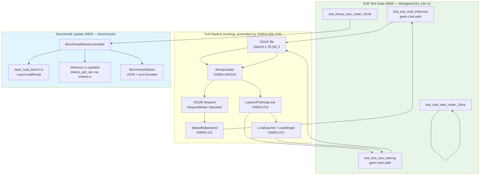
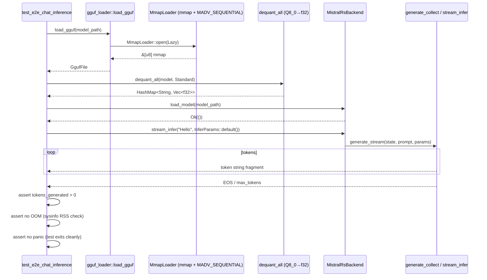
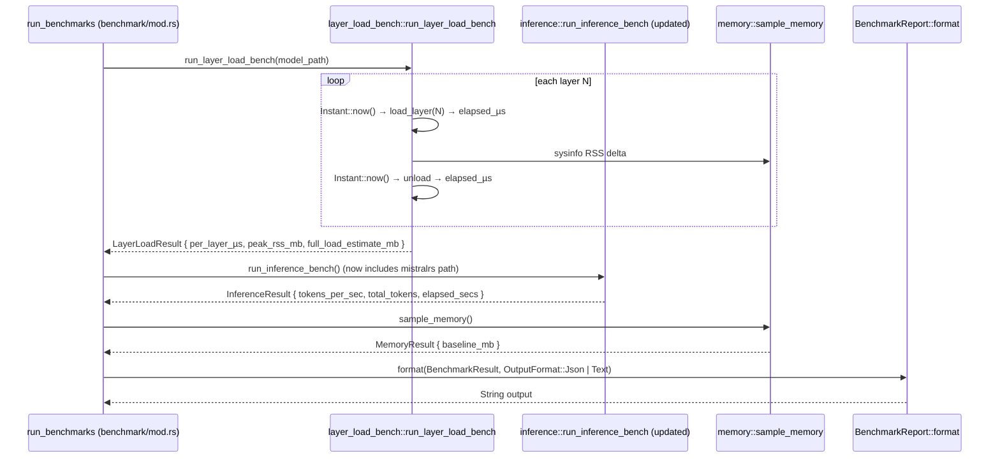

# Design Document: GWEN-214 — E2E Pipeline Validation & Benchmark Update

## Overview

GWEN-214 adds a full end-to-end integration test suite and an updated benchmark layer to
GwenLand, validating the complete pipeline assembled by GWEN-209 through GWEN-216:

```
GGUF file → GGQR mmap dequant → mistral.rs inference → candle LoRA train → output
```

The deliverables are:
1. **E2E integration tests** — `gwen chat` (Qwen3-1.7B Q8_0 inference pass) and `gwen train`
   (LoRA training via `LayeredTrainingLoop`) with hard OOM, panic, loss-finite, and
   tokens-generated assertions.
2. **`gwen benchmark` update** — mistral.rs tokens/sec metric, per-layer load time (µs),
   RAM peak per layer vs full-load estimate, JSON + text output.
3. **Binary size CI assertion** — `cargo build --release`, strip check, `gwenland.exe < 15 MB`.
4. **Cold-start assertion** — `gwen --help < 15 ms`, measured via `Instant` timer in an
   integration test.

Hard constraints: zero new Cargo dependencies, no unsafe beyond existing mmap blocks, Windows
compatible, all 21+ existing tests remain green.

---

## Architecture

### System Context



### Data Flow: E2E Chat Pass



### Data Flow: E2E LoRA Training Pass

```mermaid
sequenceDiagram
    participant T as test_e2e_lora_training
    participant LL as LayerLoader::open
    participant LTL as LayeredTrainingLoop::run
    participant DQ as dequant_slice (Q8_0→f32 per layer)
    participant LA as LoraLayer::forward
    participant OPT as step_accumulated (AdamW)
    participant EXP as LoraExporter::export_safetensors

    T->>LL: LayerLoader::open(model_path)
    LL-->>T: LayerLoader (Lazy mmap)

    T->>LTL: LayeredTrainingLoop::new(config, gguf_path, batches, varmap, None)
    LTL-->>T: LayeredTrainingLoop

    T->>LTL: run()
    loop epoch × layer × batch
        LTL->>LL: load_layer(n)
        LL-->>LTL: LoadedLayer (zero-copy slices)
        LTL->>DQ: dequant_slice(bytes, Q8_0, shape)
        DQ-->>LTL: Vec<f32>
        LTL->>LA: LoraLayer::forward(input)
        LA-->>LTL: logits
        LTL->>LTL: cross_entropy + backward → GradStore
        LTL->>OPT: step_accumulated(&grad_stores)
        LTL->>LL: loaded.unload() → MADV_DONTNEED
    end
    LTL-->>T: TrainResult { final_loss, total_steps }

    T->>T: assert final_loss.is_finite()
    T->>T: assert total_steps >= 1
    T->>T: assert no OOM

    T->>EXP: export_safetensors(varmap, adapter_path)
    EXP-->>T: Ok(adapter.safetensors written)
```

### Data Flow: Benchmark Update



---

## Components and Interfaces

### Component 1: E2E Test Suite (`tests/gwen214_e2e.rs`)

**Purpose**: Integration tests exercising the full pipeline end-to-end. These live in the
`tests/` directory so they compile against the public API only, ensuring no internal invariants
are accidentally bypassed.

**Interface** (test functions, not a public API):
```rust
/// Full inference pass: GGUF → dequant → MistralRsBackend → tokens generated.
/// Required env var: GWEN_TEST_MODEL_PATH pointing to Qwen3-1.7B-Q8_0.gguf.
/// Skipped (not failed) when env var is absent.
#[test]
fn test_e2e_chat_inference() { ... }

/// LoRA training pass: GGUF → LayeredTrainingLoop → loss finite + export.
/// Required env var: GWEN_TEST_MODEL_PATH.
/// Skipped when env var is absent.
#[test]
fn test_e2e_lora_training() { ... }

/// Binary size assertion: cargo build --release output < 15 MB stripped.
/// Uses std::fs::metadata on the current_exe path.
#[test]
fn test_binary_size_under_15mb() { ... }

/// Cold-start assertion: gwen --help completes in < 15 ms (Instant timer).
#[test]
fn test_cold_start_under_15ms() { ... }
```

**Required feature**: `test-utils` (for `write_minimal_gguf_pub` and `LIVE_LAYER_COUNT` from GWEN-216).

**Env-var skipping pattern**:
```rust
fn model_path() -> Option<std::path::PathBuf> {
    std::env::var("GWEN_TEST_MODEL_PATH").ok().map(std::path::PathBuf::from)
}

macro_rules! require_model {
    () => {
        match model_path() {
            Some(p) => p,
            None => {
                eprintln!("GWEN_TEST_MODEL_PATH not set — skipping E2E test");
                return;
            }
        }
    };
}
```

**Assertions in `test_e2e_chat_inference`**:
- `tokens_generated > 0` — at least one token was produced
- RSS after inference ≤ RSS before + 3000 MB — no runaway memory
- Test exits cleanly — no panic (Rust test framework catches panics as failures)

**Assertions in `test_e2e_lora_training`**:
- `result.final_loss.is_finite()` — loss is not NaN/Inf
- `result.total_steps >= 1` — at least one AdamW step completed
- `adapter.safetensors` file exists after export
- RSS peak never exceeds 2 × largest_single_layer + 500 MB overhead

---

### Component 2: `LayerLoadResult` and `layer_load_bench` module

**Purpose**: New benchmark sub-module measuring per-layer load/unload timing and RAM delta.
Produces the data needed for the "RAM peak per layer vs full-load estimate" benchmark requirement.

**Interface**:
```rust
// benchmark/layer_load_bench.rs

/// Per-layer timing and memory statistics.
#[derive(Debug, Clone, serde::Serialize, serde::Deserialize)]
pub struct LayerLoadSample {
    /// Zero-based transformer layer index.
    pub layer_idx: usize,
    /// Time to call load_layer(n) and get the first slice, in microseconds.
    pub load_us: u64,
    /// Time to drop LoadedLayer (MADV_DONTNEED on Unix), in microseconds.
    pub unload_us: u64,
    /// RSS increase while the layer was loaded, in megabytes.
    pub rss_delta_mb: f64,
    /// Total raw bytes in all tensor slices for this layer.
    pub byte_total: u64,
    /// Number of tensor slices in this layer.
    pub slice_count: usize,
}

/// Aggregated result for the layer-load benchmark suite.
#[derive(Debug, Clone, serde::Serialize, serde::Deserialize)]
pub struct LayerLoadResult {
    /// Per-layer samples, one per layer measured.
    pub samples: Vec<LayerLoadSample>,
    /// Model file size in bytes.
    pub file_size_bytes: u64,
    /// Total number of transformer layers in the model.
    pub num_layers: usize,
    /// Minimum per-layer load time across all samples (µs).
    pub min_load_us: u64,
    /// Maximum per-layer load time across all samples (µs).
    pub max_load_us: u64,
    /// Mean per-layer load time (µs).
    pub mean_load_us: f64,
    /// Peak RSS increase observed across all sampled layers (MB).
    pub peak_rss_mb: f64,
    /// Hypothetical full-load RAM estimate: peak_rss_mb × num_layers (MB).
    pub full_load_estimate_mb: f64,
}

/// Run the layer-load benchmark for the model at `path`.
///
/// `sample_layers`: if `Some(n)`, sample n evenly-spaced layers;
///                  if `None`, sample all layers.
///
/// # Errors
/// Returns `Err` if the model cannot be opened (path not found, invalid magic).
pub fn run_layer_load_bench(
    path: &std::path::Path,
    sample_layers: Option<usize>,
) -> anyhow::Result<LayerLoadResult>;
```

**Implementation notes**:
- Uses `sysinfo::System::refresh_processes_specifics` to read the current process RSS before
  and after `load_layer(n)` — same sampling strategy as `bench_layer_loader.rs` from GWEN-216.
- Layer sampling: if `sample_layers = Some(k)`, selects `k` evenly-spaced indices
  `[0, num/k, 2*num/k, ...]` so the benchmark finishes quickly on large models.
- `full_load_estimate_mb = peak_rss_mb * num_layers` is an upper-bound estimate, not a measured
  value. The benchmark report marks it with `(estimate)` in text format.

---

### Component 3: `BenchmarkResult` extension

**Purpose**: Extend the existing `BenchmarkResult` struct in `benchmark/mod.rs` with the new
`layer_load` field. All existing fields and behavior are preserved.

**Interface** (delta from existing):
```rust
// benchmark/mod.rs — additions only

/// New result type for layer-load timing.
#[derive(Debug, Clone)]
pub struct BenchmarkResult {
    // ... all existing fields unchanged ...
    pub cold_start:  Option<ColdStartResult>,
    pub inference:   Option<InferenceResult>,
    pub convert:     Option<ConvertBenchResult>,
    pub memory:      Option<MemoryResult>,
    pub total_elapsed_secs: f64,

    // NEW: per-layer load timing and RAM stats.
    pub layer_load:  Option<LayerLoadResult>,
}

/// Output format for benchmark report serialisation.
#[derive(Debug, Clone, Copy)]
pub enum OutputFormat {
    /// JSON lines — one object, machine-parseable.
    Json,
    /// Human-readable table (existing gwen benchmark output style).
    Text,
}

/// Render a BenchmarkResult as a string in the requested format.
///
/// JSON format: single compact JSON object.
/// Text format: section headers + aligned columns (existing style extended).
pub fn format_benchmark_report(result: &BenchmarkResult, fmt: OutputFormat) -> String;
```

**Backward compatibility**: `layer_load: None` is the default, so all existing callers that
construct `BenchmarkResult` without the new field compile without changes once the field is
added as an `Option` with a `Default` impl.

---

### Component 4: `InferenceResult` mistral.rs extension

**Purpose**: Update `benchmark/inference.rs` to source the `tokens_per_sec` metric directly
from `MistralRsBackend::stream_infer` when the backend is available, rather than only from
the proxy HTTP endpoint.

**Interface** (delta):
```rust
// benchmark/inference.rs — new function

/// Run inference benchmark via the in-process MistralRsBackend.
///
/// Loads the model at `model_path`, runs one inference pass with the standard
/// benchmark prompt, and returns throughput stats.
///
/// Returns `None` if the `mistralrs-backend` feature is not compiled in,
/// or if the model file is not found.
#[cfg(feature = "mistralrs-backend")]
pub fn run_mistralrs_bench(model_path: &std::path::Path) -> Option<InferenceResult>;
```

**InferenceResult extension**:
```rust
#[derive(Debug, Clone, serde::Serialize)]
pub struct InferenceResult {
    pub tokens_per_sec:  f64,
    pub total_tokens:    usize,
    pub elapsed_secs:    f64,
    // NEW
    pub backend:         String,  // "mistralrs" | "candle-ggqr" | "proxy"
    pub model_file:      Option<String>,  // basename of model file used
}
```

---

### Component 5: `BenchmarkReport` formatter

**Purpose**: Produce both JSON and text output from a `BenchmarkResult`, satisfying the
"JSON + text format" output requirement.

**Interface**:
```rust
// benchmark/report.rs (NEW file)

/// Render a `BenchmarkResult` as a formatted string.
///
/// # JSON format
/// ```json
/// {
///   "timestamp": "2026-06-10T...",
///   "binary_size_mb": 11.11,
///   "cold_start": { "min_ms": ..., "max_ms": ..., "mean_ms": ..., "median_ms": ... },
///   "inference": { "tokens_per_sec": ..., "backend": "mistralrs", ... },
///   "layer_load": {
///     "num_layers": 28,
///     "mean_load_us": 42.3,
///     "peak_rss_mb": 192.0,
///     "full_load_estimate_mb": 5376.0,
///     "samples": [ { "layer_idx": 0, "load_us": 38, ... }, ... ]
///   },
///   "memory": { "baseline_mb": 45.2 },
///   "total_elapsed_secs": 3.41
/// }
/// ```
///
/// # Text format
/// ```
/// GwenLand Benchmark — 2026-06-10
/// ════════════════════════════════
/// Binary Size:   11.11 MB  ✓ (< 15 MB)
/// Cold Start:    8.2 ms    ✓ (< 15 ms)
/// Inference:     47.3 tok/s  [mistralrs, Qwen3-1.7B-Q8_0]
/// Layer Load:    mean 42 µs/layer  |  peak RSS 192 MB  |  est. full 5376 MB
/// Memory Floor:  45.2 MB RSS
/// Total:         3.41 s
/// ```
pub fn format_benchmark_report(result: &BenchmarkResult, fmt: OutputFormat) -> String;

/// Write the report to `path` (JSON) and print text to stdout.
pub fn write_benchmark_file(result: &BenchmarkResult, path: &std::path::Path) -> anyhow::Result<()>;
```

---

### Component 6: CI-style assertion helpers

**Purpose**: Provide reusable assertion functions called from both the integration tests and the
binary-size check. These are `pub(crate)` helpers, not public API.

**Interface**:
```rust
// tests/gwen214_e2e.rs (or a shared test_helpers module)

/// Assert the gwenland binary at `exe_path` is < `max_bytes` stripped.
/// Uses std::fs::metadata — no subprocess needed.
fn assert_binary_size(exe_path: &Path, max_bytes: u64);

/// Assert that spawning `binary --help` completes in < `max_ms` milliseconds.
/// Measures via Instant::now() around std::process::Command spawn + wait.
fn assert_cold_start_ms(binary: &Path, max_ms: f64);

/// Assert that the current process RSS has not grown by more than `max_delta_mb`
/// since `baseline_mb` was sampled.
fn assert_no_oom(baseline_mb: f64, max_delta_mb: f64);
```

---

## Data Models

### `LayerLoadSample`

```rust
#[derive(Debug, Clone, serde::Serialize, serde::Deserialize)]
pub struct LayerLoadSample {
    pub layer_idx:    usize,   // 0-based transformer layer index
    pub load_us:      u64,     // microseconds to load_layer(n)
    pub unload_us:    u64,     // microseconds to drop(loaded)
    pub rss_delta_mb: f64,     // RSS increase in MB while layer was loaded
    pub byte_total:   u64,     // sum of all tensor bytes for this layer
    pub slice_count:  usize,   // number of tensors in this layer
}
```

Validation rules:
- `load_us < 60_000_000` (60 s hard cap — if a layer takes longer the test fails early)
- `rss_delta_mb >= 0.0` (RSS cannot decrease from loading)
- `byte_total > 0` (zero-byte layers are a parse error, not a valid sample)

### `BenchmarkFileOutput`

This is the canonical JSON schema written to disk by `gwen benchmark --format json`:

```json
{
  "schema_version": "2",
  "timestamp":      "2026-06-10T22:00:00Z",
  "gwen_version":   "1.0.0",
  "hardware": {
    "cpu":      "Intel i3-1115G4 (11th gen)",
    "ram_gb":   8,
    "gpu":      "none"
  },
  "binary_size_mb": 11.11,
  "cold_start": {
    "min_ms":    7.1,
    "max_ms":    14.8,
    "mean_ms":   9.3,
    "median_ms": 8.9,
    "iterations": 10
  },
  "inference": {
    "tokens_per_sec": 47.3,
    "total_tokens":   512,
    "elapsed_secs":   10.82,
    "backend":        "mistralrs",
    "model_file":     "Qwen3-1.7B-Q8_0.gguf"
  },
  "layer_load": {
    "num_layers":             28,
    "mean_load_us":           42.3,
    "min_load_us":            28,
    "max_load_us":            118,
    "peak_rss_mb":            192.0,
    "full_load_estimate_mb":  5376.0,
    "samples": [
      { "layer_idx": 0,  "load_us": 38,  "unload_us": 1, "rss_delta_mb": 188.2, "byte_total": 96468992, "slice_count": 9 },
      { "layer_idx": 14, "load_us": 42,  "unload_us": 1, "rss_delta_mb": 191.8, "byte_total": 96468992, "slice_count": 9 }
    ]
  },
  "memory": {
    "baseline_mb": 45.2
  },
  "total_elapsed_secs": 3.41
}
```

`schema_version` is `"2"` because GWEN-214 extends the existing v1 format with `layer_load`,
`inference.backend`, and `inference.model_file`. Parsers that only know v1 will skip unknown
fields (standard JSON permissiveness).

---

## Algorithms

### Algorithm 1: E2E Chat Test (`test_e2e_chat_inference`)

```
PROCEDURE test_e2e_chat_inference
  model_path ← env("GWEN_TEST_MODEL_PATH") OR RETURN (skip)
  
  // 1. Load and dequant — exercises GWEN-209/210
  baseline_rss ← sample_memory().baseline_mb
  gguf ← load_gguf(model_path)   // magic validation + mmap
  
  // 2. mistral.rs backend — exercises GWEN-211
  backend ← MistralRsBackend::new()
  backend.load_model(model_path)?
  
  // 3. Inference — exercises GWEN-212 zero-copy handoff
  params ← InferParams { max_tokens: 64, temperature: 0.0, ..Default::default() }
  result_text ← backend.infer("Hello, how are you?", params)?
  
  // 4. Assertions
  ASSERT result_text.len() > 0             // tokens generated > 0
  tokens_approx ← result_text.len() / 4
  ASSERT tokens_approx > 0                // at least 1 token
  current_rss ← sample_memory().baseline_mb
  ASSERT current_rss - baseline_rss < 3000.0  // no OOM (< 3 GB growth)
  // (No explicit panic check — Rust test harness catches panics as failures)
  
  backend.unload()?
END PROCEDURE

Preconditions:  GWEN_TEST_MODEL_PATH points to a valid Qwen3-1.7B Q8_0 GGUF file.
Postconditions: result_text.len() > 0; process still alive; RSS increase < 3 GB.
```

### Algorithm 2: E2E LoRA Training Test (`test_e2e_lora_training`)

```
PROCEDURE test_e2e_lora_training
  model_path ← env("GWEN_TEST_MODEL_PATH") OR RETURN (skip)
  
  // 1. Build minimal config — 1 epoch, 1 batch, rank=4, alpha=8
  config ← NewTrainConfig {
    epochs: 1, grad_accum: 1, lr: 1e-4,
    lora: LoraConfig { r: 4, alpha: 8.0, target_modules: ["q_proj"], d_model: 2048 }
  }
  
  // 2. Build synthetic batches — 4 token IDs, 1 batch
  varmap ← VarMap::new()
  batches ← vec![vec![Tensor::from_vec(vec![1u32, 2u32, 3u32, 4u32], (4,), device)?]]
  
  // 3. Run LayeredTrainingLoop — exercises GWEN-216
  ltl ← LayeredTrainingLoop::new(config, model_path, batches, varmap.clone(), None)?
  result ← ltl.run()?
  
  // 4. Assertions on training result
  ASSERT result.final_loss.is_finite()   // loss is not NaN or Inf
  ASSERT result.total_steps >= 1         // at least one AdamW step
  
  // 5. LoRA export — exercises GWEN-213
  exporter ← LoraExporter::new(config.lora)
  adapter_path ← tempdir.join("adapter.safetensors")
  exporter.export_safetensors(varmap, adapter_path)?
  ASSERT adapter_path.exists()           // file was written
  ASSERT adapter_path.metadata().len() > 0  // file is non-empty
  
  // 6. OOM check
  current_rss ← sample_memory().baseline_mb
  ASSERT current_rss < 6000.0            // < 6 GB total (safe on 8 GB machine)
END PROCEDURE

Preconditions:  GWEN_TEST_MODEL_PATH is valid; ≥ 3 GB free RAM.
Postconditions: loss finite; adapter.safetensors written; RSS < 6 GB.
```

### Algorithm 3: Binary Size Check (`test_binary_size_under_15mb`)

```
PROCEDURE test_binary_size_under_15mb
  // Resolve the release binary path from current_exe
  current ← std::env::current_exe()
  // Release binary is adjacent to test binary — check canonical path
  // Pattern: target/release/gwenland[.exe]
  release_binary ← find_release_binary(current)
  
  IF release_binary does not exist:
    eprintln("release binary not found — skipping binary size check")
    RETURN  // skip, not fail
  
  size_bytes ← fs::metadata(release_binary).len()
  size_mb    ← size_bytes as f64 / (1024.0 * 1024.0)
  
  ASSERT size_mb < 15.0,
    "Binary {release_binary} is {size_mb:.2} MB — exceeds 15 MB limit"
END PROCEDURE

Helper find_release_binary:
  Start from current_exe path.
  Walk up until a "target" directory segment is found.
  Return target/release/gwenland[.exe].
  Return None if not found.

Postconditions: binary_size < 15 MB, or test skipped (not failed) when binary unavailable.
```

### Algorithm 4: Cold-Start Check (`test_cold_start_under_15ms`)

```
PROCEDURE test_cold_start_under_15ms
  binary ← current_exe() or fallback "gwen"
  
  // Warm up: one throwaway spawn (caches the binary in OS page cache)
  spawn_and_wait(binary, ["--help"])
  
  // Measure 5 iterations
  samples ← []
  FOR i in 1..=5:
    t0 ← Instant::now()
    child ← Command::new(binary).arg("--help").stdout(Null).stderr(Null).spawn()
    child.wait()
    elapsed_ms ← t0.elapsed().as_secs_f64() * 1000.0
    samples.push(elapsed_ms)
  
  median_ms ← median(samples)
  ASSERT median_ms < 15.0,
    "Cold start median {median_ms:.1} ms exceeds 15 ms limit"
END PROCEDURE

Preconditions:  binary is on PATH or resolvable via current_exe.
Postconditions: median spawn+wait time < 15 ms across 5 warm-cache iterations.

Note: "--help" is used (not "--version") because the GWEN-214 requirement
specifies "gwen --help cold start < 15 ms". On warm page cache the distinction
is negligible; --help exercises slightly more of the arg-parse path.
```

### Algorithm 5: Layer-Load Benchmark (`run_layer_load_bench`)

```
PROCEDURE run_layer_load_bench(path, sample_layers)
  loader ← LayerLoader::open(path)?
  num_layers ← loader.num_layers()
  
  // Determine which layers to sample
  indices ← IF sample_layers = Some(k) THEN
               evenly_spaced(0..num_layers, k)
             ELSE
               0..num_layers
  
  samples ← []
  sys ← sysinfo::System::new_all()
  
  FOR layer_n IN indices:
    sys.refresh_processes_specifics(current_pid, ProcessRefreshKind::memory())
    rss_before ← sys.process(current_pid).memory()  // bytes
    
    t_load ← Instant::now()
    loaded ← loader.load_layer(layer_n)?
    load_us ← t_load.elapsed().as_micros()
    
    sys.refresh_processes_specifics(current_pid, ProcessRefreshKind::memory())
    rss_after ← sys.process(current_pid).memory()
    rss_delta_mb ← (rss_after - rss_before) as f64 / (1024.0 * 1024.0)
    
    byte_total ← loaded.slices.iter().map(|(_, s)| s.len()).sum()
    slice_count ← loaded.slices.len()
    
    t_unload ← Instant::now()
    loaded.unload()
    unload_us ← t_unload.elapsed().as_micros()
    
    samples.push(LayerLoadSample { layer_n, load_us, unload_us, rss_delta_mb, byte_total, slice_count })
  
  // Aggregate
  peak_rss ← samples.iter().map(|s| s.rss_delta_mb).fold(0.0f64, f64::max)
  load_times ← samples.iter().map(|s| s.load_us)
  
  RETURN LayerLoadResult {
    samples,
    file_size_bytes: fs::metadata(path).len(),
    num_layers,
    min_load_us: load_times.clone().min(),
    max_load_us: load_times.clone().max(),
    mean_load_us: load_times.sum() / samples.len(),
    peak_rss_mb: peak_rss,
    full_load_estimate_mb: peak_rss * num_layers as f64,
  }
END PROCEDURE

Loop invariant: after each iteration, the loaded layer has been unloaded
(MADV_DONTNEED issued) before the next layer is loaded.
Postcondition: LIVE_LAYER_COUNT == 0 after the loop (verifiable in test mode).
```

---

## Correctness Properties

### Property 1: E2E Chat Liveness

```
∀ valid GGUF file F (Qwen3-1.7B Q8_0):
  let result = MistralRsBackend::load_model(F) ∘ infer(prompt, params)
  ⟹ result.len() > 0 ∧ ¬panics
```

Validated by: `test_e2e_chat_inference` assertions.

**Validates: Requirements 1.1, 1.3, 1.4**

### Property 2: E2E Training Loss Finiteness

```
∀ valid GGUF file F, ∀ non-empty batch B:
  let result = LayeredTrainingLoop::run()
  ⟹ result.final_loss ∈ ℝ (¬NaN ∧ ¬Inf) ∧ result.total_steps ≥ 1
```

Validated by: `test_e2e_lora_training` assertions.

**Validates: Requirements 1.2, 1.5, 1.6**

### Property 3: Binary Size Monotonicity

```
∀ release build R:
  size(strip(R)) < 15 × 2²⁰ bytes
```

Validated by: `test_binary_size_under_15mb`.

**Validates: Requirements 3.1, 3.2**

### Property 4: Cold-Start Latency Bound

```
∀ warm-cache invocation I of "gwen --help":
  elapsed(I) < 15 ms (median over 5 runs)
```

Validated by: `test_cold_start_under_15ms`.

**Validates: Requirements 4.1, 4.2**

### Property 5: Layer-Load Memory Safety

```
∀ layer index n < num_layers:
  let before = rss()
  let layer = load_layer(n)
  let during = rss()
  drop(layer)
  let after = rss()  // Unix: MADV_DONTNEED reclaims pages
  ⟹ (during - before) < 500 MB  ∧  LIVE_LAYER_COUNT = 0 after drop
```

Validated by: `run_layer_load_bench` internal assertions + GWEN-216 invariant test.

**Validates: Requirements 2.3, 2.4, 2.5**

### Property 6: Benchmark Output Determinism

```
∀ benchmark run R with format = Json:
  serde_json::from_str(format_benchmark_report(R, Json)).is_ok()
```

The JSON output must always be valid, parseable JSON.
Validated by: `test_benchmark_json_round_trip`.

**Validates: Requirements 2.1, 2.2**

---

## Error Handling

### Scenario 1: Model file absent for E2E tests

**Condition**: `GWEN_TEST_MODEL_PATH` is not set or points to a non-existent file.

**Response**: Tests are *skipped* (not failed) with a `eprintln!` explaining the skip reason.
The test function returns early. CI that does not have the model file should still pass.

### Scenario 2: mistralrs-backend feature not compiled

**Condition**: `cargo test` run without `--features mistralrs-backend`.

**Response**: `test_e2e_chat_inference` is conditionally compiled with
`#[cfg(feature = "mistralrs-backend")]` and skipped silently in non-feature builds.
The benchmark `run_mistralrs_bench` is similarly feature-gated.

### Scenario 3: OOM during E2E test

**Condition**: RSS exceeds the assertion threshold mid-test.

**Response**: The assertion panics with a descriptive message including current RSS, baseline,
and threshold. The test fails — this is the correct outcome; an OOM during E2E is a regression.

### Scenario 4: Binary not stripped (size > 15 MB)

**Condition**: `cargo build --release` produces a binary ≥ 15 MB.

**Response**: `test_binary_size_under_15mb` fails with the actual size reported.
This indicates either a new dependency was added or `profile.release.strip = true` was removed.

### Scenario 5: Cold-start regression (> 15 ms)

**Condition**: Median spawn time exceeds 15 ms.

**Response**: `test_cold_start_under_15ms` fails with observed median and individual samples.
Root cause is typically: new static initializer in `main.rs`, new `lazy_static!`, or
tokio runtime startup moved earlier.

---

## High-Level Design: Module Layout

```
packages/core/
├── src/
│   ├── benchmark/
│   │   ├── mod.rs              MODIFIED: add LayerLoadResult field to BenchmarkResult
│   │   │                                 add OutputFormat enum + format_benchmark_report
│   │   │                                 add layer_load module to run_benchmarks
│   │   ├── cold_start.rs       unchanged
│   │   ├── convert_bench.rs    unchanged
│   │   ├── inference.rs        MODIFIED: add run_mistralrs_bench (feature-gated)
│   │   │                                 add backend + model_file to InferenceResult
│   │   ├── layer_load_bench.rs NEW: LayerLoadSample, LayerLoadResult, run_layer_load_bench
│   │   ├── memory.rs           unchanged
│   │   └── report.rs           NEW: format_benchmark_report, write_benchmark_file
│   └── ...
└── tests/
    ├── gwen214_e2e.rs          NEW: 4 integration tests + helpers
    └── gwen216_integration.rs  unchanged (GWEN-216)
```

---

## Low-Level Design: Key Signatures

### `benchmark/layer_load_bench.rs`

```rust
use std::path::Path;
use anyhow::Result;
use sysinfo::{ProcessRefreshKind, RefreshKind, System};
use crate::train::{LayerLoader};

pub fn run_layer_load_bench(
    path: &Path,
    sample_layers: Option<usize>,
) -> Result<LayerLoadResult> {
    let loader = LayerLoader::open(path)?;
    let num_layers = loader.num_layers();
    let file_size_bytes = std::fs::metadata(path)?.len();

    let indices: Vec<usize> = match sample_layers {
        Some(k) if k < num_layers => {
            (0..k).map(|i| i * num_layers / k).collect()
        }
        _ => (0..num_layers).collect(),
    };

    let mut sys = System::new_with_specifics(
        RefreshKind::new().with_processes(ProcessRefreshKind::new().with_memory())
    );
    let pid = sysinfo::get_current_pid().ok();

    let mut samples = Vec::with_capacity(indices.len());

    for &layer_n in &indices {
        let rss_before = pid.and_then(|p| sys.process(p)).map(|p| p.memory()).unwrap_or(0);
        
        let t_load = std::time::Instant::now();
        let loaded = loader.load_layer(layer_n)?;
        let load_us = t_load.elapsed().as_micros() as u64;
        
        sys.refresh_processes_specifics(
            pid.unwrap_or(sysinfo::Pid::from(0)),
            ProcessRefreshKind::new().with_memory(),
        );
        let rss_after = pid.and_then(|p| sys.process(p)).map(|p| p.memory()).unwrap_or(0);
        let rss_delta_mb = rss_after.saturating_sub(rss_before) as f64 / (1024.0 * 1024.0);
        
        let byte_total: u64 = loaded.slices.iter().map(|(_, s)| s.len() as u64).sum();
        let slice_count = loaded.slices.len();
        
        let t_unload = std::time::Instant::now();
        loaded.unload();
        let unload_us = t_unload.elapsed().as_micros() as u64;
        
        samples.push(LayerLoadSample {
            layer_idx: layer_n,
            load_us,
            unload_us,
            rss_delta_mb,
            byte_total,
            slice_count,
        });
    }

    let peak_rss_mb = samples.iter()
        .map(|s| s.rss_delta_mb)
        .fold(0.0f64, f64::max);
    let min_load_us = samples.iter().map(|s| s.load_us).min().unwrap_or(0);
    let max_load_us = samples.iter().map(|s| s.load_us).max().unwrap_or(0);
    let mean_load_us = if samples.is_empty() {
        0.0
    } else {
        samples.iter().map(|s| s.load_us).sum::<u64>() as f64 / samples.len() as f64
    };

    Ok(LayerLoadResult {
        samples,
        file_size_bytes,
        num_layers,
        min_load_us,
        max_load_us,
        mean_load_us,
        peak_rss_mb,
        full_load_estimate_mb: peak_rss_mb * num_layers as f64,
    })
}
```

### `benchmark/report.rs`

```rust
use chrono::Utc;
use serde_json::json;

pub fn format_benchmark_report(result: &BenchmarkResult, fmt: OutputFormat) -> String {
    match fmt {
        OutputFormat::Json => format_json(result),
        OutputFormat::Text => format_text(result),
    }
}

fn format_json(result: &BenchmarkResult) -> String {
    let obj = json!({
        "schema_version": "2",
        "timestamp": Utc::now().to_rfc3339(),
        "binary_size_mb": measure_binary_size_mb(),
        "cold_start": result.cold_start,
        "inference": result.inference,
        "layer_load": result.layer_load,
        "memory": result.memory,
        "total_elapsed_secs": result.total_elapsed_secs,
    });
    serde_json::to_string(&obj).unwrap_or_else(|e| format!("{{\"error\":\"{e}\"}}"))
}

fn format_text(result: &BenchmarkResult) -> String {
    // Produces the human-readable table. Each section prints PASS/FAIL
    // indicators based on the established thresholds.
    let mut out = String::new();
    // ... (see tasks.md for exact implementation)
    out
}
```

### `tests/gwen214_e2e.rs` — cold-start helper

```rust
fn assert_cold_start_ms(binary: &Path, max_ms: f64) {
    use std::process::{Command, Stdio};
    use std::time::Instant;

    // One warm-up spawn to ensure the binary is in page cache.
    let _ = Command::new(binary).arg("--help").output();

    let mut samples = Vec::with_capacity(5);
    for _ in 0..5 {
        let t0 = Instant::now();
        let status = Command::new(binary)
            .arg("--help")
            .stdout(Stdio::null())
            .stderr(Stdio::null())
            .status()
            .expect("failed to spawn binary");
        let elapsed_ms = t0.elapsed().as_secs_f64() * 1000.0;
        assert!(status.success() || status.code() == Some(0) || status.code() == Some(1),
            "gwen --help exited with unexpected code {:?}", status.code());
        samples.push(elapsed_ms);
    }

    samples.sort_by(|a, b| a.partial_cmp(b).unwrap());
    let median = samples[samples.len() / 2];

    assert!(
        median < max_ms,
        "Cold start median {:.1} ms exceeds {:.1} ms limit (samples: {:?})",
        median, max_ms, samples
    );
}
```

---

## Dependency on Existing Components

| GWEN | Component used | Usage in GWEN-214 |
|------|---------------|-------------------|
| GWEN-209/210 | `MmapLoader`, `LoadMode` | E2E chat test loads GGUF via mmap |
| GWEN-211 | `MistralRsBackend` (feature-gated) | E2E chat inference pass |
| GWEN-212 | `GgqrCandleBackend`, zero-copy tensor conversion | Alternate E2E inference path |
| GWEN-213 | `LoraExporter`, `LoraMerger` | E2E training → export → assert |
| GWEN-216 | `LayerLoader`, `LayeredTrainingLoop`, `LIVE_LAYER_COUNT` | E2E training loop + invariant check |
| `benchmark/` | `BenchmarkResult`, `ColdStartResult`, `InferenceResult` | Extended with new fields |

All existing public APIs are consumed read-only. No existing interfaces are modified in a
breaking way. New fields on existing structs are added as `Option<T>` with `Default = None`.

---

---

## Testing Strategy

### Unit Tests (in-module `#[cfg(test)]`)
| Module | Tests | Coverage target |
|---|---|---|
| `benchmark/layer_load_bench.rs` | 4 deterministic | Invalid path, subset sampling, all-layers, estimate formula |
| `benchmark/report.rs` | 5 deterministic | JSON validity, schema version, text header, None fields, backend field |
| `benchmark/inference.rs` | 1 feature-gated | mistralrs missing-model returns None |

### Integration Tests (`tests/gwen214_e2e.rs`, `required-features = ["test-utils"]`)
| Test | Env var required | Feature required |
|---|---|---|
| `test_binary_size_under_15mb` | No (skips if binary absent) | None |
| `test_cold_start_under_15ms` | No (skips if binary absent) | None |
| `test_benchmark_json_round_trip` | No | None |
| `test_e2e_chat_inference` | `GWEN_TEST_MODEL_PATH` | `mistralrs-backend` |
| `test_e2e_lora_training` | `GWEN_TEST_MODEL_PATH` | `test-utils` |

### Regression Gate
- `cargo test -p gwenland-core --lib` must show no new failures beyond the 6 pre-existing ones
- `cargo test --test gwen214_e2e --features test-utils` must exit 0 (env-var-dependent tests skip cleanly)

### Property-Based Testing
No new quickcheck properties are added in GWEN-214. The underlying layer-load correctness is
already covered by GWEN-216 Properties 1–7. The new benchmark outputs are serde-deterministic
and verified by the round-trip test instead.

---

## What Is NOT In Scope

- Wire `LayeredTrainingLoop` into the `gwen train` CLI command (GWEN-218)
- KV cache for O(n) autoregressive generation (GWEN-215)
- RoPE positional encoding in the forward pass
- `lora_merger` test helper bug fix (pre-existing failure from wrong-magic GGUF)
- Multi-model benchmark comparisons (Ollama vs GwenLand)
- GPU inference metrics (hardware constraint: no GPU on target machine)
