# Design Document: GWEN-216 — Selective Layer Loading for LoRA Training

## Overview

GWEN-216 implements an **active-layer-only RAM strategy** for LoRA fine-tuning of Qwen3-1.7B Q8_0 (1.92 GiB) on hardware with 8 GB RAM and no discrete GPU. Rather than loading the full model into RAM, only the transformer layer currently being trained is mapped into physical memory, processed, and then eagerly released (via `MADV_DONTNEED` on Unix; no-op on Windows). This reduces peak RAM per layer to ~50–80 MB versus the 1.92 GiB full-model baseline.

The feature builds directly on three existing foundations: `MmapLoader` (GWEN-209/210) for OOM-safe memory-mapped file access, `GgufFile`/`TensorInfo` (GGUF parser) for tensor metadata, and the `TrainingLoop`/`LoraLayer`/`VarMap` infrastructure (GWEN-213) for candle-native LoRA training. No new Cargo dependencies are introduced; all new `unsafe` is forbidden beyond the existing `MmapOptions::new().map(&file)` block.

The three deliverables are: (1) `LayerLoader` — a struct that slices the already-open mmap into per-layer byte views; (2) `LayeredTrainingLoop` — a wrapper over the existing `TrainingLoop` that sequences layer load → forward → backward → unload across all transformer layers per epoch; (3) `bench_layer_loader` — a benchmark binary measuring per-layer RAM peak versus full-load baseline.

---

## Architecture

### System Component Diagram

```mermaid
graph TD
    subgraph Disk["Disk (GGUF file, never fully in RAM)"]
        F[Qwen3-1.7B-Q8_0.gguf<br/>1.92 GiB]
    end

    subgraph Loader["Layer Loader (new — layer_loader.rs)"]
        ML[MmapLoader<br/>existing GWEN-209/210]
        LI[LayerIndex<br/>Vec&lt;LayerSlice&gt;]
        LL[LayerLoader]
        LOD[LoadedLayer<br/>lifetime-tied &amp;&#91;u8&#93; slices]
        ML --> LL
        LI --> LL
        LL --> LOD
    end

    subgraph TrainLoop["Layered Training Loop (new — layered_training_loop.rs)"]
        LTL[LayeredTrainingLoop]
        TL[TrainingLoop fields<br/>existing AdamW + VarMap]
        GS[GradStore accumulator<br/>Vec&lt;GradStore&gt;]
        LORA[Per-layer LoRA temp<br/>stack &#91;f32; R*D&#93; or Vec&lt;f32&gt;]
        LTL --> TL
        LTL --> GS
        LTL --> LORA
    end

    subgraph Candle["Candle (existing)"]
        CV[candle Tensor<br/>dequant Q8_0→f32]
        LY[LoraLayer<br/>lora_a + lora_b]
        VM[VarMap<br/>trainable Vars]
        CV --> LY
        LY --> VM
    end

    subgraph Bench["Benchmark (new — bench_layer_loader.rs)"]
        BL[bench_layer_loader binary]
    end

    F --> ML
    LOD -->|zero-copy &amp;&#91;u8&#93;| CV
    LOD -->|MADV_DONTNEED on drop| Disk
    LTL -->|load_layer&#40;n&#41;| LL
    LTL -->|unload_layer&#40;n&#41;| LOD
    LTL -->|step_accumulated| TL
    BL --> LL
    BL --> LTL

    style Loader fill:#e1f5ff
    style TrainLoop fill:#e8f5e9
    style Bench fill:#fff8e1
```



### Data Flow: Layer-Sequential Training Loop

```mermaid
sequenceDiagram
    participant LTL as LayeredTrainingLoop
    participant LL as LayerLoader
    participant Mmap as MmapLoader (OS pages)
    participant DQ as dequant (Q8_0→f32)
    participant Candle as LoraLayer / candle
    participant Opt as AdamW (step_accumulated)
    participant Ckpt as checkpoint (VarMap.save)

    loop For each epoch
        loop For each layer N (0..num_layers)
            LTL->>LL: load_layer(N)
            LL->>Mmap: slice mmap[offset..offset+len] for each tensor in layer N
            Mmap-->>LL: &[u8] (zero-copy, OS pages faulted in lazily)
            LL-->>LTL: LoadedLayer { slices: Vec<(&str, &[u8])> }

            loop For each tensor slice in LoadedLayer
                LTL->>DQ: dequantize_q8_0(raw_bytes) → Vec<f32>
                DQ-->>LTL: f32 weight data
                LTL->>Candle: Tensor::from_slice(f32_data)
            end

            LTL->>Candle: LoraLayer::forward(input)
            Candle-->>LTL: logits
            LTL->>Candle: cross_entropy(logits, targets)
            Candle-->>LTL: loss_scaled
            LTL->>Candle: loss_scaled.backward()
            Candle-->>LTL: GradStore

            LTL->>LTL: grad_stores.push(grads)

            alt is_accum_boundary OR last layer
                LTL->>Opt: step_accumulated(&grad_stores)
                LTL->>LTL: grad_stores.clear()
                opt every 500 steps
                    LTL->>Ckpt: varmap.save(checkpoint_N.safetensors)
                end
            end

            LTL->>LL: unload_layer(N) → LoadedLayer::drop()
            Note over Mmap: MADV_DONTNEED issued (Unix)<br/>OS reclaims physical pages
        end
    end
```

### Memory Layout Diagram

```
RAM during single-layer pass (target: 50–80 MB peak)
═══════════════════════════════════════════════════════

 ┌─────────────────────────────────────────────────────┐
 │  OS / kernel overhead                    ~200 MB    │
 ├─────────────────────────────────────────────────────┤
 │  Rust binary + stack + heap base          ~5 MB     │
 ├─────────────────────────────────────────────────────┤
 │  MmapLoader VA range (1.92 GiB virtual)             │
 │  Physical pages faulted in for layer N:             │
 │    ┌────────────────────────────────────┐           │
 │    │  q_proj.weight  Q8_0  ~8.4 MB      │           │
 │    │  k_proj.weight  Q8_0  ~2.1 MB      │           │
 │    │  v_proj.weight  Q8_0  ~2.1 MB      │           │
 │    │  o_proj.weight  Q8_0  ~8.4 MB      │           │
 │    │  gate_proj.weight Q8_0 ~23 MB      │           │
 │    │  up_proj.weight  Q8_0 ~23 MB       │           │
 │    │  down_proj.weight Q8_0 ~23 MB      │           │
 │    │  (norms, biases) ~0.1 MB           │           │
 │    └────────────────────────────────────┘           │
 │    Layer N raw bytes total:        ~90 MB           │
 ├─────────────────────────────────────────────────────┤
 │  f32 dequant buffer (one tensor at a time):         │
 │    max(tensor) × 4 bytes ≈           ~92 MB         │
 │    (released after candle Tensor created)           │
 ├─────────────────────────────────────────────────────┤
 │  candle Tensors (layer N only)       ~30 MB         │
 ├─────────────────────────────────────────────────────┤
 │  LoRA lora_a + lora_b (stack/heap)   ~0.1 MB        │
 │  GradStore (one window)              ~0.5 MB        │
 │  AdamW moment buffers                ~0.1 MB        │
 ├─────────────────────────────────────────────────────┤
 │  TOTAL PEAK (approx)                ~420 MB         │
 │  (well within 8 GB; drops after LoadedLayer::drop)  │
 └─────────────────────────────────────────────────────┘

Contrast: full load baseline = 1.92 GiB model data alone
```

> **Note on peak estimate**: The dominant cost is the f32 dequant buffer (one large tensor at a time) plus the candle Tensor for that tensor. These are released sequentially — the dequant Vec is dropped before the next tensor is loaded. Steady-state peak is the raw Q8_0 bytes for one layer (~90 MB) plus one dequant tensor in flight (~92 MB for `down_proj`), giving ~182 MB of model-related RAM. The 50–80 MB figure in the ticket refers to the Q8_0-only footprint; total system peak including dequant buffers is higher but still a fraction of full load.

---

## Components and Interfaces

### Component 1: LayerSlice

**Purpose**: Lightweight descriptor identifying one tensor within a specific transformer layer. Built once at startup from `GgufFile.tensors`; zero heap allocation per tensor beyond the initial `Vec<LayerSlice>` construction.

**Interface**:
```rust
/// Identifies a single tensor belonging to transformer layer `layer_idx`.
///
/// Built by [`LayerIndex::scan`] at startup; used by [`LayerLoader::load_layer`]
/// to slice the mmap without any file I/O.
#[derive(Debug, Clone)]
pub struct LayerSlice {
    /// Zero-based transformer layer number (e.g. 0 for `model.layers.0.*`).
    pub layer_idx: usize,
    /// Tensor name as stored in the GGUF file (e.g. "model.layers.0.self_attn.q_proj.weight").
    /// Stored as a heap-allocated String; the Vec itself is allocated once at scan time.
    pub tensor_name: String,
    /// Absolute byte offset of this tensor's data within the mmap'd file.
    pub byte_offset: u64,
    /// Byte length of this tensor's quantised data (Q8_0 block-aligned).
    pub byte_len: usize,
}
```

**Responsibilities**:
- Carry the four fields needed to slice a mmap region: layer index, name, offset, length
- Be `Clone` so `LayerIndex` can hand out per-layer subsets without lifetime tangles

### Component 2: LayerIndex

**Purpose**: Scans `GgufFile.tensors` once at startup to build the lookup map. No subsequent GgufFile access is needed during training.

**Interface**:
```rust
/// Index of all transformer layer tensors in the GGUF file.
///
/// Built once via [`LayerIndex::scan`]. Provides O(1) lookup for the set
/// of tensors belonging to a given layer index.
pub struct LayerIndex {
    /// All layer tensor descriptors, sorted by (layer_idx, tensor_name).
    slices: Vec<LayerSlice>,
    /// Total number of distinct transformer layers found.
    pub num_layers: usize,
}

impl LayerIndex {
    /// Scan the tensor metadata from a parsed `GgufFile` and build the index.
    ///
    /// Only tensors whose names match `model.layers.{N}.*` are included.
    /// Embedding, norm, and LM-head tensors are deliberately excluded because
    /// they are not part of the per-layer LoRA training loop.
    ///
    /// # Preconditions
    /// - `file.tensors` is non-empty
    /// - Tensor names follow the Qwen3/Mistral convention `model.layers.{N}.*`
    ///
    /// # Postconditions
    /// - `self.num_layers` equals the number of distinct layer indices found
    /// - `self.slices` is sorted by (layer_idx ASC, tensor_name ASC)
    /// - `self.slices.len()` equals the total count of per-layer tensors
    pub fn scan(file: &GgufFile) -> Self;

    /// Return the [`LayerSlice`] descriptors for layer `n`.
    ///
    /// Returns an empty slice if `n` is out of range (not an error — callers
    /// can skip gracefully).
    pub fn layer_slices(&self, n: usize) -> &[LayerSlice];
}
```

**Responsibilities**:
- Parse tensor names with a `model.layers.{N}.` prefix regex/pattern to extract `N`
- Compute `byte_offset` as `tensor_info.data_offset + data_base_offset` (absolute)
- Sort slices for deterministic layer iteration order

### Component 3: LayerLoader

**Purpose**: Wraps the `MmapLoader`'s byte slice to produce zero-copy `&[u8]` views for individual transformer layers. The mmap stays open for the lifetime of `LayerLoader`; only page-residency changes as layers are loaded/unloaded.

**Interface**:
```rust
/// Loads individual transformer layers from an already-open mmap.
///
/// The mmap is opened once and held for the full training run. Calling
/// [`load_layer`] returns a [`LoadedLayer`] with lifetime-tied byte slices
/// directly into the mmap — zero heap copy. Dropping [`LoadedLayer`] (or
/// calling [`LoadedLayer::unload`]) issues `MADV_DONTNEED` on Unix to
/// eagerly return the physical pages to the OS.
pub struct LayerLoader {
    /// The memory-mapped file — open for the entire training run.
    mmap: MmapLoader,
    /// Pre-built index of all per-layer tensor offsets.
    index: LayerIndex,
}

impl LayerLoader {
    /// Open the GGUF file at `path`, parse its tensor index, and prepare for
    /// layer-by-layer access.
    ///
    /// Uses `LoadMode::Lazy` unconditionally — we must not eagerly prefetch
    /// the full model into RAM, which would defeat the purpose of this struct.
    ///
    /// # Errors
    /// - File not found or not readable
    /// - Invalid GGUF magic bytes
    /// - GGUF parse error (malformed header)
    pub fn open(path: &Path) -> Result<Self>;

    /// Return the number of transformer layers in the model.
    pub fn num_layers(&self) -> usize;

    /// Load layer `n` and return lifetime-tied byte slices into the mmap.
    ///
    /// Each element of the returned slice is `(tensor_name, raw_q8_0_bytes)`.
    /// The bytes are a direct view into the mmap — no copy, no allocation.
    ///
    /// The OS may fault in the underlying physical pages on first access.
    /// On a cold NVMe read this takes ~5–20 ms per layer; on a warm page
    /// cache it is near-zero.
    ///
    /// # Preconditions
    /// - `n < self.num_layers()`
    ///
    /// # Postconditions
    /// - Returned slices point directly into the mmap (zero-copy)
    /// - Byte ranges are within `[0, mmap.len())`
    pub fn load_layer<'a>(&'a self, n: usize) -> Result<LoadedLayer<'a>>;
}
```

**Responsibilities**:
- Hold the single `MmapLoader` (and therefore the single `unsafe` mmap block) for the training run
- Delegate index building to `LayerIndex::scan`
- Produce `LoadedLayer` values by slicing `mmap.as_bytes()` at the offsets from `LayerIndex`

### Component 4: LoadedLayer

**Purpose**: Owns the lifetime-tied tensor name→bytes list for one transformer layer. Dropping it issues `MADV_DONTNEED` to reclaim physical pages. The explicit `unload()` method is provided for callers that want to reclaim eagerly without relying on drop order.

**Interface**:
```rust
/// A view of one transformer layer's raw tensor bytes, sliced from the mmap.
///
/// Dropping this value — or calling [`unload`] — issues `MADV_DONTNEED` on
/// Unix to hint the OS to reclaim the underlying physical pages. On Windows
/// the drop is a no-op (mmap pages are reclaimed by the OS on demand).
///
/// The `'mmap` lifetime ties the byte slices to the originating `LayerLoader`,
/// ensuring the mmap cannot be closed while slices are live.
pub struct LoadedLayer<'mmap> {
    /// (tensor_name, raw_q8_0_bytes) pairs for all tensors in this layer.
    /// Byte slices point directly into the mmap — zero copy.
    pub slices: Vec<(&'mmap str, &'mmap [u8])>,
    /// Byte range covered by this layer within the mmap, used for madvise.
    pub(crate) mmap_range: std::ops::Range<usize>,
    /// Reference to the mmap for issuing madvise on unload.
    pub(crate) mmap_data: &'mmap memmap2::Mmap,
}

impl<'mmap> LoadedLayer<'mmap> {
    /// Eagerly hint the OS to reclaim the physical pages for this layer.
    ///
    /// On Unix, issues `MADV_DONTNEED` over `mmap_range`. This is advisory;
    /// the OS may ignore it. The virtual address range remains valid (the
    /// mmap is still open), so accessing the bytes again will fault them back
    /// in from disk.
    ///
    /// On Windows this is a no-op — identical to the existing
    /// `apply_madvise` stub in `loader.rs`.
    pub fn unload(self) {
        // MADV_DONTNEED issued here or in Drop impl below.
        drop(self);
    }
}

impl<'mmap> Drop for LoadedLayer<'mmap> {
    fn drop(&mut self) {
        // Unix: hint OS to reclaim physical pages.
        #[cfg(unix)]
        {
            let _ = self.mmap_data.advise_range(
                memmap2::Advice::DontNeed,
                self.mmap_range.start,
                self.mmap_range.len(),
            );
        }
        // Windows / other: no-op (mirrors apply_madvise stub in loader.rs)
    }
}
```

**Responsibilities**:
- Hold the `Vec<(&str, &[u8])>` of name→bytes mappings for the active layer
- Issue `MADV_DONTNEED` on the exact byte range of the layer's tensors on drop
- Expose `unload()` for explicit, early release (semantically identical to drop)

### Component 5: LayeredTrainingLoop

**Purpose**: Orchestrates the full layer-sequential training loop. Wraps (not replaces) the existing `TrainingLoop` field layout, reusing `VarMap`, `AdamW`, and `step_accumulated` without duplication.

**Interface**:
```rust
/// Layer-sequential LoRA training loop.
///
/// For each epoch, iterates over all transformer layers sequentially:
/// 1. `LayerLoader::load_layer(n)` — fault in raw Q8_0 bytes (zero-copy)
/// 2. Dequantise Q8_0 → f32, build candle Tensors
/// 3. `LoraLayer::forward` → cross-entropy loss → `loss.backward()`
/// 4. Accumulate `GradStore`
/// 5. At accumulation boundary: `step_accumulated` → AdamW update
/// 6. `LoadedLayer::unload()` → `MADV_DONTNEED` → OS reclaims pages
///
/// Gradient accumulation semantics are identical to `TrainingLoop::run()`:
/// the existing `step_accumulated` helper is called unchanged.
pub struct LayeredTrainingLoop {
    /// LoRA training configuration (epochs, lr, grad_accum, lora rank/alpha).
    config: NewTrainConfig,
    /// Layer loader — holds the open mmap for the full training run.
    layer_loader: LayerLoader,
    /// Pre-batched token-ID tensors (same format as TrainingLoop).
    batches: Vec<Vec<Tensor>>,
    /// Holds lora_a and lora_b Vars; used for checkpointing.
    varmap: VarMap,
    /// AdamW optimiser seeded from varmap.all_vars().
    adamw: AdamW,
    /// Optional TUI pipe — same semantics as TrainingLoop.tx.
    tx: Option<Sender<String>>,
}

impl LayeredTrainingLoop {
    /// Construct the layered training loop.
    ///
    /// Opens the GGUF file at `gguf_path` via [`LayerLoader::open`] (Lazy mode).
    /// Seeds AdamW from `varmap.all_vars()` (lora_a + lora_b only).
    ///
    /// # Preconditions
    /// - `gguf_path` points to a valid Qwen3-compatible GGUF v3 file
    /// - `varmap` contains paired lora_a / lora_b Vars for each target module
    /// - `config.grad_accum >= 1`
    pub fn new(
        config: NewTrainConfig,
        gguf_path: &Path,
        batches: Vec<Vec<Tensor>>,
        varmap: VarMap,
        tx: Option<Sender<String>>,
    ) -> Result<Self>;

    /// Run the full layer-sequential training loop.
    ///
    /// Emits the same JSON progress events to stdout as `TrainingLoop::run()`.
    /// Writes safetensors checkpoints every 500 optimiser steps.
    ///
    /// # Postconditions
    /// - At no point are more than `num_layers_per_pass` layers resident in RAM
    /// - GradStore accumulation uses the same `step_accumulated` semantics
    /// - Returns `TrainResult` with final_loss, total_steps, elapsed
    pub fn run(&mut self) -> Result<TrainResult>;
}
```

**Compatibility bridge — reuse without duplication**:

```
TrainingLoop fields        LayeredTrainingLoop equivalent
─────────────────────────────────────────────────────────
config: NewTrainConfig  →  config: NewTrainConfig  (identical)
model: LoraLayer        →  built per-layer inside run() from LoadedLayer
batches: Vec<Vec<…>>    →  batches: Vec<Vec<…>>    (identical)
varmap: VarMap          →  varmap: VarMap           (identical)
adamw: AdamW            →  adamw: AdamW             (identical)
tx: Option<Sender<…>>   →  tx: Option<Sender<…>>   (identical)

step_accumulated()      →  called verbatim (same signature, same semantics)
save_checkpoint()       →  called verbatim (same signature, same semantics)
prepare_batch()         →  called verbatim (same signature, same semantics)
ProgressEvent::emit()   →  called verbatim (same JSON format, same cadence)
```

`LoraLayer` is **not** a field of `LayeredTrainingLoop` — it is reconstructed each time a layer is loaded, using the dequantised base weights from the mmap slice. The `VarMap` (and therefore `lora_a`/`lora_b`) **persists** across the full training run.

### Component 6: bench_layer_loader binary

**Purpose**: Measure per-layer RAM peak and throughput versus the full-load baseline from `bench_ggqr`.

**Interface**:
```rust
/// bench_layer_loader — per-layer RAM benchmark for GWEN-216.
///
/// Usage:
///   bench_layer_loader <gguf_path> [--layer N] [--iterations M]
///                      [--compare-full] [--format json|text]
///
/// Reports:
///   - Peak RSS before and after load_layer(N)
///   - Time to load + dequant one layer
///   - Time for MADV_DONTNEED (unload)
///   - If --compare-full: run bench_ggqr-style full load for baseline
fn main() { /* ... */ }
```

---

## Data Models

### LayerSlice (detailed)

```rust
#[derive(Debug, Clone)]
pub struct LayerSlice {
    pub layer_idx:   usize,   // 0-based transformer layer number
    pub tensor_name: String,  // e.g. "model.layers.7.self_attn.q_proj.weight"
    pub byte_offset: u64,     // absolute offset into mmap'd file
    pub byte_len:    usize,   // Q8_0-block-aligned byte count
}
```

**Validation rules**:
- `byte_offset + byte_len <= mmap_len` (enforced in `LayerIndex::scan`)
- `byte_len > 0` (zero-length tensors are an error condition)
- `tensor_name` is non-empty and valid UTF-8 (guaranteed by GGUF parser)

### LoRA per-layer temp storage

```rust
/// Compile-time threshold: if rank × d_model ≤ LORA_STACK_THRESHOLD,
/// the lora_a/lora_b buffers are stack-allocated; otherwise heap Vec<f32>.
const LORA_STACK_THRESHOLD: usize = 512;

/// Per-layer LoRA adapter storage.
///
/// Uses a const-generic array when the size fits in LORA_STACK_THRESHOLD
/// elements (e.g. rank=8, d_model=64 → 512 → stack).
/// Falls back to heap Vec<f32> for larger configurations (rank=16, d_model=2048).
enum LoraStorage {
    Stack([f32; LORA_STACK_THRESHOLD]),  // rank × d_model ≤ 512
    Heap(Vec<f32>),                       // rank × d_model > 512
}
```

> For Qwen3-1.7B: rank=8, d_model=2048 → 8×2048=16384 > 512 → `Heap` path is used. The `Stack` path is exercised in tests and on tiny models. The threshold is a compile-time constant, not a runtime branch on size.

---

## Algorithmic Pseudocode

### Algorithm 1: `LayerIndex::scan` — Build Layer Tensor Map

```pascal
PROCEDURE LayerIndex::scan(file: GgufFile) → LayerIndex
  INPUT: file with file.tensors: Vec<TensorInfo>
  OUTPUT: LayerIndex with slices sorted by (layer_idx, tensor_name)

  PRECONDITIONS:
    file.tensors is non-empty

  slices ← []
  max_layer_idx ← 0

  FOR each tensor_info IN file.tensors DO
    name ← tensor_info.name

    // Match pattern: "model.layers.{N}."
    IF name starts_with "model.layers." THEN
      remainder ← name after "model.layers."
      dot_pos ← index of first '.' in remainder

      IF dot_pos EXISTS THEN
        layer_str ← remainder[0..dot_pos]
        layer_idx ← parse_usize(layer_str)

        IF parse succeeded THEN
          abs_offset ← tensor_info.data_offset
          // Note: data_offset in TensorInfo is already absolute (data_base added by parser)

          slice ← LayerSlice {
            layer_idx:   layer_idx,
            tensor_name: name.clone(),
            byte_offset: abs_offset,
            byte_len:    tensor_info.data_size,
          }
          slices.push(slice)
          max_layer_idx ← max(max_layer_idx, layer_idx)
        END IF
      END IF
    END IF
  END FOR

  // Sort for deterministic ordering and binary-search-capable lookup
  slices.sort_by(|a, b| a.layer_idx.cmp(b.layer_idx)
                           .then(a.tensor_name.cmp(b.tensor_name)))

  num_layers ← if slices.is_empty() THEN 0
               ELSE max_layer_idx + 1

  ASSERT slices.len() > 0 OR file.tensors contains no layer tensors
  RETURN LayerIndex { slices, num_layers }
END PROCEDURE
```

**Preconditions**: `file.tensors` is the parsed tensor list from `gguf_parser::parse`.
**Postconditions**: `slices` contains exactly those tensors matching `model.layers.{N}.*`; sorted by `(layer_idx, tensor_name)`; `num_layers` is `max_N + 1`.
**Loop invariant**: All previously processed slices have valid `byte_offset + byte_len ≤ file_size`.

---

### Algorithm 2: `LayerLoader::load_layer` — Zero-Copy Layer Slice

```pascal
PROCEDURE LayerLoader::load_layer(self, n: usize) → Result<LoadedLayer>
  INPUT: layer index n
  OUTPUT: LoadedLayer with mmap byte slices

  PRECONDITIONS:
    n < self.index.num_layers
    self.mmap.as_bytes().len() >= max(slice.byte_offset + slice.byte_len for all slices of layer n)

  layer_slices ← self.index.layer_slices(n)

  IF layer_slices.is_empty() THEN
    RETURN Err("layer {n} has no tensors in index")
  END IF

  mmap_bytes ← self.mmap.as_bytes()   // &[u8], zero-copy view of entire file
  result_slices ← Vec::with_capacity(layer_slices.len())
  range_min ← u64::MAX
  range_max ← 0u64

  FOR each slice IN layer_slices DO
    start ← slice.byte_offset as usize
    end   ← start + slice.byte_len

    ASSERT end <= mmap_bytes.len()   // bounds check

    raw_bytes ← &mmap_bytes[start..end]   // zero-copy slice into mmap
    result_slices.push((slice.tensor_name.as_str(), raw_bytes))

    range_min ← min(range_min, slice.byte_offset)
    range_max ← max(range_max, slice.byte_offset + slice.byte_len as u64)
  END FOR

  mmap_range ← (range_min as usize)..(range_max as usize)

  ASSERT result_slices.len() == layer_slices.len()
  RETURN Ok(LoadedLayer {
    slices:     result_slices,
    mmap_range: mmap_range,
    mmap_data:  &self.mmap.data,    // lifetime-tied to &'mmap self
  })
END PROCEDURE
```

**Preconditions**: `n < self.num_layers()`; all `LayerSlice.byte_offset + byte_len` are within mmap bounds (verified at scan time).
**Postconditions**: Every `&[u8]` in `LoadedLayer.slices` is a valid, non-overlapping subslice of `self.mmap.as_bytes()`; `mmap_range` spans the union of all tensor byte ranges for layer `n`.
**Loop invariant**: After each iteration, all pushed slices are valid subslices of the mmap.

---

### Algorithm 3: `LayeredTrainingLoop::run` — Main Training Loop

```pascal
PROCEDURE LayeredTrainingLoop::run(self) → Result<TrainResult>
  OUTPUT: TrainResult { final_loss, total_steps, elapsed }

  PRECONDITIONS:
    self.layer_loader.num_layers() > 0
    self.batches.len() > 0
    self.config.grad_accum >= 1

  start ← Instant::now()
  grad_accum ← max(self.config.grad_accum, 1)
  num_layers ← self.layer_loader.num_layers()
  global_batch ← 0
  optimizer_steps ← 0
  accum_loss_sum ← 0.0
  last_avg_loss ← 0.0
  grad_stores ← Vec::with_capacity(grad_accum)

  total_layer_passes ← num_layers * self.batches.len() * self.config.epochs
  // Each "global batch" is one (layer, batch) pair

  FOR epoch IN 1..=self.config.epochs DO
    FOR batch_idx IN 0..self.batches.len() DO

      // ── Phase A: Iterate over all layers for this batch ──────────────────
      FOR layer_n IN 0..num_layers DO
        global_batch += 1

        // ── 1. Load layer (zero-copy mmap slice) ──────────────────────────
        loaded ← self.layer_loader.load_layer(layer_n)?

        // ── 2. Dequantise Q8_0 → f32 and build candle Tensors ────────────
        layer_tensors ← HashMap::new()
        FOR (name, raw_bytes) IN loaded.slices DO
          f32_weights ← dequantize_q8_0(raw_bytes)?   // Vec<f32>
          shape ← shape_from_slice_name(name, &self.config)?
          t ← Tensor::from_slice(&f32_weights, shape, device)?
          layer_tensors.insert(name, t)
        END FOR

        // ── 3. Build per-layer LoRA layer (borrows from varmap) ───────────
        base_weight ← layer_tensors["q_proj.weight"]   // or appropriate target
        lora_layer ← LoraLayer::new(d_in, d_out, base_weight, &self.config.lora, vb)?

        // ── 4. Prepare batch for this layer ───────────────────────────────
        batch ← self.batches[batch_idx].clone()
        (input_tensor, target_tensor) ← self.prepare_batch(&batch)?

        // ── 5. Forward + loss ─────────────────────────────────────────────
        logits ← lora_layer.forward(&input_tensor)?
        loss_full ← cross_entropy(&logits, &target_tensor)?
        accum_loss_sum += scalar_f32(&loss_full)?
        loss_scaled ← (loss_full / grad_accum as f64)?

        // ── 6. Backward ───────────────────────────────────────────────────
        grads ← loss_scaled.backward()?
        grad_stores.push(grads)

        // ── 7. Optimiser step at accumulation boundary ────────────────────
        is_boundary ← (global_batch % grad_accum == 0)
                        OR (global_batch == total_layer_passes)

        IF is_boundary AND NOT grad_stores.is_empty() THEN
          self.step_accumulated(&grad_stores)?
          optimizer_steps += 1
          last_avg_loss ← accum_loss_sum / grad_stores.len() as f32
          accum_loss_sum ← 0.0
          grad_stores.clear()

          IF optimizer_steps % 500 == 0 THEN
            self.save_checkpoint(optimizer_steps)?
          END IF
        END IF

        // ── 8. Emit progress event ────────────────────────────────────────
        display_loss ← if is_boundary THEN last_avg_loss
                        ELSE (accum_loss_sum / max(grad_stores.len(), 1) as f32)
                               * grad_accum as f32
        ProgressEvent { epoch, global_batch, loss: display_loss,
                         elapsed_secs: start.elapsed().as_secs() }.emit()

        // ── 9. Unload layer (MADV_DONTNEED on Unix) ───────────────────────
        // LOOP INVARIANT: after this point, physical pages for layer_n
        // are returned to the OS; RAM usage returns to baseline.
        loaded.unload()   // calls Drop → MADV_DONTNEED
        // All candle Tensors constructed from `loaded` are also dropped here
        // because layer_tensors and lora_layer go out of scope.
        drop(layer_tensors)
        drop(lora_layer)

      END FOR  // layer_n
    END FOR  // batch_idx
  END FOR  // epoch

  // Emit completion event
  done_json ← format!(r#"{"event":"done","final_loss":{:.4},"total_steps":{},"elapsed_secs":{}}"#,
                       last_avg_loss, optimizer_steps, start.elapsed().as_secs())
  println!(done_json)
  if let Some(tx) = self.tx THEN tx.send(done_json).ok()

  ASSERT optimizer_steps >= 1 (at least one AdamW step completed)
  RETURN Ok(TrainResult { final_loss: last_avg_loss, total_steps: optimizer_steps,
                           elapsed: start.elapsed() })
END PROCEDURE
```

**Preconditions**: `num_layers > 0`; `batches.len() > 0`; `grad_accum ≥ 1`.
**Postconditions**: All layers processed for every epoch and batch; `varmap` contains updated `lora_a`/`lora_b`; at least one checkpoint written if `total_steps ≥ 500`; `total_steps = ceil(num_layers × batches × epochs / grad_accum)`.
**Loop invariants**:
- After each `loaded.unload()`, physical RAM for layer `N` is returned to the OS
- `grad_stores` is cleared at every accumulation boundary before the next window begins
- `global_batch` monotonically increases by 1 per `(layer, batch)` pair

---

## Key Functions with Formal Specifications

### Function 1: `LayerIndex::scan`

```rust
/// Scan GgufFile tensor metadata and produce the layer index.
pub fn scan(file: &GgufFile) -> Self
```

**Preconditions**:
- `file.tensors` is the full list from `gguf_parser::parse`
- Each `TensorInfo.data_offset` is the absolute byte offset of tensor data within the file

**Postconditions**:
- `result.num_layers = max(layer_idx) + 1` across all matched tensors; 0 if none found
- `result.slices` contains exactly those tensors whose names match `"model.layers.{N}.*"`
- `result.slices` is sorted by `(layer_idx ASC, tensor_name ASC)`
- `∀ s ∈ result.slices: s.byte_offset + s.byte_len ≤ file_total_size`

**Loop invariant**: After processing `k` tensors, `slices[0..k_matched]` contains all matched tensors from the first `k` with valid offsets.

---

### Function 2: `LayerLoader::load_layer`

```rust
/// Return zero-copy byte slices for all tensors in layer `n`.
pub fn load_layer<'a>(&'a self, n: usize) -> Result<LoadedLayer<'a>>
```

**Preconditions**:
- `n < self.num_layers()`
- `self.mmap` is open and valid (not closed/unmapped)
- All `LayerSlice` byte ranges for layer `n` are within `[0, mmap_len)`

**Postconditions**:
- `∀ (name, bytes) ∈ result.slices: bytes` is a subslice of `self.mmap.as_bytes()`
- `result.slices.len()` equals the number of tensors in `LayerIndex` for layer `n`
- No heap allocation proportional to tensor size (only `Vec` of slice headers)
- `result.mmap_range` covers the union of all tensor byte ranges for layer `n`

**Error conditions**:
- `n >= self.num_layers()` → `Err("layer N out of range")`
- `byte_offset + byte_len > mmap_len` → `Err("tensor byte range exceeds mmap bounds")` (should not occur if scan was correct)

---

### Function 3: `LoadedLayer::drop` / `unload`

```rust
/// Release physical memory pages for this layer.
pub fn unload(self) { drop(self); }

impl Drop for LoadedLayer<'_> { fn drop(&mut self); }
```

**Preconditions**:
- `self.mmap_data` is the mmap that backs `self.slices`
- `self.mmap_range` is a valid subrange of the mmap

**Postconditions**:
- On Unix: `MADV_DONTNEED` issued over `mmap_range`; advisory (OS may ignore but typically honours it)
- On Windows: no-op (mirrors `apply_madvise` stub in `loader.rs`)
- After drop, `self.slices` byte references are invalid (Rust lifetime system enforces this statically)

---

### Function 4: `LayeredTrainingLoop::new`

```rust
pub fn new(
    config: NewTrainConfig,
    gguf_path: &Path,
    batches: Vec<Vec<Tensor>>,
    varmap: VarMap,
    tx: Option<Sender<String>>,
) -> Result<Self>
```

**Preconditions**:
- `gguf_path` points to a valid GGUF v2/v3 file with `model.layers.{N}.*` tensors
- `varmap` contains `lora_a` and `lora_b` Vars for each target module
- `config.grad_accum >= 1`

**Postconditions**:
- `self.layer_loader.num_layers() > 0`
- `self.adamw` is seeded from `varmap.all_vars()` (lora_a + lora_b only)
- `LoadMode::Lazy` is used — the full model is NOT prefetched into RAM

---

### Function 5: `LayeredTrainingLoop::run`

```rust
pub fn run(&mut self) -> Result<TrainResult>
```

**Preconditions**:
- `self.layer_loader.num_layers() > 0`
- `self.batches` is non-empty
- `self.config.grad_accum >= 1`

**Postconditions**:
- `result.total_steps >= 1`
- `result.final_loss` is finite (no NaN or Inf)
- At no point during execution are more than 1 layer's worth of Q8_0 bytes resident in RAM simultaneously (plus one in-flight dequant buffer)
- Progress JSON events emitted to stdout after every `(layer, batch)` pair
- Gradient accumulation semantics identical to `TrainingLoop::run()`: same `step_accumulated` helper, same `grad_accum` cadence

**Loop invariants**:
- `global_batch` increases by exactly 1 per `(layer, batch)` pair
- `grad_stores.len() <= grad_accum` at all times
- After each `loaded.unload()`, the `LoadedLayer` and all `Tensor` values derived from it are dropped, returning their candle-managed memory to the allocator and their mmap pages to the OS

---

## Error Handling

| Scenario | Condition | Error Type | Response |
|---|---|---|---|
| GGUF file not found | `Path::open` fails | `anyhow::Error` wrapping `io::Error` | Propagate with context: "cannot open GGUF at '{path}'" |
| Invalid GGUF magic | First 4 bytes ≠ `b"GGUF"` | `String` error from `MmapLoader` | Propagate: "invalid GGUF magic bytes" |
| Layer index out of range | `n >= num_layers()` | `anyhow::Error` | "layer {n} out of range (model has {num_layers} layers)" |
| Tensor byte range OOB | `byte_offset + byte_len > mmap_len` | `anyhow::Error` | "tensor '{name}' byte range [{offset}, {end}) exceeds mmap len {len}" — should only occur on corrupt GGUF |
| No layer tensors found | `LayerIndex.num_layers == 0` | `anyhow::Error` | "no 'model.layers.N.*' tensors found in GGUF; verify model architecture" |
| Q8_0 dequant failure | Block size mismatch or invalid bytes | `String` from `dequant::dequantize` | Propagate with layer+tensor context |
| AdamW step failure | Candle internal error | `anyhow::Error` | "AdamW step failed at global_batch {N}: {cause}" |
| Checkpoint write failure | Disk full or permission denied | `anyhow::Error` | "failed to write checkpoint '{path}': {cause}" (non-fatal: log and continue) |
| MADV_DONTNEED failure | Kernel returns error | Silently ignored (`let _ = …`) | Advisory hint — same policy as existing `apply_madvise` in `loader.rs` |
| Forward pass failure | Candle shape mismatch | `anyhow::Error` | "forward pass failed at layer {n}, batch {b}: {cause}" |
| Zero layers in batch | `batches.len() == 0` | `anyhow::Error` from `new()` | "batches must be non-empty" |

---

## Testing Strategy

### Unit Testing

- `LayerIndex::scan` with synthetic `GgufFile`: verify correct layer count, correct tensor filtering (non-layer tensors excluded), correct sort order
- `LayerIndex::scan` with no layer tensors: verify `num_layers == 0`
- `LayerLoader::load_layer` with a hand-crafted GGUF tempfile: verify byte slice correctness
- `LoadedLayer::drop` issues `MADV_DONTNEED`: verified by checking `mmap_range` coverage (mock or integration)
- LoRA temp storage: verify `LoraStorage::Stack` used when `rank × d_model ≤ 512`, `Heap` otherwise

### Property-Based Testing (quickcheck)

**Library**: `quickcheck` (already in `[dev-dependencies]`)

**Property 1: LayerIndex round-trip**
```
∀ set of (layer_idx: usize, tensor_name: String, byte_offset: u64, byte_len: usize):
  LayerIndex::scan(synthetic_gguf(tensors))
    .layer_slices(layer_idx)
    .map(|s| s.tensor_name)
  == expected_names_for_layer_idx
```
*Generator*: arbitrary `Vec<(usize, String)>` of `(layer_idx, suffix)` pairs, prefix each name with `"model.layers.{N}."`.

**Property 2: Load/unload idempotency**
```
∀ valid_gguf, layer_n:
  load_layer(n).unload() does not panic
  load_layer(n).unload() can be called twice (second load after unload is valid)
```

**Property 3: Byte range coverage**
```
∀ loaded_layer ∈ LoadedLayer:
  loaded_layer.mmap_range.start == min(s.byte_offset for s in layer_slices)
  loaded_layer.mmap_range.end   == max(s.byte_offset + s.byte_len for s in layer_slices)
```

**Property 4: Grad accumulation correctness**
```
∀ grad_accum ∈ [1..16], num_layers ∈ [1..32], num_batches ∈ [1..8]:
  LayeredTrainingLoop::run() with synthetic data produces
  total_steps == ceil(num_layers × num_batches × epochs / grad_accum)
```

**Property 5: No full-model RAM**
```
∀ training run:
  ¬∃ point t during run() such that
    sum(loaded_layer.mmap_range.len() for all live LoadedLayer) > largest_single_layer_bytes × 2
```
*(Encoded as an assertion/monitor in test builds using a counter.)*

### Integration Testing

- Load a real (or minimal synthetic) GGUF file; run `LayeredTrainingLoop` for 1 epoch, 1 batch, assert `TrainResult.total_steps >= 1` and `TrainResult.final_loss.is_finite()`
- Verify checkpoint file is written to `output_path` after 500 steps (or at end with forced flush)
- Verify progress JSON events are valid JSON on stdout

---

## Performance Considerations

- `LayerIndex::scan` is O(T log T) where T = number of tensors. For Qwen3-1.7B with ~200 tensors, this is negligible (< 1 ms).
- `load_layer(n)` is O(K) where K = tensors per layer (~7–9 for Qwen3). No heap allocation proportional to tensor data size.
- Dequantising one Q8_0 tensor (e.g. `down_proj.weight` at ~23 MB raw) allocates ~92 MB of `Vec<f32>`. This is the largest single allocation. It is freed before the next tensor is dequantised.
- `MADV_DONTNEED` on the layer byte range (~90 MB) is synchronous but fast (< 1 ms kernel call). Physical page reclaim happens asynchronously — the OS does not immediately zero the pages, but subsequent accesses for that range fault back from disk.
- On warm page cache (subsequent epochs), `load_layer` effectively re-faults pages that may still be in page cache — this is desirable and faster than a cold read.
- The `step_accumulated` scaling approach (divide lr by n, step n times) adds O(n × params) work per accumulation window. For `grad_accum=16` and ~150K LoRA params per layer, this is negligible.

---

## Correctness Properties

### Property 1: LayerIndex completeness
```
∀ file ∈ GgufFile, ∀ tensor ∈ file.tensors where tensor.name matches "model.layers.{N}.*":
  ∃ s ∈ LayerIndex::scan(file).slices such that s.tensor_name == tensor.name
```
Every tensor matching the layer pattern appears exactly once in the index.

**Validates: Requirements 1.2, 1.3**

### Property 2: LayerIndex byte range validity
```
∀ index = LayerIndex::scan(file), ∀ s ∈ index.slices:
  s.byte_offset + s.byte_len ≤ file_total_size
```
No slice extends beyond the file boundary.

**Validates: Requirements 1.6**

### Property 3: LayerIndex sorted order
```
∀ index = LayerIndex::scan(file):
  index.slices is sorted by (layer_idx ASC, tensor_name ASC)
```
Deterministic iteration order is guaranteed.

**Validates: Requirements 1.4**

### Property 4: num_layers = max(layer_idx) + 1
```
∀ index = LayerIndex::scan(file) where index.slices.len() > 0:
  index.num_layers == max(s.layer_idx for s in index.slices) + 1
```

**Validates: Requirements 1.5**

### Property 5: load_layer zero-copy invariant
```
∀ loader: LayerLoader, ∀ n < loader.num_layers():
  let loaded = loader.load_layer(n)?;
  ∀ (_, bytes) ∈ loaded.slices:
    bytes is a subslice of loader.mmap.as_bytes()
    // i.e. bytes.as_ptr() >= loader.mmap.as_bytes().as_ptr()
    //   && bytes.as_ptr() + bytes.len() <= loader.mmap.as_bytes().as_ptr() + loader.mmap.len()
```
No heap copy of tensor data.

**Validates: Requirements 2.3, 2.6**

### Property 6: LoadedLayer mmap_range coverage
```
∀ loaded: LoadedLayer:
  loaded.mmap_range.start == min(s.byte_offset for s in layer_slices_for_n)
  loaded.mmap_range.end   == max(s.byte_offset + s.byte_len for s in layer_slices_for_n)
```

**Validates: Requirements 2.5, 3.3**

### Property 7: Gradient accumulation total steps
```
∀ run with num_layers L, batches B, epochs E, grad_accum G:
  result.total_steps == ⌈(L × B × E) / G⌉
```

**Validates: Requirements 4.3, 4.10**

### Property 8: No simultaneous full-model residency
```
∀ point t during LayeredTrainingLoop::run():
  bytes_resident_in_RAM(model_data) ≤ 2 × max_single_layer_bytes
```
At most one `LoadedLayer` plus one in-flight dequant buffer are alive simultaneously.

**Validates: Requirements 4.1, 6.1**

### Property 9: Final loss is finite
```
∀ valid LayeredTrainingLoop::run() that completes without error:
  ¬isNaN(result.final_loss) ∧ ¬isInf(result.final_loss)
```

**Validates: Requirements 4.10**

### Property 10: VarMap key stability
```
∀ varmap after LayeredTrainingLoop::run():
  varmap.all_vars() contains keys "lora_a" and "lora_b"
  // same keys as established by GWEN-213 LoraLayer::new()
```

**Validates: Requirements 5.4, 5.5**

## Security Considerations

- All `unsafe` is confined to the existing `MmapOptions::new().map(&file)` block in `loader.rs`. `LayerLoader` opens a new `MmapLoader` but calls the same `MmapLoader::open_with_mode` entry point — no additional `unsafe` blocks are introduced.
- The `LoadedLayer` byte slices are read-only views into the mmap. There is no write-through path and no pointer escaping the lifetime `'mmap`.
- `LayerIndex::scan` validates `byte_offset + byte_len <= file_size` to prevent OOB slice construction.
- GGUF magic validation is performed by `MmapLoader::open_with_mode` before any tensor access.

---

## Dependencies

No new Cargo dependencies are introduced. All functionality uses:
- `memmap2` (already in `[dependencies]`) — for `Mmap::advise_range`
- `candle-core`, `candle-nn` (already in `[dependencies]`) — for `Tensor`, `VarMap`, `AdamW`
- `anyhow` (already in `[dependencies]`) — for error context
- `sysinfo` (already in `[dependencies]`) — used in benchmark for RSS measurement
- `quickcheck`, `quickcheck_macros` (already in `[dev-dependencies]`) — for property tests
- `criterion` (already in `[dev-dependencies]`) — optionally for micro-benchmarks within the bench binary

---

## Files to Create / Modify

| File | Action | Description |
|---|---|---|
| `packages/core/src/train/layer_loader.rs` | Create | `LayerSlice`, `LayerIndex`, `LayerLoader`, `LoadedLayer` |
| `packages/core/src/train/layered_training_loop.rs` | Create | `LayeredTrainingLoop`, `LoraStorage` |
| `packages/core/src/bin/bench_layer_loader.rs` | Create | Benchmark binary |
| `packages/core/src/train/mod.rs` | Modify | Add `pub mod layer_loader; pub mod layered_training_loop;` |
| `packages/core/Cargo.toml` | Modify | Add `[[bin]]` entry for `bench_layer_loader` |
