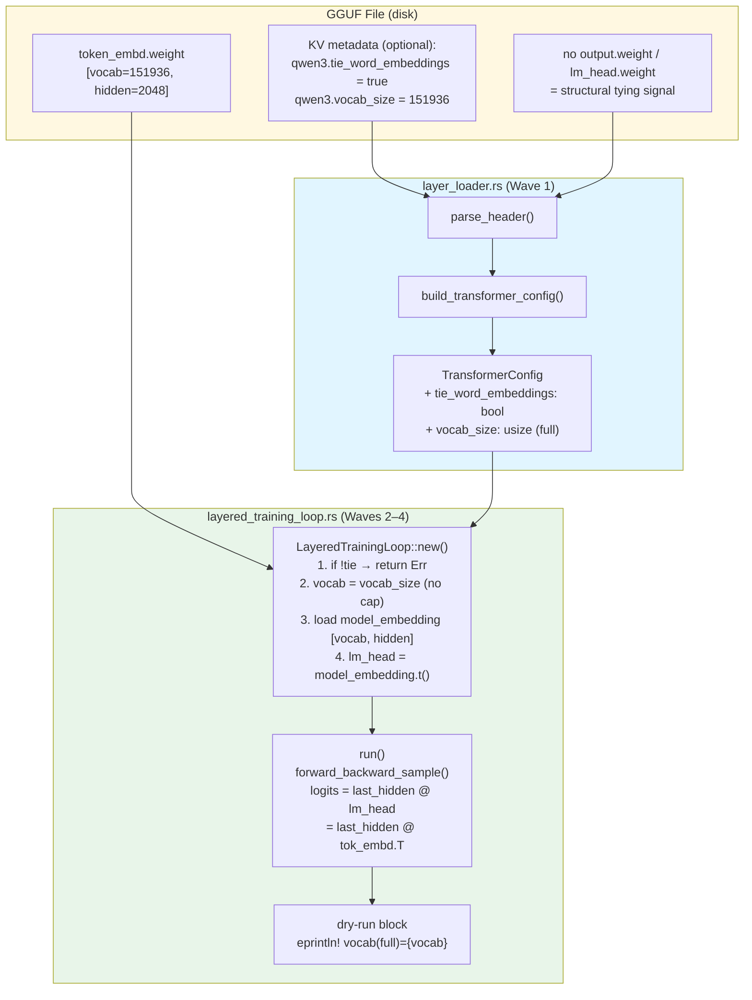
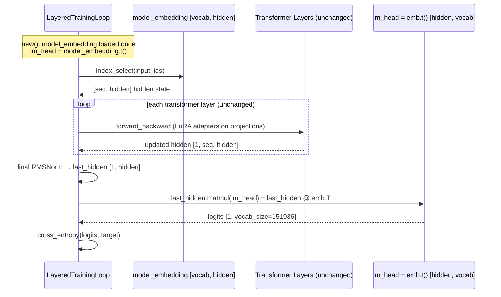

# Design Document: GWEN-221 — Lift VOCAB_CAP via Weight Tying

## Overview

GWEN-221 removes the `VOCAB_CAP=8192` constant from `layered_training_loop.rs` by leveraging Qwen3's tied token embedding and output projection. Explicit Boolean GGUF metadata takes precedence; when the key is absent, the standard GGUF representation with no standalone output-head tensor is accepted as structural evidence of tying. When weight tying is active the output head is the transpose of the already-resident token embedding matrix, so lifting the cap from 8192 to the full 151936 adds no second output-head buffer. A hard `Err` remains for explicit false, malformed metadata, or an absent key paired with a standalone output head.

The four implementation waves:

| Wave | Change | Files |
|------|--------|-------|
| 1 | Add `tie_word_embeddings: bool` to `TransformerConfig`; resolve metadata or structural tying | `layer_loader.rs` |
| 2 | Remove `VOCAB_CAP`; read full `vocab_size` from config | `layered_training_loop.rs` |
| 3 | Tie `lm_head = tok_embeddings.t()`; freeze both; block LoRA on them | `layered_training_loop.rs` |
| 4 | Update dry-run stderr line to `vocab(full)=<vocab_size>` | `layered_training_loop.rs` |

---

## Architecture

### System Component Diagram



### Data Flow: Weight-Tied Forward Pass



### Memory Budget After GWEN-221

```
Before GWEN-221 (VOCAB_CAP=8192):
  tok_embeddings [8192, 2048] f32  =   64 MB
  lm_head        [8192, 2048] f32  =   64 MB (separate buffer)
  TOTAL embedding+head             =  128 MB

After GWEN-221 (tie_word_embeddings=true, vocab=151936):
  tok_embeddings [151936, 2048] f32 = 1,175 MB (needed once)
  lm_head        = .t() view       =    0 MB additional (shared buffer)
  TOTAL embedding+head             = 1,175 MB

Expected increase over the old capped pair:
  1,175 MB - 128 MB                 = 1,047 MB

The full embedding is dequantized into a resident Candle f32 tensor during
construction. Weight tying removes the second full-vocabulary head allocation;
it does not make the full embedding lazy.
```

> The `load_matrix_rows` path for `model_embedding` dequantizes Q8_0 to f32. For Qwen3-1.7B this is `[151936, 2048]`, allocated once at construction and held for the entire training run. The `lm_head` field is a zero-copy `.t()` transpose view, so it introduces no second weight buffer.

---

## Components and Interfaces

### Wave 1: `TransformerConfig` Addition (`layer_loader.rs`)

```rust
/// Architecture values required by the training transformer forward.
#[derive(Debug, Clone)]
pub struct TransformerConfig {
    pub architecture:       String,
    pub n_layers:           usize,
    pub hidden_size:        usize,
    pub n_heads:            usize,
    pub n_kv_heads:         usize,
    pub intermediate_size:  usize,
    pub vocab_size:         usize,
    pub rms_norm_eps:       f32,
    pub rope_theta:         f32,
    // GWEN-221: Wave 1 addition ──────────────────────────────────
    /// Explicit Boolean metadata takes precedence. When the key is absent,
    /// no standalone output head is treated as structural weight tying.
    pub tie_word_embeddings: bool,
}
```

**Resolution rule in `build_transformer_config`:**

```rust
let tie_word_embeddings = match header.metadata.get(&prefixed("tie_word_embeddings")) {
    Some(MetadataValue::Bool(value)) => *value,
    Some(_) => false,
    None => !has_separate_output_head(&header.tensors),
};

Ok(TransformerConfig {
    // ... existing fields ...
    tie_word_embeddings,
})
```

**`MetadataValue::Bool` extraction** — `MetadataValue` already has the `Bool(bool)` variant (type code 7) and is parsed in `gguf_parser.rs`. No changes required there.

---

### Wave 2: Remove `VOCAB_CAP` (`layered_training_loop.rs`)

The constant is deleted:

```diff
-/// Upper bound on the fixed vocab dimension, keeping the resident
-/// embedding + output head bounded regardless of the model's true vocab.
-/// This is a *runtime cap* applied to whatever vocab the GGUF reports — not a
-/// per-model constant — so the loop stays model-agnostic and memory-safe.
-const VOCAB_CAP: usize = 8192;
```

In `LayeredTrainingLoop::new`, the `vocab` computation changes from:

```rust
// Before
let vocab = model_config.vocab_size.min(VOCAB_CAP).max(2);
```

to:

```rust
// After (Wave 2 + Wave 1 guard)
if !model_config.tie_word_embeddings {
    return Err(anyhow!(
        "GGUF '{}' does not declare tie_word_embeddings=true. \
         Full-vocab training without weight tying would require a ~1.16 GiB \
         standalone lm_head tensor — exceeding the GWEN-216 RAM budget. \
         Park this spec and open a sampled-softmax follow-up.",
        gguf_path.display()
    ));
}
let vocab = model_config.vocab_size.max(2);
```

The `load_capped_matrix` call for `model_embedding` receives `vocab` (now the full `vocab_size`) as its `rows` parameter:

```rust
let model_embedding = load_capped_matrix(
    &layer_loader,
    &["token_embd.weight", "model.embed_tokens.weight"],
    vocab,   // full vocab_size, not VOCAB_CAP
    hidden,
    &device,
)
.context("load full model embedding")?;
```

> **Compatibility**: The `load_capped_matrix` helper itself does not change. Its `rows` argument simply becomes `vocab_size` instead of `min(vocab_size, VOCAB_CAP)`. When `vocab_size ≤ stored_rows` the existing bounds check passes unchanged. For Qwen3-1.7B this is `151936 ≤ 151936` — exact match.

---

### Wave 3: Tied `lm_head` (`layered_training_loop.rs`)

The `lm_head` construction block in `new()` changes from a conditional load to an unconditional tie:

```rust
// Before (GWEN-220 era)
let lm_head = if layer_loader.find_tensor(&["output.weight", "lm_head.weight"]).is_some() {
    load_capped_matrix(&layer_loader, &["output.weight", "lm_head.weight"],
        vocab, hidden, &device).context("load capped output head")?
} else {
    model_embedding.clone()
};

// After (GWEN-221 Wave 3) — tie_word_embeddings=true is already guaranteed above
let lm_head = model_embedding
    .t()
    .context("transpose model_embedding for tied lm_head")?;
// Any output.weight / lm_head.weight present in the GGUF is intentionally ignored.
```

**LoRA exclusion** — No change required in code; the constraint is already satisfied by design:

- `model_embedding` and `lm_head` are plain `Tensor`s (not `Var`s), so they are not tracked by `VarMap` or `AdamW`.
- LoRA adapters are only created in the `for n in 0..num_layers` block over `proj_keys_ranked`, which operates on transformer projection tensors (`attn_q`, `ffn_gate`, etc.) — never on `token_embd.weight`.
- The VarMap key namespace uses `l{N}.{proj_key}.lora_{a|b}` for all trainable variables. No key `tok_embed.*` or `lm_head.*` is ever inserted.

This invariant is asserted in the correctness properties below and verified by the existing `extract_adapters_reads_layered_checkpoint_layout` test in `lora_bridge.rs`.

**Logit computation** in `forward_backward_sample`:

```rust
// model_embedding is [vocab, hidden], so lm_head is [hidden, vocab].
let logits = last_hidden.matmul(&self.lm_head)?;
```

> Transposing `lm_head` again would restore `[vocab, hidden]` and make the matrix multiplication invalid. The projection therefore uses the stored `[hidden, vocab]` view directly.

---

### Wave 4: Dry-Run Reporting Update (`layered_training_loop.rs`)

The dry-run `eprintln!` block changes from `vocab(capped)={}` to `vocab(full)={}`:

```rust
// Before
eprintln!(
    "[dry-run] vocab(capped)={} hidden={} layers={}",
    self.vocab, self.hidden, num_layers
);

// After
eprintln!(
    "[dry-run] vocab(full)={} hidden={} layers={}",
    self.vocab, self.hidden, num_layers
);
```

All other fields in the dry-run block (`trainable params`, `RSS start/peak/delta`, `step 1 loss`, `✓ no OOM`) are preserved unchanged.

---

## Data Models

### `TransformerConfig` (updated)

| Field | Type | Source | Notes |
|-------|------|--------|-------|
| `architecture` | `String` | `general.architecture` | e.g. `"qwen3"` |
| `n_layers` | `usize` | `<arch>.block_count` | Validated against tensor index |
| `hidden_size` | `usize` | `<arch>.embedding_length` | |
| `n_heads` | `usize` | `<arch>.attention.head_count` | |
| `n_kv_heads` | `usize` | `<arch>.attention.head_count_kv` | |
| `intermediate_size` | `usize` | `<arch>.feed_forward_length` | |
| `vocab_size` | `usize` | `<arch>.vocab_size` | 151936 for Qwen3-1.7B |
| `rms_norm_eps` | `f32` | `<arch>.attention.layer_norm_rms_epsilon` | |
| `rope_theta` | `f32` | `<arch>.rope.freq_base` | |
| **`tie_word_embeddings`** | **`bool`** | **`<arch>.tie_word_embeddings`** | **New. Defaults to `false` if absent or non-Bool** |

### `LayeredTrainingLoop` fields (GWEN-221 deltas)

| Field | Before | After | Notes |
|-------|--------|-------|-------|
| `vocab` | `vocab_size.min(VOCAB_CAP).max(2)` | `vocab_size.max(2)` | Full vocabulary |
| `model_embedding` | `[min(vocab_size,8192), hidden]` f32 | `[vocab_size, hidden]` f32 | Qwen3: [151936, 2048] |
| `lm_head` | conditional: either loaded or `emb.clone()` | `model_embedding.t()` | Zero-copy transpose view |
| `VOCAB_CAP` | `const VOCAB_CAP: usize = 8192;` | *(deleted)* | Removed entirely |

---

## Algorithm: `LayeredTrainingLoop::new` (GWEN-221 diff)

```
PROCEDURE LayeredTrainingLoop::new(config, gguf_path, batches, varmap, tx, initial_step)

  layer_loader ← LayerLoader::open(gguf_path)

  IF layer_loader.num_layers() == 0 THEN
    RETURN Err("no model.layers.* tensors")
  END IF

  model_config ← layer_loader.transformer_config().clone()
  hidden       ← model_config.hidden_size

  // ── GWEN-221 Wave 1+2 guard ──────────────────────────────────────
  IF NOT model_config.tie_word_embeddings THEN
    RETURN Err("GGUF does not declare tie_word_embeddings=true. \
                Full-vocab training requires weight tying. \
                Open sampled-softmax follow-up.")
  END IF
  vocab ← model_config.vocab_size.max(2)   // VOCAB_CAP removed
  // ─────────────────────────────────────────────────────────────────

  device ← Device::Cpu

  model_embedding ← load_capped_matrix(
    layer_loader,
    ["token_embd.weight", "model.embed_tokens.weight"],
    rows = vocab,          // full vocab_size — no cap
    input_dim = hidden,
    device
  )

  output_norm ← load_vector(layer_loader, ["output_norm.weight", "model.norm.weight"], hidden, device)

  // ── GWEN-221 Wave 3: tied lm_head ───────────────────────────────
  lm_head ← model_embedding.t()
  // Any output.weight / lm_head.weight in the GGUF is intentionally ignored.
  // lm_head is a zero-copy Candle transpose view; no additional f32 buffer.
  // ─────────────────────────────────────────────────────────────────

  // ... (layer_config, LoRA adapter creation, AdamW — unchanged from GWEN-220) ...

  RETURN Ok(LayeredTrainingLoop { ..., vocab, model_embedding, lm_head, ... })
END PROCEDURE
```

**Preconditions** (updated):
- `model_config.tie_word_embeddings` must be `true` (else `Err` returned before any allocation).
- `model_config.vocab_size ≥ 2` (enforced by `.max(2)`).

**Postconditions** (updated):
- `self.vocab = model_config.vocab_size.max(2)`.
- `self.lm_head` is the transpose of `self.model_embedding` — no independent buffer.
- `self.varmap` contains no `tok_embed.*` or `lm_head.*` keys.

---

## Error Handling

| Condition | Error message | Source location |
|-----------|--------------|-----------------|
| explicit `tie_word_embeddings = false` | Weight tying is not established; sampled-softmax diagnostic | `LayeredTrainingLoop::new` |
| key absent and standalone output head present | Same as above | `build_transformer_config` structural resolution |
| key absent and no standalone output head | Accepted as standard structural weight tying | `build_transformer_config` structural resolution |
| `tie_word_embeddings` key is non-Bool | Rejected; malformed metadata does not enable inference | `build_transformer_config` structural resolution |
| `load_matrix_rows` fails for embedding | `"load full model embedding: …"` | `.context()` in `new()` |
| `model_embedding.t()` fails | `"transpose model_embedding for tied lm_head: …"` | `.context()` in `new()` |

---

## Testing Strategy

### Unit Tests (deterministic)

**`layer_loader.rs` tests** (Wave 1):

- `test_tie_word_embeddings_true`: Build a GGUF with `<arch>.tie_word_embeddings = Bool(true)` KV; assert `TransformerConfig::tie_word_embeddings == true`.
- `tie_word_embeddings_absent_without_separate_head_is_inferred_true`: Build a GGUF with no key and no output head; assert `true`.
- `tie_word_embeddings_absent_with_separate_head_defaults_false`: Build a GGUF with no key and a separate output head; assert `false`.
- `tie_word_embeddings_non_bool_disables_structural_inference`: Build a GGUF with `U64(1)` and no output head; assert `false`.
- `tie_word_embeddings_explicit_false_overrides_structural_inference`: Build a GGUF with `Bool(false)` and no output head; assert `false`.

**`layered_training_loop.rs` tests** (Waves 2–4):

- `test_new_rejects_untied_gguf`: Pass a GGUF with `tie_word_embeddings=false`; assert `LayeredTrainingLoop::new` returns `Err` with a message containing `"sampled-softmax"`.
- `new_accepts_structurally_tied_gguf_without_metadata`: Pass a GGUF with no tying key and no separate output head; assert construction succeeds.
- `test_full_vocab_used_when_tied`: Construct with a tied GGUF of `vocab_size=16`; assert `ltl.vocab == 16`.
- `test_lm_head_is_transpose_of_embedding`: After `new()`, assert `lm_head.dims() == [hidden, vocab]` and `lm_head.matmul(&emb)` is identity-like.
- `test_no_lora_on_embedding_or_head`: Assert the VarMap contains no keys matching `"tok_embed"` or `"lm_head"`.
- `test_dry_run_emits_vocab_full`: Run with `max_steps=Some(1)`; capture stderr; assert contains `"vocab(full)="`.

### Test GGUF Helper Update

The existing `write_transformer_gguf` helper in `layered_training_loop.rs` and `write_transformer_gguf_pub` in `layer_loader.rs` must be updated to write `<arch>.tie_word_embeddings = Bool(true)` (KV type code `7`, then one byte `0x01`). This allows all existing tests to pass without modification to test configs (since `new()` now requires `tie_word_embeddings=true`).

GGUF KV encoding for the new field:
```
key:   "test.tie_word_embeddings"  (as length-prefixed string)
type:  7 (u32 little-endian) — BOOL
value: 1 (u8) — true
```

---

## Correctness Properties

*A property is a characteristic or behavior that should hold true across all valid executions of a system — essentially, a formal statement about what the system should do. Properties serve as the bridge between human-readable specifications and machine-verifiable correctness guarantees.*

### Property 1: `tie_word_embeddings` parsing round-trip

*For any* GGUF header that contains a `MetadataValue::Bool(b)` value at the key `<arch>.tie_word_embeddings`, the resulting `TransformerConfig::tie_word_embeddings` must equal `b`.

**Validates: Requirements 1.1, 1.2**

---

### Property 2: Structural fallback is conservative

*For any* GGUF header with an absent tying key, the resulting configuration is tied only when no standalone output-head tensor exists. Explicit false and non-Boolean values always produce `false`, even when the output head is absent.

**Validates: Requirements 1.3, 1.4, 1.5**

---

### Property 3: `new()` rejects all untied configs

*For any* otherwise-valid GGUF where `TransformerConfig::tie_word_embeddings` is `false`, `LayeredTrainingLoop::new` must return `Err`, and the error message must reference `"sampled-softmax"` to direct the caller to the follow-up spec.

**Validates: Requirements 1.5, 4.6**

---

### Property 4: Full `vocab_size` used as effective vocabulary

*For any* tied GGUF with `vocab_size = V` (where `V ≥ 2`), after a successful `LayeredTrainingLoop::new`, `self.vocab` must equal `V`. Token-ID modulo in `forward_backward_sample` must use `self.vocab` as the divisor, ensuring all results are in `[0, V)`.

**Validates: Requirements 2.2, 2.3, 2.4**

---

### Property 5: `lm_head` is the transposed embedding — no separate buffer

*For any* tied construction with embedding matrix `E` of shape `[vocab, hidden]`, the `lm_head` tensor must have shape `[hidden, vocab]` and satisfy `E.matmul(lm_head) ≈ E · E.T` (i.e. `lm_head` is the transpose of `E`). No additional f32 allocation for `output.weight` / `lm_head.weight` may occur.

**Validates: Requirements 3.1, 3.2, 2.5**

---

### Property 6: VarMap never contains tok_embeddings or lm_head adapters

*For any* `LayeredTrainingLoop` constructed with `tie_word_embeddings=true`, the `VarMap` must not contain any key that starts with `"tok_embed"` or `"lm_head"`. All trainable variables must use the `l{N}.{proj_key}.lora_{a|b}` namespace.

**Validates: Requirements 3.3**

---

### Property 7: Logits shape is `[1, vocab_size]`

*For any* tied training loop with `vocab_size = V` and any valid input sequence, the logit tensor produced by `last_hidden.matmul(&self.lm_head)` must have shape `[1, V]`.

**Validates: Requirements 3.5**

---

### Property 8: Dry-run reports `vocab(full)=<vocab_size>`

*For any* tied training loop with `vocab_size = V` executed with `max_steps = Some(1)`, the dry-run stderr output must contain the substring `"vocab(full)=V"` and must NOT contain `"vocab(capped)="`.

**Validates: Requirements 4.2, 5.1**

---

### Property 9: Dry-run stderr contains all mandatory fields

*For any* tied dry-run (`max_steps = Some(_)`), the stderr output must contain all of: `"vocab(full)="`, `"hidden="`, `"layers="`, `"trainable params="`, `"RSS"`, and `"loss="`.

**Validates: Requirements 5.3**

---

### Property 10: Loss remains numerically valid in the first 50 steps

*For any* 50-step run on any small JSONL dataset with a freshly initialized LoRA adapter, every reported CE loss value must be finite and non-negative. A low loss is not itself an error because zero-initialized LoRA B preserves the pretrained model's logits at step 1.

**Validates: Requirements 4.5**
