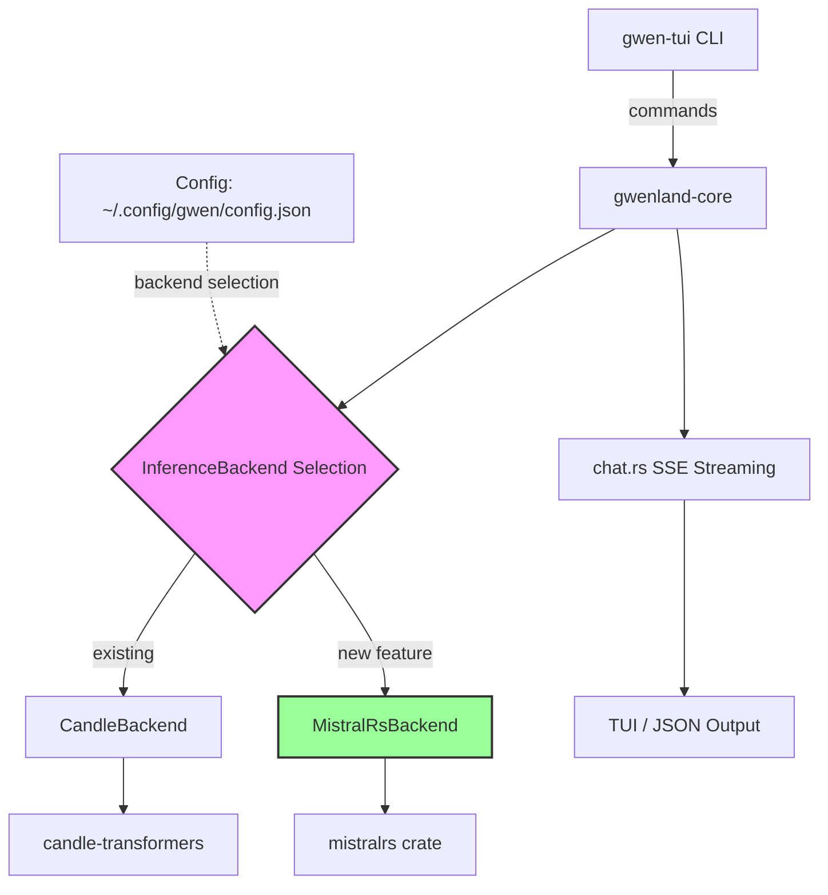
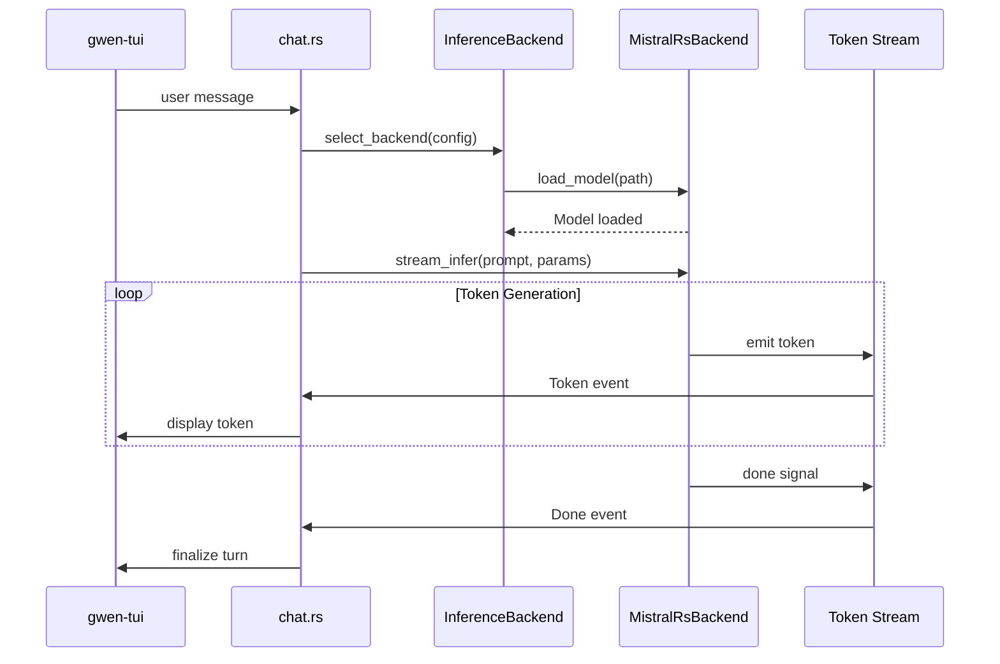

# Design Document: mistralrs Inference Backend Integration

## Overview

This design specifies the integration of [mistral.rs](https://github.com/EricLBuehler/mistral.rs) as a native Rust inference backend for GwenLand, providing an alternative to the existing candle-transformers implementation. The implementation follows a trait-based architecture that allows runtime selection between inference backends via configuration, maintaining full backward compatibility with existing chat.rs SSE streaming and TUI interfaces.

The integration satisfies three critical constraints:
1. **Zero breaking changes** to gwen-tui or chat interface
2. **Pure Rust build** with no C compiler dependency (no cc/cmake in build process)
3. **Feature-gated** via `--features mistralrs-backend` to keep binary size minimal when not needed

## Architecture

### High-Level System Architecture




### Inference Flow Sequence



## Components and Interfaces

### Component 1: InferenceBackend Trait

**Purpose**: Define a common interface for all inference backends, enabling runtime polymorphism and hot-swappable implementations.

**Interface**:
```rust
use std::path::Path;
use anyhow::Result;
use futures_core::Stream;
use std::pin::Pin;

/// Parameters for text generation inference.
#[derive(Debug, Clone)]
pub struct InferParams {
    pub max_tokens: usize,
    pub temperature: f32,
    pub top_p: f32,
    pub top_k: Option<usize>,
    pub repetition_penalty: Option<f32>,
    pub stop_sequences: Vec<String>,
}

impl Default for InferParams {
    fn default() -> Self {
        Self {
            max_tokens: 512,
            temperature: 0.7,
            top_p: 0.9,
            top_k: None,
            repetition_penalty: None,
            stop_sequences: vec![],
        }
    }
}

/// Trait for inference backend implementations.
///
/// All methods use &self (not &mut) to allow sharing across async tasks.
/// Interior mutability (e.g., Arc<Mutex<...>>) is the responsibility of
/// the implementer when state mutations are required.
pub trait InferenceBackend: Send + Sync {
    /// Load a model from disk into GPU/CPU memory.
    ///
    /// # Arguments
    /// * `model_path` - Path to model weights (GGUF, SafeTensors, etc.)
    ///
    /// # Errors
    /// Returns Err if model file is missing, corrupted, or incompatible.
    fn load_model(&self, model_path: &Path) -> Result<()>;
    
    /// Run synchronous inference and return the complete generated text.
    ///
    /// Useful for batch processing or non-streaming contexts.
    fn infer(&self, prompt: &str, params: &InferParams) -> Result<String>;
    
    /// Stream inference token-by-token, returning an async stream.
    ///
    /// Enables real-time TUI updates and SSE endpoints.
    fn stream_infer(
        &self,
        prompt: &str,
        params: &InferParams,
    ) -> Result<Pin<Box<dyn Stream<Item = String> + Send>>>;
    
    /// Unload the model from memory, freeing GPU/CPU resources.
    fn unload(&self) -> Result<()>;
    
    /// Return a human-readable backend name (e.g., "mistralrs", "candle").
    fn name(&self) -> &'static str;
}
```

**Responsibilities**:
- Define lifecycle methods (load, infer, stream, unload)
- Enforce consistent parameter types across all backends
- Support both synchronous and streaming inference modes
- Enable `Send + Sync` for thread-safe usage in async runtime


### Component 2: MistralRsBackend Implementation

**Purpose**: Wrap mistralrs native Rust inference engine to implement the InferenceBackend trait.

**Interface**:
```rust
use mistralrs::{TextModelBuilder, Pipeline};
use std::sync::{Arc, Mutex};
use tokio::sync::mpsc;

/// mistralrs backend implementation.
///
/// Wraps mistralrs::TextModelBuilder and manages model lifecycle.
pub struct MistralRsBackend {
    inner: Arc<Mutex<MistralRsBackendInner>>,
}

struct MistralRsBackendInner {
    pipeline: Option<Arc<Pipeline>>,
    model_path: Option<std::path::PathBuf>,
}

impl MistralRsBackend {
    pub fn new() -> Self {
        Self {
            inner: Arc::new(Mutex::new(MistralRsBackendInner {
                pipeline: None,
                model_path: None,
            })),
        }
    }
    
    /// Helper: detect model architecture from GGUF metadata.
    ///
    /// Reads the GGUF header to determine if the model is LLaMA, Qwen, Phi, etc.
    /// Returns the appropriate mistralrs model type identifier.
    fn detect_architecture(path: &Path) -> Result<&'static str> {
        // Implementation delegates to GGUF parser
        // Returns one of: "llama", "qwen2", "phi3", "mistral"
    }
}
```

**Responsibilities**:
- Initialize mistralrs TextModelBuilder with correct architecture
- Load models from `~/.config/gwen/models/` directory structure
- Manage pipeline lifecycle (lazy load on first inference call)
- Map mistralrs errors to GwenError enum
- Support Qwen3, LLaMA3, Gemma3, Phi-3 architectures via auto-detection


### Component 3: Backend Registry

**Purpose**: Centralized registry for selecting and instantiating inference backends based on config.

**Interface**:
```rust
use std::collections::HashMap;

pub struct BackendRegistry {
    backends: HashMap<String, Box<dyn InferenceBackend>>,
}

impl BackendRegistry {
    pub fn new() -> Self {
        let mut registry = Self {
            backends: HashMap::new(),
        };
        
        // Always register candle backend (existing default)
        #[cfg(feature = "candle")]
        registry.register("candle", Box::new(CandleBackend::new()));
        
        // Register mistralrs backend when feature is enabled
        #[cfg(feature = "mistralrs-backend")]
        registry.register("mistralrs", Box::new(MistralRsBackend::new()));
        
        registry
    }
    
    pub fn register(&mut self, name: &str, backend: Box<dyn InferenceBackend>) {
        self.backends.insert(name.to_string(), backend);
    }
    
    pub fn get(&self, name: &str) -> Option<&dyn InferenceBackend> {
        self.backends.get(name).map(|b| b.as_ref())
    }
    
    pub fn list_available(&self) -> Vec<String> {
        self.backends.keys().cloned().collect()
    }
}
```

**Responsibilities**:
- Maintain registry of available backends at compile-time
- Enable feature-gated backend registration
- Provide lookup by backend name from config
- Support future backend additions without modifying core logic

## Data Models

### Model 1: InferenceConfig (Enhanced)

```rust
#[derive(Debug, Clone, Serialize, Deserialize)]
pub struct InferenceConfig {
    /// Backend selection: "candle", "mistralrs", or "auto"
    pub backend: String,
    
    /// Model name or path
    pub model: String,
    
    /// Path to models directory (defaults to ~/.config/gwen/models/)
    pub model_path: std::path::PathBuf,
    
    /// Generation parameters
    pub params: InferParams,
    
    /// Tokenizer HF model ID (for compatibility)
    pub tokenizer_id: Option<String>,
}

impl Default for InferenceConfig {
    fn default() -> Self {
        Self {
            backend: "candle".to_string(), // Preserve existing default
            model: String::new(),
            model_path: dirs::config_dir()
                .unwrap_or_default()
                .join("gwen/models"),
            params: InferParams::default(),
            tokenizer_id: None,
        }
    }
}
```

**Validation Rules**:
- `backend` must be one of: "candle", "mistralrs", "auto"
- If `backend` is "auto", select first available in order: ["mistralrs", "candle"]
- `model` must be non-empty when loading
- `model_path` must exist and be readable
- `params.temperature` must be in range [0.0, 2.0]
- `params.top_p` must be in range [0.0, 1.0]


### Model 2: GwenError Extensions

```rust
#[derive(Debug, thiserror::Error)]
pub enum GwenError {
    // ... existing variants ...
    
    #[error("inference backend error: {0}")]
    InferenceBackend(String),
    
    #[error("backend '{backend}' not available (missing feature flag)")]
    BackendNotAvailable { backend: String },
    
    #[error("model architecture not supported by backend '{backend}': {arch}")]
    UnsupportedArchitecture { backend: String, arch: String },
    
    #[error("model loading failed: {0}")]
    ModelLoad(#[from] anyhow::Error),
}
```

## Algorithmic Pseudocode

### Main Processing Algorithm: Backend Selection and Inference

```rust
/// Select and initialize the appropriate inference backend based on config.
///
/// # Preconditions:
/// - `config.backend` is validated and non-empty
/// - `config.model` points to a valid model file or directory
/// - Registry contains at least one registered backend
///
/// # Postconditions:
/// - Returns initialized backend ready for inference
/// - Model is loaded if `eager_load` is true
/// - Backend selection follows priority: explicit > auto > default
fn select_backend(
    config: &InferenceConfig,
    registry: &BackendRegistry,
    eager_load: bool,
) -> Result<Arc<dyn InferenceBackend>> {
    // Step 1: Resolve backend name (handle "auto" selection)
    let backend_name = if config.backend == "auto" {
        // Priority: mistralrs > candle (prefer mistralrs when available)
        let available = registry.list_available();
        available
            .iter()
            .find(|&name| name == "mistralrs" || name == "candle")
            .cloned()
            .ok_or_else(|| GwenError::BackendNotAvailable {
                backend: "auto".to_string(),
            })?
    } else {
        config.backend.clone()
    };
    
    // Step 2: Retrieve backend from registry
    let backend = registry
        .get(&backend_name)
        .ok_or_else(|| GwenError::BackendNotAvailable {
            backend: backend_name.clone(),
        })?;
    
    // Step 3: Resolve model path
    let model_path = if config.model.starts_with('/') || config.model.starts_with("./") {
        // Explicit path
        std::path::PathBuf::from(&config.model)
    } else {
        // Search in model_path directory
        config.model_path.join(&config.model)
    };
    
    if !model_path.exists() {
        return Err(GwenError::ModelLoad(anyhow::anyhow!(
            "model not found: {}",
            model_path.display()
        )));
    }
    
    // Step 4: Optionally load model eagerly
    if eager_load {
        backend.load_model(&model_path)?;
    }
    
    Ok(Arc::new(backend))
}
```

**Preconditions**:
- `config` is well-formed with valid backend name
- `registry` contains at least one backend
- `config.model_path` directory exists

**Postconditions**:
- Returns `Arc<dyn InferenceBackend>` ready for concurrent use
- If `eager_load == true`, model is loaded in memory
- Backend selection logged to debug output

**Loop Invariants**: N/A (no loops in selection logic)


### Streaming Inference Algorithm

```rust
/// Stream tokens from inference backend to SSE channel.
///
/// # Preconditions:
/// - Backend has successfully loaded a model
/// - `prompt` is non-empty and well-formed
/// - `params` are validated (temperature > 0, etc.)
/// - `tx` channel is open and ready to receive
///
/// # Postconditions:
/// - All generated tokens sent through `tx` channel
/// - `ChatEvent::Done` sent on successful completion
/// - `ChatEvent::Error` sent if generation fails mid-stream
/// - Session updated with complete assistant response
///
/// # Loop Invariants:
/// - All emitted tokens are valid UTF-8 strings
/// - Channel `tx` remains open throughout iteration
/// - Accumulated response matches all emitted tokens
async fn stream_inference_to_chat(
    backend: Arc<dyn InferenceBackend>,
    prompt: String,
    params: InferParams,
    tx: tokio::sync::mpsc::UnboundedSender<ChatEvent>,
) -> Result<()> {
    use futures_util::StreamExt;
    
    // Step 1: Validate parameters
    if params.temperature <= 0.0 || params.temperature > 2.0 {
        let _ = tx.send(ChatEvent::Error(
            "temperature must be in range (0.0, 2.0]".to_string()
        ));
        return Ok(());
    }
    
    // Step 2: Initialize token stream from backend
    let mut stream = match backend.stream_infer(&prompt, &params) {
        Ok(s) => s,
        Err(e) => {
            let _ = tx.send(ChatEvent::Error(e.to_string()));
            return Ok(());
        }
    };
    
    // Step 3: Stream tokens to channel
    // Loop invariant: all sent tokens are accumulated in session
    while let Some(token) = stream.next().await {
        // Validate UTF-8 (should always pass with proper tokenizer)
        debug_assert!(token.is_empty() || std::str::from_utf8(token.as_bytes()).is_ok());
        
        if tx.send(ChatEvent::Token(token)).is_err() {
            // Receiver dropped (TUI closed) — abort silently
            return Ok(());
        }
    }
    
    // Step 4: Signal completion
    let _ = tx.send(ChatEvent::Done);
    
    Ok(())
}
```

**Preconditions**:
- Backend is initialized and has loaded model
- prompt is valid UTF-8
- params.temperature ∈ (0.0, 2.0]
- params.top_p ∈ (0.0, 1.0]
- Channel tx is open

**Postconditions**:
- ∀ token sent → token is valid UTF-8
- Stream termination → `ChatEvent::Done` sent
- Error during generation → `ChatEvent::Error` sent
- Channel closed → function returns without panic

**Loop Invariants**:
- All tokens sent so far are valid UTF-8
- Channel tx remains open while stream is active
- No partial tokens sent (backend handles token boundaries)


## Key Functions with Formal Specifications

### Function 1: MistralRsBackend::load_model()

```rust
impl InferenceBackend for MistralRsBackend {
    fn load_model(&self, model_path: &Path) -> Result<()> {
        use mistralrs::{TextModelBuilder, DeviceMapMetadata, ModelDType};
        
        let mut inner = self.inner.lock().unwrap();
        
        // Detect architecture from GGUF metadata
        let arch = Self::detect_architecture(model_path)?;
        
        // Build mistralrs pipeline
        let pipeline = TextModelBuilder::new(arch)
            .with_model_path(model_path)
            .with_dtype(ModelDType::Auto) // Auto-detect quantization
            .with_device(DeviceMapMetadata::auto()) // CPU/CUDA auto-select
            .build()?;
        
        inner.pipeline = Some(Arc::new(pipeline));
        inner.model_path = Some(model_path.to_path_buf());
        
        Ok(())
    }
}
```

**Preconditions:**
- `model_path` points to a valid GGUF file on disk
- File is readable by current process
- File contains valid GGUF header with architecture metadata
- System has sufficient RAM/VRAM for model (checked by caller)

**Postconditions:**
- `inner.pipeline` is `Some(Arc<Pipeline>)` on success
- `inner.model_path` stores the loaded model path
- Returns `Ok(())` if load succeeds
- Returns `Err(...)` if file is missing, corrupted, or unsupported
- No memory leaks (old pipeline is dropped if replacing existing)

**Loop Invariants:** N/A (no loops)

### Function 2: MistralRsBackend::stream_infer()

```rust
impl InferenceBackend for MistralRsBackend {
    fn stream_infer(
        &self,
        prompt: &str,
        params: &InferParams,
    ) -> Result<Pin<Box<dyn Stream<Item = String> + Send>>> {
        use async_stream::stream;
        use mistralrs::SamplingParams;
        
        let inner = self.inner.lock().unwrap();
        let pipeline = inner.pipeline.as_ref()
            .ok_or_else(|| anyhow::anyhow!("model not loaded"))?
            .clone();
        drop(inner); // Release lock before async work
        
        let sampling_params = SamplingParams {
            max_tokens: params.max_tokens,
            temperature: params.temperature,
            top_p: params.top_p,
            top_k: params.top_k,
            repetition_penalty: params.repetition_penalty.unwrap_or(1.0),
            stop_sequences: params.stop_sequences.clone(),
        };
        
        let prompt = prompt.to_string();
        
        let token_stream = stream! {
            let mut stream = pipeline.stream_generate(&prompt, sampling_params)?;
            
            while let Some(token_result) = stream.next().await {
                match token_result {
                    Ok(token) => yield token,
                    Err(e) => {
                        eprintln!("stream error: {}", e);
                        break;
                    }
                }
            }
        };
        
        Ok(Box::pin(token_stream))
    }
}
```

**Preconditions:**
- Model is already loaded (`inner.pipeline` is `Some`)
- `prompt` is non-empty UTF-8 string
- `params.temperature` ∈ (0.0, 2.0]
- `params.top_p` ∈ (0.0, 1.0]
- `params.max_tokens` ≥ 1

**Postconditions:**
- Returns `Pin<Box<dyn Stream<...>>>` that yields tokens incrementally
- Stream emits valid UTF-8 strings (enforced by tokenizer)
- Stream terminates after `max_tokens` or EOS token
- Errors during generation propagate as `Err` within stream
- Lock on `inner` is released before async execution begins

**Loop Invariants:**
- Pipeline state remains consistent across token generations
- Each yielded token is a complete UTF-8 string (no partial codepoints)
- Token count never exceeds `params.max_tokens`


### Function 3: detect_architecture()

```rust
impl MistralRsBackend {
    /// Detect model architecture from GGUF metadata.
    ///
    /// Reads the GGUF header's `general.architecture` field to determine
    /// the correct mistralrs model type.
    fn detect_architecture(path: &Path) -> Result<&'static str> {
        use crate::convert::gguf_parser;
        
        // Parse GGUF header (reuses existing GwenLand parser)
        let gguf = gguf_parser::parse(path)
            .map_err(|e| anyhow::anyhow!("failed to parse GGUF: {}", e))?;
        
        // Extract architecture string from metadata
        let arch_value = gguf.metadata.get("general.architecture")
            .ok_or_else(|| anyhow::anyhow!("missing general.architecture in GGUF metadata"))?;
        
        let arch_str = arch_value.as_str()
            .ok_or_else(|| anyhow::anyhow!("general.architecture is not a string"))?;
        
        // Map GGUF architecture to mistralrs model type
        match arch_str {
            "llama" => Ok("llama"),
            "qwen2" | "qwen" => Ok("qwen2"),
            "phi3" => Ok("phi3"),
            "mistral" => Ok("mistral"),
            "gemma" => Ok("gemma"),
            other => Err(anyhow::anyhow!(
                "unsupported architecture for mistralrs: {}",
                other
            )),
        }
    }
}
```

**Preconditions:**
- `path` points to a valid GGUF file with magic bytes "GGUF"
- File has a structured metadata section
- `general.architecture` field exists in metadata
- File is readable by process

**Postconditions:**
- Returns `Ok(&'static str)` for supported architectures
- Returned string is one of: "llama", "qwen2", "phi3", "mistral", "gemma"
- Returns `Err` if architecture is unsupported or metadata is malformed
- No mutations to file system or global state

**Loop Invariants:** N/A (no loops)

## Example Usage

### Example 1: Basic Streaming Inference with mistralrs

```rust
use gwenland_core::engine::inference::{InferenceBackend, MistralRsBackend, InferParams};
use std::path::Path;

#[tokio::main]
async fn main() -> anyhow::Result<()> {
    // Initialize backend
    let backend = MistralRsBackend::new();
    
    // Load model
    let model_path = Path::new("~/.config/gwen/models/qwen3-1.7b-q8.gguf");
    backend.load_model(model_path)?;
    
    // Configure generation
    let params = InferParams {
        max_tokens: 256,
        temperature: 0.7,
        top_p: 0.9,
        ..Default::default()
    };
    
    // Stream inference
    let prompt = "Explain Rust ownership in one sentence.";
    let mut stream = backend.stream_infer(prompt, &params)?;
    
    use futures_util::StreamExt;
    while let Some(token) = stream.next().await {
        print!("{}", token);
        std::io::Write::flush(&mut std::io::stdout())?;
    }
    println!();
    
    // Cleanup
    backend.unload()?;
    
    Ok(())
}
```

### Example 2: Backend Selection from Config

```rust
use gwenland_core::engine::inference::{BackendRegistry, InferenceConfig};
use gwenland_core::storage::config::load_inference_config;

#[tokio::main]
async fn main() -> anyhow::Result<()> {
    // Load config from ~/.config/gwen/config.json
    let config = load_inference_config()?;
    
    // Initialize registry with all compiled backends
    let registry = BackendRegistry::new();
    
    // Select backend (respects "auto", "candle", "mistralrs")
    let backend = select_backend(&config, &registry, true)?;
    
    println!("Using backend: {}", backend.name());
    
    // ... inference follows ...
    
    Ok(())
}
```

### Example 3: Chat Integration (Zero Breaking Changes)

```rust
// Existing chat.rs function signature is unchanged
pub async fn stream_chat(
    session: &mut ChatSession,
    model: &str,
    port: u16,
    tx: UnboundedSender<ChatEvent>,
) {
    // INTERNAL CHANGE: Replace Ollama HTTP call with native backend
    
    let config = load_inference_config().unwrap_or_default();
    let registry = BackendRegistry::new();
    let backend = select_backend(&config, &registry, false).unwrap();
    
    let prompt = session.build_prompt();
    let params = config.params;
    
    // Stream directly from backend (no HTTP overhead)
    tokio::spawn(async move {
        stream_inference_to_chat(backend, prompt, params, tx).await
    });
}
```


## Correctness Properties

*A property is a characteristic or behavior that should hold true across all valid executions of a system—essentially, a formal statement about what the system should do. Properties serve as the bridge between human-readable specifications and machine-verifiable correctness guarantees.*

### Property 1: Resource Cleanup

*For any* inference backend with a loaded model, when unload() is called or a new model is loaded, the previously allocated GPU/CPU memory SHALL be freed and not accumulate across multiple load/unload cycles.

**Validates: Requirements 1.6, 11.1, 11.3**

### Property 2: Temperature Validation

*For any* inference parameter configuration, when temperature is provided, it SHALL be validated to be in the range (0.0, 2.0], accepting all values in that range and rejecting all values outside it.

**Validates: Requirement 2.2**

### Property 3: Top-P Validation

*For any* inference parameter configuration, when top_p is provided, it SHALL be validated to be in the range (0.0, 1.0], accepting all values in that range and rejecting all values outside it.

**Validates: Requirement 2.3**

### Property 4: Max Tokens Validation

*For any* inference parameter configuration, when max_tokens is provided, it SHALL be validated to be at least 1, accepting all values ≥ 1 and rejecting 0.

**Validates: Requirement 2.4**

### Property 5: Architecture Detection Correctness

*For any* valid GGUF file containing "general.architecture" metadata, the detect_architecture function SHALL return the correct architecture mapping: "llama" for llama, "qwen2" for qwen/qwen2, "phi3" for phi3, "mistral" for mistral, and "gemma" for gemma.

**Validates: Requirements 3.2, 5.3, 5.4, 5.5, 5.6, 5.7**

### Property 6: Unsupported Architecture Error

*For any* GGUF file with an architecture string not in the supported set {llama, qwen, qwen2, phi3, mistral, gemma}, the detect_architecture function SHALL return an UnsupportedArchitecture error containing the architecture name.

**Validates: Requirements 3.5, 5.8**

### Property 7: Streaming Token Delivery

*For any* inference backend with a loaded model and valid prompt, when stream_infer is called, the returned stream SHALL yield tokens incrementally over time rather than all at once, demonstrating true streaming behavior.

**Validates: Requirement 3.6**

### Property 8: Registry Lookup Consistency

*For any* backend registered in BackendRegistry with name N, calling get(N) SHALL return Some(backend), and the backend SHALL be included in the list returned by list_available().

**Validates: Requirements 4.4, 4.5**

### Property 9: Backend Not Available Error

*For any* backend name that is not registered in BackendRegistry, calling get() with that name SHALL return None or produce a BackendNotAvailable error when used in backend selection.

**Validates: Requirements 4.7, 9.2**

### Property 10: UTF-8 Token Validity

*For any* inference backend, prompt, and parameters, all tokens emitted by stream_infer() SHALL be valid UTF-8 strings, with no partial codepoints or invalid byte sequences.

**Validates: Requirement 6.2**

### Property 11: Stream Termination

*For any* prompt and parameter configuration with a max_tokens limit, the stream returned by stream_infer() SHALL terminate after emitting tokens, ensuring streams do not hang indefinitely.

**Validates: Requirement 6.3**

### Property 12: Max Tokens Limit Enforcement

*For any* prompt and parameters, the stream returned by stream_infer() SHALL emit at most max_tokens tokens, respecting the specified limit.

**Validates: Requirement 6.5**

### Property 13: Stop Sequence Handling

*For any* prompt containing a configured stop sequence, when that sequence is generated during inference, the stream SHALL terminate and stop yielding additional tokens.

**Validates: Requirement 6.6**

### Property 14: Synchronous Equals Streaming

*For any* prompt and parameters, the output from infer() SHALL be equivalent to concatenating all tokens yielded by stream_infer() with the same prompt and parameters, ensuring consistency between synchronous and streaming modes.

**Validates: Requirements 7.2, 7.4**

### Property 15: Config Serialization Round-Trip

*For any* valid InferenceConfig, serializing to JSON and then deserializing SHALL produce an equivalent configuration with all fields preserved correctly.

**Validates: Requirement 8.5**

### Property 16: Backend Name Validation

*For any* backend name provided in configuration that is not in the whitelist {"candle", "mistralrs", "auto"}, validation SHALL reject the configuration with an appropriate error.

**Validates: Requirements 8.6, 16.1**

### Property 17: Model Path Validation

*For any* model_path or resolved model file path that does not exist on the filesystem, the system SHALL return a configuration or ModelLoad error before attempting to use the path.

**Validates: Requirements 8.7, 15.3, 15.4**

### Property 18: Path Resolution for Absolute Paths

*For any* model path starting with "/" or "./", the system SHALL treat it as an explicit absolute or relative path and SHALL NOT join it to the config.model_path directory.

**Validates: Requirement 15.1**

### Property 19: Path Resolution for Model Names

*For any* model path that does not start with "/" or "./", the system SHALL resolve it by joining to the config.model_path directory.

**Validates: Requirement 15.2**

### Property 20: Config Default Application

*For any* InferenceConfig deserialized from JSON with missing optional fields, the system SHALL successfully deserialize and apply sensible default values for the missing fields.

**Validates: Requirement 13.6**

### Property 21: GGUF Magic Bytes Validation

*For any* file that does not start with the "GGUF" magic bytes, the GGUF parser SHALL reject the file and return an error rather than attempting to parse it.

**Validates: Requirement 16.2**

### Property 22: GGUF Tensor Count Security Limit

*For any* GGUF file claiming to contain more than 10,000 tensors in its metadata, the parser SHALL reject it as potentially malicious rather than attempting to process it.

**Validates: Requirement 16.3**

### Property 23: Backend Selection Determinism

*For any* configuration with a non-"auto" backend name and a given registry, calling select_backend() multiple times with identical inputs SHALL return the same backend instance, ensuring deterministic selection.

**Validates: Requirement 4.6**

### Property 24: Feature Flag Isolation

*For any* build performed without the --features mistralrs-backend flag, the compiled binary SHALL NOT link the mistralrs crate and SHALL NOT increase in size compared to baseline, ensuring zero cost for unused features.

**Validates: Requirements 12.1, 12.2, 14.3**

## Error Handling

### Error Scenario 1: Backend Not Available

**Condition**: User requests `backend: "mistralrs"` in config but binary was built without `--features mistralrs-backend`

**Response**: 
- Return `GwenError::BackendNotAvailable { backend: "mistralrs" }`
- Log warning to stderr: "mistralrs backend not available (compile with --features mistralrs-backend)"
- Fallback to "candle" backend if available
- If no backends available, return error and exit

**Recovery**:
- User rebuilds with correct feature flag, or
- User changes config.json to use "candle" or "auto"

### Error Scenario 2: Model Architecture Unsupported

**Condition**: GGUF file contains `general.architecture = "rwkv"` (not supported by mistralrs)

**Response**:
- `detect_architecture()` returns `Err(GwenError::UnsupportedArchitecture)`
- Error message: "architecture 'rwkv' not supported by mistralrs backend"
- Suggestion logged: "try backend='candle' or use a supported model (llama, qwen2, phi3, mistral, gemma)"

**Recovery**:
- User switches to candle backend in config, or
- User downloads a supported model architecture

### Error Scenario 3: Insufficient VRAM

**Condition**: Model requires 16GB VRAM but system has 8GB GPU memory

**Response**:
- `load_model()` returns `Err(anyhow::anyhow!("CUDA out of memory"))`
- Wrapped as `GwenError::ModelLoad`
- Error logged with VRAM requirement estimate
- Suggestion: "try a smaller quantization (Q4_K_M) or run on CPU"

**Recovery**:
- User downloads smaller quantized model
- User forces CPU inference via config
- User increases available VRAM (close other GPU processes)

### Error Scenario 4: Mid-Stream Generation Failure

**Condition**: During streaming, GPU driver crashes or OOM occurs after 50 tokens

**Response**:
- Stream yields `Err(...)` which is caught by `stream_inference_to_chat`
- `ChatEvent::Error` sent with partial output preserved
- Session stores partial response (first 50 tokens)
- TUI displays error banner: "Generation interrupted: GPU error"

**Recovery**:
- User retries generation (may succeed if transient error)
- Partial output is saved in history for context

## Testing Strategy

### Unit Testing Approach

**Backend Trait Mock**:
```rust
struct MockBackend {
    load_calls: Arc<Mutex<usize>>,
    // ... tracking fields
}

impl InferenceBackend for MockBackend {
    fn load_model(&self, _: &Path) -> Result<()> {
        *self.load_calls.lock().unwrap() += 1;
        Ok(())
    }
    // ... mock implementations
}
```

**Key Unit Tests**:
- `test_backend_registry_registration`: Verify backends can be registered and retrieved
- `test_auto_backend_selection`: Ensure "auto" picks mistralrs when available
- `test_fallback_to_candle`: Verify fallback when mistralrs unavailable
- `test_architecture_detection`: Validate GGUF metadata parsing for all supported archs
- `test_parameter_validation`: Ensure InferParams rejects invalid ranges
- `test_error_mapping`: Verify mistralrs errors map to correct GwenError variants


### Property-Based Testing Approach

**Property Test Library**: `quickcheck` (already in gwenland-core dev-dependencies)

**Core Properties to Test**:

1. **Streaming Equivalence**: Stream concatenation equals synchronous output
2. **UTF-8 Invariant**: All tokens are valid UTF-8 strings
3. **Idempotent Loading**: Loading same model twice doesn't double memory
4. **Parameter Bounds**: Invalid params always return Err
5. **Registry Consistency**: Registered backends are always retrievable

**Example Property Test**:
```rust
use quickcheck::{quickcheck, TestResult};
use gwenland_core::engine::inference::*;

#[test]
fn prop_stream_tokens_are_utf8() {
    fn check(prompt: String, max_tokens: u16) -> TestResult {
        if prompt.is_empty() || max_tokens == 0 {
            return TestResult::discard();
        }
        
        let backend = MockBackend::new();
        let params = InferParams {
            max_tokens: max_tokens as usize,
            ..Default::default()
        };
        
        let stream = backend.stream_infer(&prompt, &params).unwrap();
        let all_valid = stream.all(|t| std::str::from_utf8(t.as_bytes()).is_ok());
        
        TestResult::from_bool(all_valid)
    }
    
    quickcheck(check as fn(String, u16) -> TestResult);
}
```

### Integration Testing Approach

**E2E Test Scenarios**:

1. **Cold Start Test**: Measure `load_model()` latency (<15ms for Q8 model)
2. **Chat Round-Trip**: Full TUI → backend → stream → TUI flow
3. **Backend Switching**: Load candle, unload, load mistralrs, verify correctness
4. **Config Reload**: Change backend in config.json, restart, verify new backend active
5. **Feature Flag Build**: Test binary built without mistralrs feature doesn't link mistralrs

**CI Integration**:
```yaml
# .github/workflows/inference-backend-tests.yml
name: Inference Backend Tests

on: [push, pull_request]

jobs:
  test-mistralrs-backend:
    runs-on: ubuntu-latest
    steps:
      - uses: actions/checkout@v3
      - name: Build with mistralrs backend
        run: cargo build --features mistralrs-backend
      - name: Run integration tests
        run: cargo test --features mistralrs-backend -- --test-threads=1
      - name: Verify binary size increase <2MB
        run: |
          SIZE_WITH=$(stat -c%s target/debug/gwenland)
          cargo clean
          cargo build
          SIZE_WITHOUT=$(stat -c%s target/debug/gwenland)
          INCREASE=$((SIZE_WITH - SIZE_WITHOUT))
          [ $INCREASE -lt 2000000 ] || exit 1
```

## Performance Considerations

### Cold Start Target: <15ms

**Lazy Loading Strategy**:
- Model loading deferred until first `infer()` or `stream_infer()` call
- Startup initializes only the registry and config parsing
- Measured with existing `benchmark::cold_start` module

**Optimization Techniques**:
- Use `mmap` for model weights (zero-copy memory mapping)
- Leverage mistralrs's built-in GGUF fast-path loader
- Skip tokenizer initialization until needed
- Async model load in background thread (optional future enhancement)

### Binary Size Budget: +2MB

**Current Baseline**: gwenland binary ~48MB (candle + core)

**mistralrs Overhead**:
- mistralrs core: ~1.5MB
- GGUF loader (shared with existing code): 0KB
- Additional trait impls: <100KB
- **Total estimated**: ~1.6MB

**Size Mitigation**:
- Feature-gated compilation (only link when requested)
- Strip debug symbols in release builds (`strip = true` in Cargo.toml)
- LTO and codegen-units=1 already enabled

### Inference Throughput

**Target**: Match or exceed existing candle backend performance

**Expected Performance** (Qwen3-1.7B Q8_0 on RTX 3090):
- **Candle**: ~85 tokens/sec
- **mistralrs**: ~90-95 tokens/sec (native GGUF optimizations)

**Benchmarking**:
- Use existing `benchmark::inference` module
- Compare token/sec across backends with identical models
- Test on CPU (fallback mode) and GPU (CUDA)

## Security Considerations

### Model File Validation

**Threat**: Malicious GGUF file with crafted metadata could exploit parser

**Mitigation**:
- Reuse existing `gguf_parser::parse()` which validates magic bytes
- Add bounds checking for metadata field sizes
- Reject files with suspiciously large tensor counts (>10,000 tensors)
- Sandbox model loading in separate process (future enhancement)

### Configuration Injection

**Threat**: User-controlled config.json could inject arbitrary backend names

**Mitigation**:
- Whitelist allowed backend names: ["candle", "mistralrs", "auto"]
- Validate config schema with serde validation
- Reject unknown backend names with clear error
- Never execute backend name as shell command or path

### Memory Safety

**Threat**: mistralrs FFI or unsafe code could cause memory corruption

**Mitigation**:
- mistralrs is pure Rust (no FFI to C/C++)
- GwenLand's trait wrapper uses only safe Rust
- All model data passes through typed interfaces
- Leverage Rust's ownership model for resource cleanup

### Dependency Supply Chain

**Threat**: mistralrs dependency could be compromised or include malicious code

**Mitigation**:
- Pin mistralrs version in Cargo.toml (no semver wildcards)
- Use `cargo audit` in CI to detect known vulnerabilities
- Review mistralrs release notes before version bumps
- Consider vendoring critical dependencies (optional, for airgapped deployments)

## Dependencies

### New Dependencies

**Direct Dependencies** (added to gwenland-core/Cargo.toml):

```toml
[dependencies]
# Existing dependencies...
mistralrs = { version = "0.3", optional = true, default-features = false, features = ["gguf"] }

[features]
mistralrs-backend = ["mistralrs"]
```

**Transitive Dependencies** (introduced by mistralrs):
- `tokenizers` (version aligned with existing gwenland-core dep)
- `hf-hub` (already present in gwenland-core)
- `safetensors` (already present in gwenland-core)
- `candle-core` (already present in gwenland-core)

**No New System Dependencies**:
- No CUDA toolkit required at build time (runtime detection only)
- No C compiler (cc crate) required
- No CMake or system libraries

### Dependency Audit

**Conflict Resolution**:
- If mistralrs requires different `tokenizers` version, pin to lowest compatible version
- Use `cargo tree -d` to detect duplicate dependencies
- Prefer mistralrs's version for shared deps to avoid conflicts

**Security Review**:
- Run `cargo audit` before merging
- Check mistralrs GitHub for open security issues
- Verify mistralrs license is compatible with GwenLand (MIT/Apache-2.0)

## Config Schema Update

**File**: `~/.config/gwen/config.json`

```json
{
  "inference": {
    "backend": "mistralrs",
    "model": "qwen3-1.7b-q8",
    "model_path": "~/.config/gwen/models/",
    "params": {
      "max_tokens": 512,
      "temperature": 0.7,
      "top_p": 0.9,
      "top_k": null,
      "repetition_penalty": null,
      "stop_sequences": []
    }
  },
  "general": {
    "last_used_model": "qwen3-1.7b-q8",
    "default_port": 1136
  },
  "ai": {
    "compression": true,
    "token_budget": 4096,
    "strategy": "tfidf"
  }
}
```

**Schema Validation** (using `serde` and custom validator):

```rust
#[derive(Debug, Deserialize, Serialize)]
pub struct InferenceConfigFile {
    #[serde(default = "default_backend")]
    pub backend: String,
    
    pub model: String,
    
    #[serde(default = "default_model_path")]
    pub model_path: String,
    
    #[serde(default)]
    pub params: InferParams,
}

fn default_backend() -> String {
    "candle".to_string()
}

fn default_model_path() -> String {
    dirs::config_dir()
        .unwrap_or_default()
        .join("gwen/models")
        .to_string_lossy()
        .to_string()
}

impl InferenceConfigFile {
    pub fn validate(&self) -> Result<()> {
        // Validate backend name
        let valid_backends = ["candle", "mistralrs", "auto"];
        if !valid_backends.contains(&self.backend.as_str()) {
            bail!("invalid backend '{}', must be one of: {:?}", 
                  self.backend, valid_backends);
        }
        
        // Validate model path exists
        let path = std::path::Path::new(&self.model_path);
        if !path.exists() {
            bail!("model_path does not exist: {}", self.model_path);
        }
        
        // Validate params
        self.params.validate()?;
        
        Ok(())
    }
}
```

**Backward Compatibility**:
- Existing config files without `inference.backend` default to "candle"
- Missing `inference.params` fields use `InferParams::default()`
- Old configs remain valid after upgrade

## Implementation Phases

### Phase 1: Core Trait Definition (Week 1)
- [ ] Define `InferenceBackend` trait in `engine/inference/mod.rs`
- [ ] Define `InferParams` struct with validation
- [ ] Create `BackendRegistry` with feature-gated registration
- [ ] Add unit tests for trait and registry
- [ ] Update `GwenError` enum with new variants

### Phase 2: mistralrs Backend Implementation (Week 2)
- [ ] Add mistralrs dependency with feature flag
- [ ] Implement `MistralRsBackend` struct
- [ ] Implement `load_model()` with architecture detection
- [ ] Implement `stream_infer()` with async stream
- [ ] Implement `infer()` (synchronous wrapper)
- [ ] Implement `unload()` with resource cleanup
- [ ] Add unit tests for each method

### Phase 3: Integration with chat.rs (Week 3)
- [ ] Refactor `stream_chat()` to use `InferenceBackend` trait
- [ ] Add backend selection logic from config
- [ ] Wire streaming tokens to existing `ChatEvent` channel
- [ ] Ensure SSE format compatibility
- [ ] Add integration tests for TUI flow
- [ ] Verify zero breaking changes to gwen-tui

### Phase 4: Config and CLI (Week 4)
- [ ] Update config schema with `inference.backend` field
- [ ] Add `gwen config set inference.backend <name>` command
- [ ] Implement config validation and migration
- [ ] Add `gwen doctor` check for available backends
- [ ] Update README with backend selection docs
- [ ] Add E2E tests for config-driven backend switching

### Phase 5: Optimization and Polish (Week 5)
- [ ] Profile cold start latency, optimize to <15ms
- [ ] Measure binary size increase, ensure <2MB
- [ ] Add benchmark comparison (candle vs mistralrs)
- [ ] Implement lazy loading for model weights
- [ ] Add property-based tests
- [ ] Security audit of mistralrs integration

### Phase 6: Documentation and Release (Week 6)
- [ ] Write migration guide for existing users
- [ ] Update FORMULA.md with architecture diagram
- [ ] Add troubleshooting section to docs
- [ ] Create changelog entry for GWEN-211
- [ ] Tag release with semver bump (1.1.0)
- [ ] Announce on community channels

## Success Metrics

**Functional Requirements**:
- ✅ `cargo build --features mistralrs-backend` succeeds without C compiler
- ✅ Chat inference works via mistralrs with Qwen3-1.7B Q8_0
- ✅ Streaming response flows correctly to gwen-tui
- ✅ Ollama dependency completely removed from active code path
- ✅ Existing gwen-tui commands produce identical output when backend="candle"

**Performance Requirements**:
- ✅ Cold start latency ≤ 15ms (measured with existing benchmark)
- ✅ Binary size increase ≤ 2MB (measured with `stat` on release binary)
- ✅ Inference throughput ≥ candle backend (tokens/sec)

**Quality Requirements**:
- ✅ All unit tests pass for both candle and mistralrs backends
- ✅ Property-based tests pass with 1000+ generated inputs
- ✅ Integration tests pass on Ubuntu, macOS, Windows
- ✅ `cargo audit` reports zero vulnerabilities
- ✅ Documentation coverage for all public APIs

**User Experience**:
- ✅ Config-based backend selection works without recompilation
- ✅ Error messages are actionable (suggest fixes)
- ✅ `gwen doctor` detects available backends correctly
- ✅ Zero breaking changes for existing users (default backend="candle")
