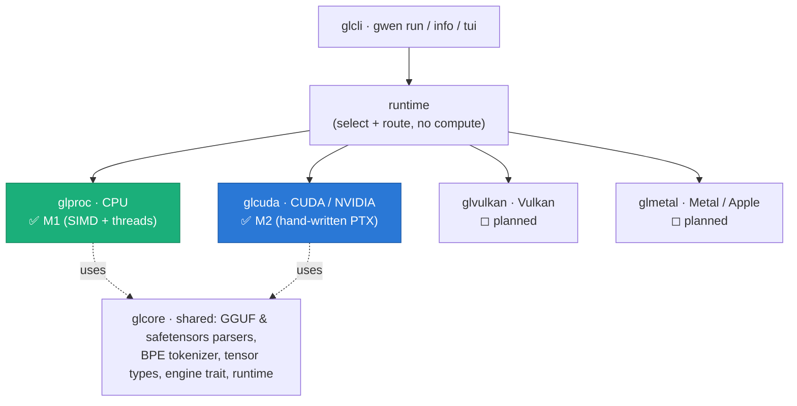

# GwenLand

**Local-first LLM inference in pure Rust.** No Python, no CUDA toolkit, no
`nvcc`, no vendor SDKs at build time — one Cargo workspace that loads GGUF /
safetensors models and runs them on your CPU or GPU. The GPU backends ship
hand-written kernels (PTX for CUDA) and load the driver at runtime, so the same
tree builds on a machine with no GPU at all.

GwenLand targets modest hardware — the reference CPU box is an 11th-gen i3 with
8 GB of RAM — with an mmap-based loader that streams model weights without
blowing the RAM budget. A GPU is optional.

> Status: pre-1.0. The CPU engine (`glproc`) runs models end-to-end today. The
> CUDA engine (`glcuda`) has **passed its M2 milestone** — validated on real
> hardware (see below). Vulkan and Metal backends are scaffolded but not yet
> implemented.

---

## Architecture: the "gl-stack"

Every backend is an independent engine implementing one shared trait
(`glcore::engine_trait`). A thin runtime selects an engine and routes requests —
it owns no compute logic — so engines never depend on each other and can be added
without touching the runtime.



| Crate | Role | Status |
|-------|------|--------|
| `glcore` | Shared: GGUF/safetensors parsers (from scratch, mmap zero-copy), BPE tokenizer, `Tensor` types, the engine trait, the runtime | ✅ |
| `glproc` | CPU engine — scalar → SIMD + threaded matmul, attention, KV cache, sampler | ✅ M1 |
| `glcuda` | CUDA engine — CUDA Driver FFI, hand-written PTX kernels (SIMT), VRAM bump allocator, CUDA-graph decode | ✅ **M2** |
| `glvulkan` | Vulkan compute backend (cross-vendor) | ◻ planned |
| `glmetal` | Metal backend (Apple Silicon) | ◻ planned |
| `glcli` | The `gwen` command-line interface | ✅ |

---

## Building

Needs a recent Rust toolchain. From the workspace root:

```bash
cargo build --release -p glcli      # builds the `gwen` binary
```

The binary lands at `target/release/gwen`. No CUDA toolkit is required to build —
`glcuda` loads `libcuda.so.1` at runtime and ships its kernels as PTX.

## Running

```bash
# one-shot inference on a local GGUF
gwen run model.gguf --prompt "Explain what a GPU is in one sentence."

# interactive REPL (omit --prompt)
gwen run model.gguf

# model metadata
gwen info model.gguf
```

`gwen run` flags: `--prompt`, `--max-tokens` (256), `--temperature` (0.8),
`--top-k` (40), `--top-p` (0.95), `--repeat-penalty` (1.1), `--raw` (skip the chat
template). The CLI currently runs on the CPU engine; the CUDA engine is validated
standalone (see the notebook below) and is being wired into the runtime's
fallback chain.

---

## glcuda — the CUDA backend (M2 ✅)

`glcuda` is a from-scratch CUDA SIMT inference engine with **hand-authored PTX
kernels** — no `nvcc`, no cuBLAS. It has passed every criterion of its M2
Definition of Done on a **Tesla T4** (sm_75): full forward pass with coherent
output, tensor-by-tensor numerical parity against the CPU engine (14/14 tests),
backend-buffer reuse (zero `cudaMalloc` after init), mmap loading, no VRAM leaks.

Measured on the T4 (Qwen2.5-7B-Q8_0):

- **decode 29.2 tok/s** — 88 % of the card's memory bandwidth (bandwidth-bound,
  as expected for weight-streaming decode)
- **prefill 73 tok/s** via batched GEMM
- coherent output, parity with the CPU reference within spec ε

Full write-up, charts, and the Definition-of-Done table:
[`docs/ArchGLCuda/ArchGLML_Done.md`](docs/ArchGLCuda/ArchGLML_Done.md).
Benchmark methodology: [`docs/ArchGLCuda/BENCHMARK_ArchGLCuda.md`](docs/ArchGLCuda/BENCHMARK_ArchGLCuda.md).
The whole validation is reproducible on a free Colab T4 via
[`glcuda_t4_validation.ipynb`](glcuda_t4_validation.ipynb).

---

## Development

```bash
cargo build --workspace
cargo test  -p glcore --lib
cargo test  -p glproc --lib

# glcuda's host tests run without a GPU; its parity/forward tests skip cleanly
# when no CUDA device is present, and are meaningful on GPU hardware:
cargo test  -p glcuda --lib
cargo test  -p glcuda --test parity  -- --test-threads=1
```

The architecture specs live in [`architecture/`](architecture/) (e.g.
`ArchGLML_X2.md` is the glcuda M2 ground truth) and the roadmap in
[`ROADMAP.md`](ROADMAP.md).

## Privacy

Inference runs entirely on your machine. The engines make no network calls.

## License

**MIT + Commons Clause** — see [LICENSE](LICENSE). Free for personal, research,
and internal use; modification and forking allowed. Selling GwenLand as a product
or a substantially-unchanged hosted service requires a separate commercial
agreement. Enquiries: jinxsuperdev@gmail.com
