# ArchGLML_X2.md

---

## 1 · Disclaimer

> [!WARNING]
> **Experimental Architecture — Not Production-Ready**
>
> This document describes an **experimental architecture proposal** for the
> GwenLand AI GPU execution engine.
>
> The ideas presented here are original concepts developed by the author and are
> currently under active research and validation. This document **is not
> intended to represent a production-ready architecture**, nor is it intended
> for commercial deployment.
>
> Every design decision documented herein may change as new benchmarks,
> experiments, and implementation results become available. Future revisions may
> alter, extend, or retract any section without prior notice.
>
> This proposal has not undergone external peer review. Readers should treat all
> claims as hypotheses subject to empirical verification.
>
> **No warranty — express or implied — is provided.**

---

## 2 · Executive Summary

This proposal defines **ArchGLML X2**, the GPU-accelerated execution
architecture for GwenLand AI's local inference engine. The architecture targets
Milestone **M2** (CUDA SIMT backend) with a forward path toward M2.1 (Tensor
Core optimization), M3 (Vulkan compute), and M4 (Metal compute).

The current design assumes the following invariants:

| Invariant | Rationale |
|---|---|
| Pure Rust | Eliminates C/C++ FFI boundary bugs; enables `cargo`-native tooling. |
| Zero external ML runtime | No dependency on PyTorch, ONNX Runtime, or TensorRT; the engine owns every byte of computation. |
| Local-first | The engine runs on the user's hardware. No cloud dependency. |
| Single GPU | Reduces scheduling complexity by orders of magnitude. |
| Backend isolation | Each GPU API receives a self-contained engine, not a shared abstraction. |
| `glproc` as ground truth | CPU backend defines numerical correctness; GPU backends must match within explicit ε. |

ArchGLML X2 intentionally trades breadth of hardware coverage for depth of
architectural clarity. The engine supports four backends — `glcuda`, `glvulkan`,
`glmetal`, `glproc` — each implemented as an independent engine behind a shared
contract. The runtime orchestrates; the engine computes.

Performance without maintainability eventually becomes technical debt.
Maintainability without performance becomes impractical.
ArchGLML X2 attempts to balance both.

---

## 3 · Motivation

### 3.1 The State of Local Inference

The dominant local inference engines — llama.cpp, vLLM, TensorRT-LLM —
optimized for different points in the design space:

- **llama.cpp**: Maximum portability. One runtime, dozens of backends, a shared
  `ggml` tensor abstraction. Trade-off: the unified abstraction constrains
  per-backend optimization.
- **vLLM**: Maximum throughput for serving. Continuous batching, PagedAttention.
  Trade-off: assumes a server deployment model and Python runtime.
- **TensorRT-LLM**: Maximum NVIDIA performance. Trade-off: vendor lock-in,
  opaque compilation, closed-source components.

None of these projects prioritize **architectural transparency** and
**numerical reproducibility** as first-class design goals. GwenLand AI occupies
a different niche: a local inference engine where correctness is provable,
architecture is readable, and every GPU backend is independently verifiable
against a CPU reference.

### 3.2 Why a New Architecture?

The existing GwenLand CPU engine (`glproc`) demonstrates that correct,
maintainable inference is achievable in pure Rust. ArchGLML X2 extends this
philosophy to GPU execution.

This proposal exists because:

1. **GPU inference requires fundamentally different execution semantics.** CPU
   SIMD and GPU SIMT are not interchangeable. A separate architecture document
   is necessary.
2. **Backend isolation demands explicit design.** Without a formal architecture,
   the natural tendency is to build a shared abstraction layer — which this
   project intentionally rejects.
3. **Numerical parity requires contractual precision.** Implicit tolerance
   between backends causes silent output degradation. This must be designed, not
   discovered.

---

## 4 · Problem Statement

**How does GwenLand AI execute transformer inference on a single GPU with
provable numerical parity to its CPU reference, without depending on any
external ML runtime, while maintaining backend isolation across heterogeneous
GPU APIs?**

Sub-problems:

| Sub-Problem | Complexity Source |
|---|---|
| CUDA kernel authorship in Rust | No mature Rust → PTX toolchain; requires raw CUDA driver API via FFI. |
| Numerical parity across ISAs | FP32/FP16 accumulation order differs between CPU SIMD and GPU warp reductions. |
| Memory management on GPU | VRAM is limited; model weights, KV cache, and activations compete for the same pool. |
| Scheduling without a graph compiler | No XLA/TVM; the scheduler must be hand-authored. |
| Backend isolation without code duplication | Each engine is independent but must satisfy the same contract. |

---

## 5 · Design Goals

| ID | Goal | Rationale |
|---|---|---|
| G1 | **Correct CUDA inference** | Every token produced by `glcuda` must match `glproc` within defined ε. Correctness is the prerequisite for all optimization. |
| G2 | **SIMT-first kernel design** | SIMT is universal across all CUDA compute capabilities. Tensor Cores are not. Building on SIMT guarantees every NVIDIA GPU is supported. |
| G3 | **Zero-allocation hot path** | `cudaMalloc` on the inference hot path introduces latency spikes of 50–500 μs. Pre-allocated buffers eliminate this. |
| G4 | **Predictable memory footprint** | Total VRAM consumption must be calculable at model load time. No runtime growth. |
| G5 | **Backend isolation** | Each backend owns its scheduling, memory, and kernel strategy. No shared abstraction layer constrains optimization. |
| G6 | **Reproducible benchmarks** | Given identical hardware, model, prompt, and seed, the engine must produce identical output and identical performance measurements. |
| G7 | **Maintainable kernel code** | Every kernel must be readable by a single engineer. Readability is a hard constraint, not a preference. |

---

## 6 · Non-Goals

| Non-Goal | Why It Is Excluded |
|---|---|
| Fastest possible throughput at M2 | M2 prioritizes correctness and architecture. Raw speed without correctness is meaningless. |
| Matching llama.cpp performance parity | Different architectures optimize for different objectives. Direct comparison is misleading until M2.1. |
| Supporting every CUDA compute capability | M2 targets sm_70+ (Volta and later). Older architectures lack features required for efficient warp-level primitives. |
| Automatic kernel tuning | Auto-tuning requires a search infrastructure that is disproportionate to M2's scope. |
| Mixed-precision training | GwenLand is inference-only. Training is a different problem domain. |

---

## 7 · Design Philosophy

### 7.1 Correctness Before Performance

Every optimization must prove it does not violate numerical parity with
`glproc`. This is not a testing strategy — it is an architectural invariant.

The consequence: some obvious optimizations (e.g., reduced-precision
accumulation, aggressive kernel fusion) are deferred until their numerical
impact is formally characterized.

### 7.2 Isolation Over Abstraction

Shared abstraction layers (e.g., `ggml_backend_t`) enable code reuse at the
cost of constraining per-backend optimization. This architecture intentionally
rejects shared abstractions in favor of independent engines.

The trade-off is explicit: some logic is duplicated across engines (tokenizer
integration, sampler, KV cache shape). The benefit: each engine can exploit
hardware-specific features without negotiating with a common interface.

### 7.3 Static Over Dynamic

Transformer inference graphs are structurally predictable. The attention
pattern, layer count, and tensor shapes are known at model load time. This
architecture intentionally assumes static graphs.

The consequence: dynamic graph rewriting, JIT compilation, and runtime shape
inference are excluded. These features solve problems that static transformer
inference does not have.

### 7.4 Depth Over Breadth

This architecture intentionally limits hardware coverage to four backends. Each
backend receives full engineering attention rather than partial support across
dozens of targets.

The trade-off: users with unsupported hardware cannot run GwenLand AI on GPU.
The benefit: supported backends are deeply optimized and rigorously tested.

---

## 8 · Architecture Principles

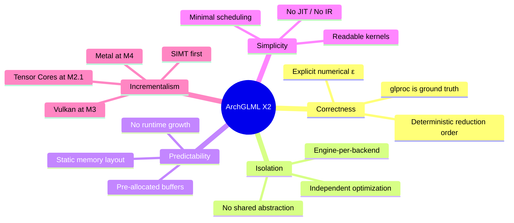

### Principle 1 — Engine Contract

Every backend implements the same trait contract. The contract defines:

- `load_model(path) → Result<Model>`
- `forward(model, tokens, kv_cache) → Result<Logits>`
- `metadata(model) → ModelInfo`

The contract does **not** prescribe how the engine schedules work, manages
memory, or implements kernels. These decisions belong entirely to the engine.

### Principle 2 — Numerical Parity as Invariant

All engines must produce output matching `glproc` within a per-operation
tolerance ε. The tolerance is defined per operation, not per model:

| Operation | Tolerance (max abs diff) | Rationale |
|---|---|---|
| MatMul (FP32 accum) | 1e-5 | FP32 accumulation order may differ; 1e-5 covers IEEE 754 rounding. |
| RMSNorm | 1e-6 | Single reduction; tighter tolerance achievable. |
| Softmax | 1e-5 | Exp + sum reduction; order-dependent. |
| RoPE | 1e-7 | Element-wise; no reduction. |
| SwiGLU | 1e-6 | Fused but element-wise post-gate. |

### Principle 3 — No Allocation on the Hot Path

Memory allocation (CPU or GPU) on the token-generation hot path is a
correctness violation, not a performance concern. Allocation introduces
non-deterministic latency that violates reproducibility.

---

## 9 · Overall Architecture

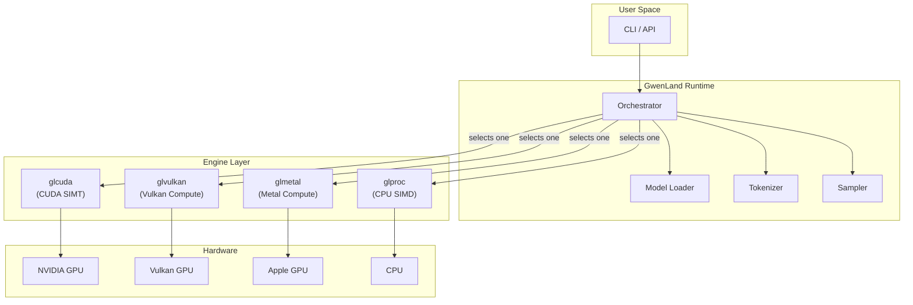

The runtime is responsible for model loading, tokenization, and sampling. The
runtime does **not** participate in forward-pass computation. Once an engine is
selected, it owns the entire inference pipeline from input tokens to output
logits.

This architecture intentionally separates orchestration from computation.

---

## 10 · Runtime Flow

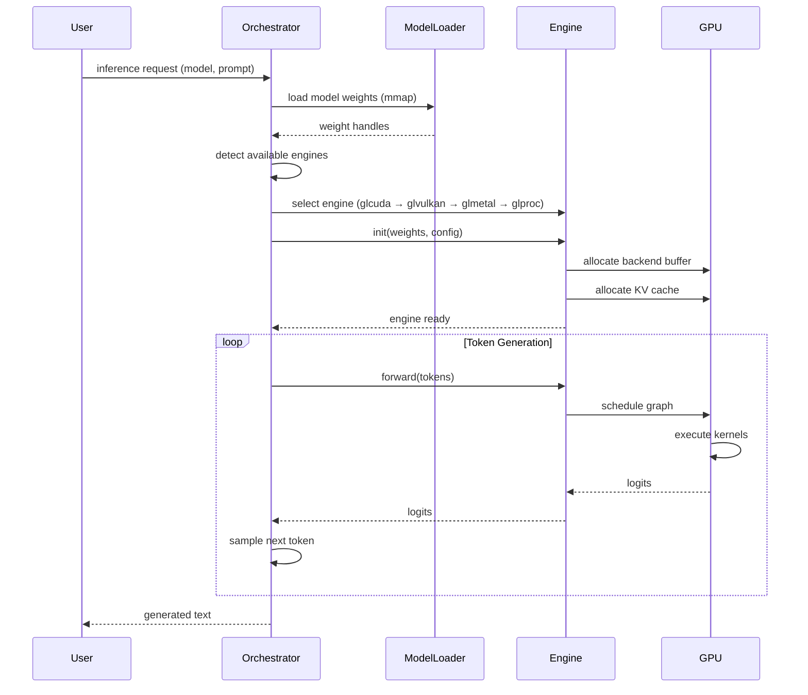

**Key design decisions visible in this flow:**

1. **Engine selection happens once at startup.** No mid-inference switching.
   This eliminates an entire class of state-synchronization bugs.
2. **The orchestrator never touches GPU memory.** All GPU interaction is
   mediated by the engine. The orchestrator sees only `logits: &[f32]`.
3. **Model weights are mmap'd, not copied.** The OS paging system loads weight
   pages on demand, reducing startup latency.

---

## 11 · Backend Isolation

```mermaid
flowchart TB
    subgraph Contract["Engine Contract (trait)"]
        load["load_model()"]
        forward["forward()"]
        meta["metadata()"]
    end

    subgraph glcuda_engine["glcuda"]
        direction TB
        cuda_sched["CUDA Graph Scheduler"]
        cuda_buf["CUDA Backend Buffer"]
        cuda_kern["CUDA SIMT Kernels"]
        cuda_mem["cuMemAlloc / cuMemcpy"]
    end

    subgraph glvulkan_engine["glvulkan"]
        direction TB
        vk_sched["Vulkan Command Buffer Scheduler"]
        vk_buf["Vulkan Buffer Pool"]
        vk_kern["Vulkan Compute Shaders (SPIR-V)"]
        vk_mem["vkAllocateMemory"]
    end

    subgraph glmetal_engine["glmetal"]
        direction TB
        mtl_sched["Metal Command Queue Scheduler"]
        mtl_buf["Metal Buffer Pool"]
        mtl_kern["Metal Compute Kernels (MSL)"]
        mtl_mem["MTLDevice.makeBuffer"]
    end

    subgraph glproc_engine["glproc"]
        direction TB
        cpu_sched["CPU Thread Pool Scheduler"]
        cpu_buf["Arena Allocator"]
        cpu_kern["CPU SIMD Kernels (AVX2/VNNI)"]
        cpu_mem["mmap / malloc"]
    end

    Contract --> glcuda_engine
    Contract --> glvulkan_engine
    Contract --> glmetal_engine
    Contract --> glproc_engine
```

**Why isolation instead of abstraction?**

Each GPU API has a fundamentally different execution model:

| Concept | CUDA | Vulkan | Metal |
|---|---|---|---|
| Thread grouping | Warps (32 threads) | Subgroups (vendor-defined) | Threadgroups (developer-defined) |
| Scheduling | Driver-managed | Explicit command buffers | Command queues |
| Memory model | Unified or discrete | Explicit memory types | Managed or shared |
| Synchronization | Streams + events | Pipeline barriers + semaphores | Command buffer fences |
| Shader language | PTX / CUDA C | SPIR-V (from GLSL/HLSL) | MSL |

A shared abstraction would need to paper over all of these differences. The
result is invariably a lowest-common-denominator interface that prevents each
backend from exploiting its native strengths.

**Alternative considered:** A thin abstraction layer covering only buffer
allocation and kernel dispatch. Rejected because even "thin" abstractions
accumulate constraints over time. The cost of maintaining four independent
engines is lower than the cost of maintaining a leaky abstraction plus four
backends that fight it.

---

## 12 · Memory Architecture

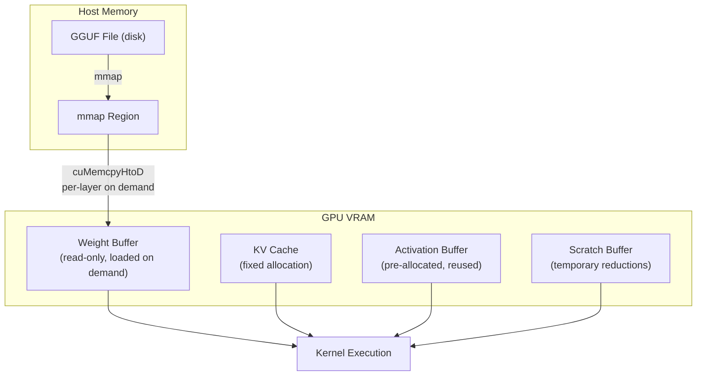

### Memory Regions

| Region | Lifetime | Size Calculation | Mutability |
|---|---|---|---|
| Weight Buffer | Model session | Σ (layer weight sizes) | Read-only after load |
| KV Cache | Model session | `n_layers × n_heads × head_dim × max_seq_len × 2 × sizeof(f16)` | Read-write |
| Activation Buffer | Model session | `max(layer_activation_sizes)` | Read-write, reused per layer |
| Scratch Buffer | Per-kernel | Reduction workspace size | Write-then-read, transient |

**Why fixed allocation?**

Dynamic allocation on the GPU hot path introduces two problems:

1. **Latency non-determinism.** `cudaMalloc` can take 50–500 μs depending on
   fragmentation state. This directly impacts token generation latency.
2. **Memory fragmentation.** Repeated alloc/free cycles fragment the VRAM heap,
   eventually causing allocation failures despite sufficient total free memory.

Pre-allocating all buffers at model load time eliminates both problems. The
total VRAM requirement is known before inference begins. If the model does not
fit, the engine reports failure before generating any output — not after 100
tokens.

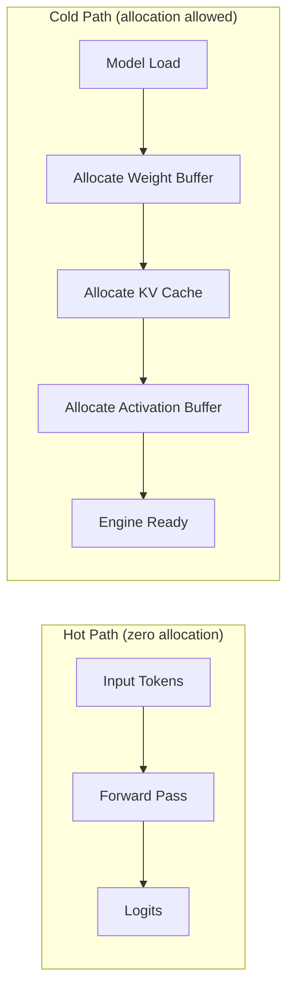

---

## 13 · Graph Scheduler

### Why a Scheduler?

GPU kernels are only fast if they receive work efficiently. Without scheduling,
the host submits kernels one at a time, waiting for each to complete before
submitting the next. This leaves the GPU idle between kernel launches.

A graph scheduler solves three problems:

1. **Eliminates unnecessary synchronization.** Independent operations (e.g.,
   computing Q, K, V projections) can be submitted without waiting for each
   other.
2. **Reduces launch overhead.** Batching kernel submissions amortizes the
   per-launch cost of the CUDA driver API.
3. **Enables buffer reuse planning.** The scheduler knows which buffers are live
   at each point in the graph, enabling optimal reuse.

### Design: Static Layer Graph

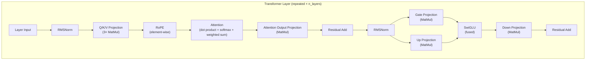

The graph is **statically constructed** at model load time. No runtime graph
building, no dynamic shape inference. The scheduler walks the same graph for
every forward pass; only the input tokens change.

**Trade-off:** Static graphs cannot adapt to dynamic control flow (e.g.,
early-exit transformers, mixture-of-experts routing). This is acceptable because
the M2 target models (LLaMA-family) have fixed structure.

**Alternative considered:** CUDA Graphs (`cudaGraphLaunch`). CUDA Graphs
capture an entire kernel sequence and replay it with minimal launch overhead.
This was deferred because CUDA Graphs require all kernel parameters to be fixed
at capture time. KV cache pointers change every token. Workarounds exist
(graph update API) but add complexity disproportionate to M2's scope.

---

## 14 · Backend Buffer

### Why a Custom Buffer Allocator?

The CUDA runtime allocator (`cudaMalloc` / `cudaFree`) is general-purpose. It
handles arbitrary allocation sizes, concurrent allocations from multiple
threads, and fragmentation management. This generality has a cost: each call
may take 50–500 μs.

For inference, the allocation pattern is entirely predictable:

1. Allocate weight buffer (once, read-only).
2. Allocate KV cache (once, read-write).
3. Allocate activation buffer (once, reused per layer).
4. Allocate scratch space (once, reused per kernel).

A backend buffer pre-allocates a single contiguous VRAM region and subdivides it
with a bump allocator. The allocator state is reset between layers.

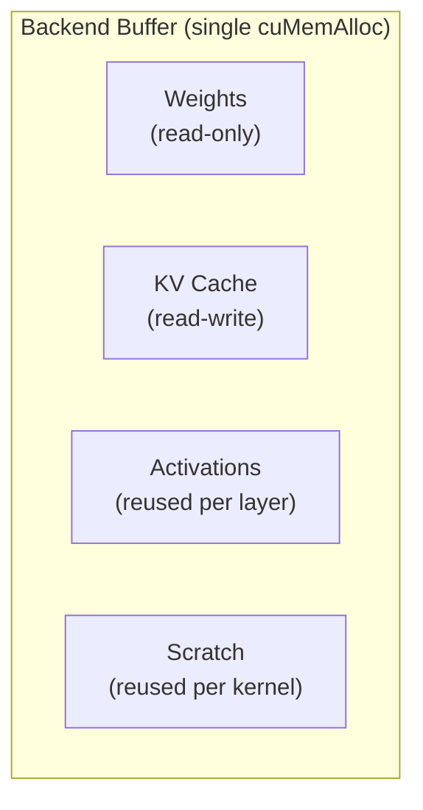

### Buffer Lifecycle

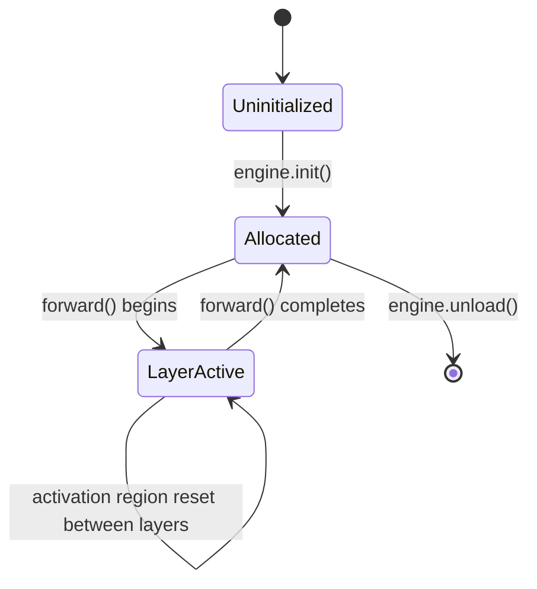

**Trade-off:** The backend buffer forces all VRAM to be allocated upfront. If
the model barely fits in VRAM, there is no option to allocate "just enough" per
layer. This is intentional: if the model does not fit, the user should know
immediately — not after 30 seconds of partial generation.

---

## 15 · mmap Strategy

### Why Memory-Map Model Weights?

Large language models are dominated by static weights. A 7B-parameter model in
Q4_0 quantization occupies ~3.8 GB on disk. Loading this into RAM via
`std::fs::read` requires:

1. Allocating 3.8 GB of contiguous heap memory.
2. Reading the entire file sequentially.
3. Parsing tensor metadata.
4. Copying weights to GPU.

Memory mapping (`mmap` / `CreateFileMapping`) eliminates steps 1 and 2:

- The OS maps the file into virtual address space without reading it.
- Physical pages are loaded on demand when accessed.
- Pages may be evicted and re-loaded by the OS paging system.

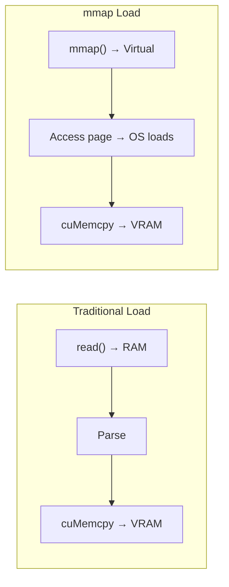

### Benefits

| Benefit | Mechanism |
|---|---|
| Faster startup | No upfront read; pages load on demand. |
| Lower peak RAM | Only accessed pages reside in physical RAM. |
| Simpler code | No manual buffer management for weight loading. |
| OS-managed caching | The kernel page cache handles caching and eviction. |

### Risks and Mitigations

| Risk | Impact | Mitigation |
|---|---|---|
| Page fault latency | First access to a weight page incurs a page fault (~10 μs). | Pre-fault critical pages during model load (via `madvise(MADV_WILLNEED)` or `PrefetchVirtualMemory`). |
| Swap pressure | If physical RAM is exhausted, mmap'd pages are evicted to disk. | Document minimum RAM requirements per model size. |
| NUMA effects | On multi-socket systems, mmap'd pages may reside on the wrong NUMA node. | Single-socket assumption for M2. NUMA-aware allocation deferred. |

---

## 16 · CUDA SIMT Strategy

### Why SIMT-First?

SIMT (Single Instruction, Multiple Threads) is the foundational execution model
of every CUDA-capable GPU since G80 (2006). Every NVIDIA GPU that runs CUDA
supports SIMT. Tensor Cores, by contrast, are available only on sm_70+ (Volta,
2017) and require specific data layouts and instruction sequences.

Building the CUDA backend on SIMT guarantees that:

1. Every supported NVIDIA GPU can run GwenLand AI.
2. The kernel design reflects the actual hardware execution model.
3. Tensor Core optimizations (M2.1) become **enhancements**, not dependencies.

### SIMT Execution Model

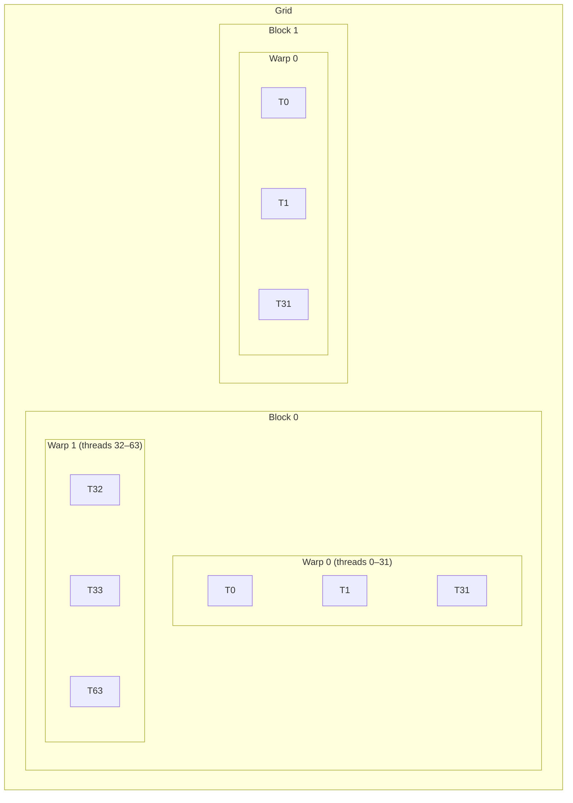

- **Warp:** 32 threads executing in lockstep. The fundamental unit of
  scheduling.
- **Block:** A collection of warps sharing shared memory and synchronization
  primitives.
- **Grid:** The collection of all blocks for a kernel launch.

### Kernel Inventory (M2)

| Operation | Grid Geometry | Strategy | Why This Design |
|---|---|---|---|
| MatMul — decode (GEMV) | 1 block per output row | Warp-level dot product via `__shfl_down_sync` | Decode is memory-bound; one warp per row maximizes memory coalescing without over-subscribing the SM. |
| MatMul — prefill (GEMM) | 2D tile of blocks | Tiled across thread blocks; shared memory staging | Prefill is compute-bound; tiling amortizes global memory latency. |
| RMSNorm | 1 block per position | Parallel reduction + broadcast | Each position is independent; one block per position avoids cross-block synchronization. |
| RoPE | 1 thread per (position, dim_pair) | Element-wise; no inter-thread dependency | RoPE applies a rotation to each dimension pair independently. No reduction needed. |
| SwiGLU (fused) | 1 warp per output element | Gate and Up projections consumed in same kernel | Fusing avoids writing intermediate gate/up results to VRAM. |
| Softmax | 1 block per head | Max reduction → exp → sum reduction → normalize | Softmax requires two passes (max, then normalize). One block per head keeps both passes in shared memory. |
| Attention — decode | 1 warp per query head | KV loaded from VRAM; warp-level reduction | Decode attention is memory-bound; warp-level reduction minimizes active threads per head. |

### Numerical Stability Contract

All reductions use **warp shuffle** (`__shfl_down_sync`) rather than shared
memory atomics for primary accumulation. Warp shuffle provides a deterministic
reduction order for a fixed warp size (32 threads).

**FP32 accumulation** is mandatory for all dot products, regardless of weight
precision (Q4, Q8, FP16). This matches `glproc`'s behavior and prevents
precision loss in long reductions.

Deviation from this contract is a bug, not a known limitation.

---

## 17 · Tensor Core Strategy (M2.1)

> [!NOTE]
> Tensor Core optimization is **out of scope for M2**. This section documents
> the planned approach for M2.1 to ensure M2's architecture does not preclude
> Tensor Core integration.

### Why Defer Tensor Cores?

1. **Correctness first.** SIMT kernels must be validated against `glproc` before
   adding a second execution path.
2. **Tensor Cores require specific data layouts.** WMMA/MMA instructions operate
   on fragments (e.g., 16×16×16 tiles). The weight layout and activation buffer
   layout must accommodate these dimensions. Designing for Tensor Cores before
   SIMT kernels are stable risks over-engineering the buffer layout.
3. **Not all target GPUs have Tensor Cores.** GTX 1060/1070/1080 (sm_61) do not.
   SIMT must remain the fallback.

### Planned M2.1 Approach

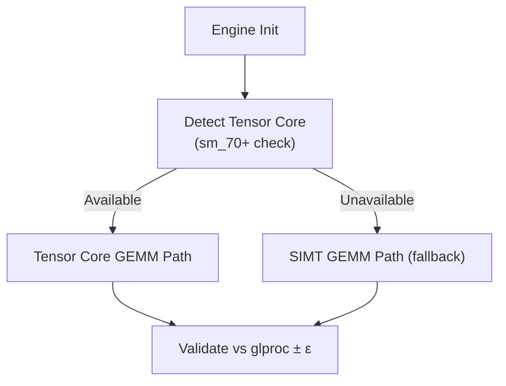

| Component | Description |
|---|---|
| Detection | Query `SM_VERSION` at engine init; enable TC path only for sm_70+. |
| Instruction | WMMA (`nvcuda::wmma`) for sm_70–sm_75; MMA (PTX `mma.sync`) for sm_80+. |
| Fragment layout | Weights pre-arranged into 16×16 tiles at model load time. |
| Accumulation | FP32 accumulator fragments; matches SIMT numerical contract. |
| Fallback | If TC path produces output deviating from `glproc` beyond ε, fall back to SIMT and report a diagnostic. |

**Trade-off:** Deferred Tensor Core support means M2 throughput on Ampere/Hopper
GPUs will be significantly below theoretical peak. This is acceptable because
M2's definition of done is correctness, not peak throughput.

---

## 18 · Trade-offs

| Decision | What We Gain | What We Sacrifice | Why This Trade-off |
|---|---|---|---|
| Pure Rust | Memory safety, cargo tooling, no UB in host code | No access to CUDA C++ ecosystem; PTX generation via raw driver API | FFI boundary is narrow (driver API only). Host safety outweighs ecosystem convenience. |
| Zero external ML runtime | Full control over every computation; no version pinning to PyTorch/ONNX | Must implement everything from scratch; no pre-built operator library | External runtimes are opaque. Debugging operator-level issues requires source access. |
| Backend isolation | Per-engine optimization without abstraction constraints | Code duplication (tokenizer/sampler logic per engine) | Duplication is bounded and reviewable. Abstraction debt compounds. |
| Single GPU | Dramatically simpler scheduling and memory management | Cannot serve models larger than VRAM; no multi-GPU disaggregation | Multi-GPU is a different problem domain. Solving it prematurely adds complexity that benefits no current user. |
| SIMT-first | Universal CUDA support; predictable performance model | Under-utilizes Tensor Cores on capable hardware until M2.1 | Correctness on all hardware > peak performance on some hardware. |
| Static graphs | No runtime graph building overhead; predictable execution | Cannot adapt to dynamic models (MoE routing, early exit) | Target models (LLaMA-family) are static. Dynamic graphs solve a problem we do not have. |
| mmap for weights | Fast startup, low RAM overhead, OS-managed paging | Page fault latency on first access; no control over eviction policy | Page faults are amortized across model load. Pre-faulting mitigates first-access latency. |
| Fixed VRAM allocation | Predictable memory, no fragmentation, no hot-path allocation | Wastes VRAM if model uses less than allocated; fails if model needs more | Waste is bounded (activation buffer headroom). Failure is early and explicit. |
| `glproc` as ground truth | Every GPU backend has a provable correctness reference | `glproc` bugs propagate as "correct" behavior to all engines | Mitigated by extensive `glproc` unit tests. Ground truth must itself be tested. |
| FP32 accumulation always | Numerical stability; matches `glproc` behavior | Slightly lower throughput on FP16-capable paths | Throughput loss is minimal; numerical correctness is non-negotiable. |

---

## 19 · Architecture Decision Records (ADR)

### ADR-001: Engine-Per-Backend Instead of Shared Abstraction

- **Status:** Accepted
- **Context:** Most inference engines (llama.cpp, ONNX Runtime) use a shared
  backend interface. This enables code reuse but constrains per-backend
  optimization.
- **Decision:** Each backend is a complete, independent engine.
- **Rationale:** GPU APIs differ fundamentally in threading model, memory model,
  and synchronization. A shared interface inevitably becomes the lowest common
  denominator. Independent engines can exploit native features without
  constraint.
- **Consequences:** Code duplication for common logic (tokenizer, sampler).
  Accepted because this logic is small relative to the kernel code.
- **Alternatives rejected:** Thin abstraction layer (rejected: even thin
  abstractions accumulate constraints). Plugin-based backend system (rejected:
  adds dynamic dispatch overhead and ABI stability concerns).

### ADR-002: `glproc` as Numerical Ground Truth

- **Status:** Accepted
- **Context:** GPU backends may produce slightly different results due to
  floating-point accumulation order. Without a defined reference, "correct
  output" is ambiguous.
- **Decision:** `glproc` (CPU SIMD backend) defines correct output. All GPU
  backends must match within per-operation ε.
- **Rationale:** CPU execution is deterministic for a fixed binary and input.
  GPU execution order can vary across driver versions. A fixed reference
  eliminates ambiguity.
- **Consequences:** `glproc` bugs are propagated as "correct" behavior. Mitigated
  by independent unit tests of `glproc` against reference implementations.
- **Alternatives rejected:** Golden output files (rejected: impractical to
  maintain across model updates). Statistical comparison (rejected: too loose;
  argmax boundary errors are not caught).

### ADR-003: SIMT-First, Tensor Cores at M2.1

- **Status:** Accepted
- **Context:** Tensor Cores provide 4–16× throughput improvement for matrix
  operations on capable hardware.
- **Decision:** M2 uses SIMT exclusively. Tensor Core support is deferred to
  M2.1.
- **Rationale:** SIMT is universal across all CUDA compute capabilities. Tensor
  Cores require specific data layouts and instructions that complicate the
  initial implementation. Correctness must be established on the simpler
  execution model before adding complexity.
- **Consequences:** M2 under-utilizes Ampere/Hopper hardware. Accepted because
  M2 prioritizes correctness over throughput.

### ADR-004: No JIT Compilation

- **Status:** Accepted
- **Context:** JIT compilation enables runtime kernel specialization (e.g.,
  generating kernels for specific quantization formats or sequence lengths).
- **Decision:** All kernels are ahead-of-time compiled (PTX embedded in binary
  or compiled at build time via `nvcc`).
- **Rationale:** JIT requires compiler infrastructure (IR, code generation,
  kernel cache, error handling). The engineering cost is disproportionate for M2.
  Static transformer graphs do not require runtime kernel generation.
- **Consequences:** Cannot specialize kernels for runtime-known parameters (e.g.,
  exact sequence length). Accepted because specialization benefits are marginal
  for M2 workloads.

### ADR-005: Fixed VRAM Allocation

- **Status:** Accepted
- **Context:** Dynamic VRAM allocation via `cudaMalloc` introduces latency
  spikes and fragmentation risk on the hot path.
- **Decision:** All VRAM is allocated at model load time. The hot path performs
  zero allocations.
- **Rationale:** Inference memory usage is fully predictable at model load time.
  There is no technical reason to defer allocation to the hot path.
- **Consequences:** Over-allocates if the model uses less than the maximum
  possible activation size. Accepted because the over-allocation is bounded and
  the alternative (latency spikes) is worse.

---

## 20 · Out of Scope (with Rationale)

Each item below is intentionally excluded from ArchGLML X2. These are not
oversights — they are conscious architectural boundaries.

### Multi-GPU

**Why excluded:** Multi-GPU introduces inter-device synchronization, memory
partitioning across devices, heterogeneous scheduling, and NVLink/PCIe
topology-aware placement. These are distributed computing problems. GwenLand AI
is a local inference engine. Solving multi-GPU correctly requires engineering
effort comparable to the single-GPU engine itself. This effort would delay M2
without benefiting the primary use case (single-device inference).

### Distributed Inference

**Why excluded:** Distributed inference requires network transport, fault
tolerance, load balancing, and consensus on model partitioning. These are
infrastructure problems, not engine problems. An engine that runs correctly on
a single GPU can later be wrapped in a distributed framework. The reverse — a
distributed engine that is later simplified to single-GPU — is architecturally
much harder.

### Cloud Orchestration

**Why excluded:** Cloud orchestration (autoscaling, request routing, model
serving APIs) is fundamentally different from engine design. Keeping the engine
local-first preserves simplicity and allows cloud integration to be built as a
separate layer. Coupling cloud concerns into the engine creates deployment
dependencies that contradict the local-first principle.

### JIT Compiler

**Why excluded:** JIT compilation requires an intermediate representation (IR),
a code generator, a kernel cache, compilation error handling, and warm-up
latency management. The engineering cost is disproportionate for M2's scope.
Transformer inference graphs are static and predictable — JIT solves a problem
(dynamic kernel specialization) that this architecture does not have at M2.

### Dynamic Graph Rewriting

**Why excluded:** Transformer inference graphs for LLaMA-family models are
structurally fixed. The layer count, attention pattern, and tensor dimensions
are known at model load time. Dynamic graph rewriting is valuable for models
with conditional execution paths (e.g., mixture-of-experts). This architecture
intentionally targets static models first. Dynamic model support, if pursued,
belongs to a future milestone.

### Graph Fusion

**Why excluded:** Kernel fusion (combining multiple operations into a single
kernel launch) is a valuable optimization that reduces launch overhead and
intermediate memory traffic. However, fusion is only valuable after correctness
has been established. Fusing incorrect kernels produces incorrect results
faster. This architecture prioritizes validating individual kernels against
`glproc` before combining them. Fusion belongs to M2.1 or later.

### OpenCL

**Why excluded:** OpenCL's compute capabilities are a strict subset of Vulkan
compute on all modern GPUs. Vulkan compute provides the same cross-vendor
coverage with a more modern API, explicit memory management, and better
tooling. Supporting both would double the cross-vendor backend work for zero
additional hardware coverage.

### HIP

**Why excluded:** HIP (AMD's CUDA-compatible API) targets AMD GPUs. While
architecturally similar to CUDA, HIP introduces a second GPU vendor's driver
stack, debugging tools, and hardware quirks. The current architecture limits
hardware scope to four backends. AMD GPU support, if pursued, would be added as
`glhip` — a fifth independent engine — in a future milestone.

### SYCL

**Why excluded:** SYCL is a high-level C++ abstraction over heterogeneous
compute (Intel, AMD, NVIDIA). It requires a SYCL-compatible compiler (DPC++,
hipSYCL) and introduces a dependency on a C++ toolchain. This conflicts with
the pure-Rust constraint. Additionally, SYCL's abstraction model conflicts with
the backend isolation principle.

---

## 21 · Milestones

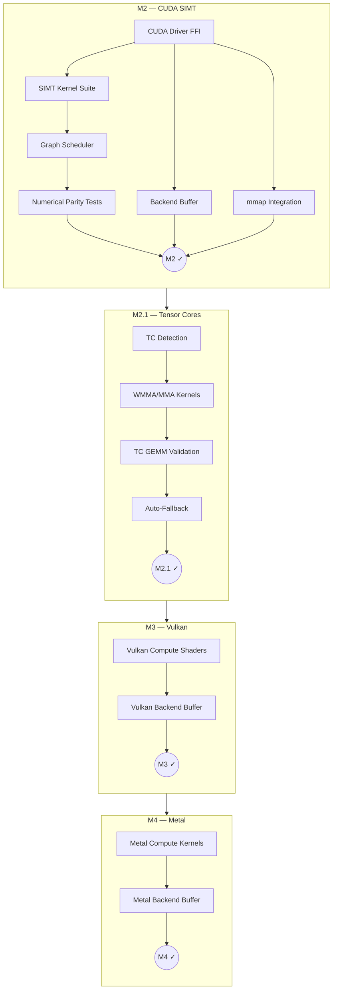

### M2 — CUDA SIMT Backend

| Deliverable | Description |
|---|---|
| CUDA Driver FFI | Rust bindings to the CUDA Driver API (`cuInit`, `cuModuleLoad`, `cuLaunchKernel`, etc.). |
| SIMT Kernel Suite | All kernels from the Kernel Inventory table, compiled to PTX. |
| Backend Buffer | Pre-allocated VRAM manager with bump allocation. |
| mmap Integration | Memory-mapped GGUF loading with on-demand page transfer to VRAM. |
| Graph Scheduler | Static layer graph walker with kernel submission batching. |
| Numerical Parity Tests | Per-operation comparison against `glproc` with defined ε thresholds. |

### M2.1 — Tensor Core Enhancement

| Deliverable | Description |
|---|---|
| TC Detection | Runtime detection of Tensor Core availability via SM version query. |
| WMMA/MMA Kernels | Tensor Core GEMM kernels using WMMA (sm_70) and MMA (sm_80+). |
| TC GEMM Validation | Numerical parity with SIMT GEMM kernels within ε. |
| Auto-Fallback | Automatic fallback to SIMT if TC path produces deviating output. |
| Performance Benchmark | Throughput comparison: TC vs SIMT on identical hardware. |

---

## 22 · Benchmark Philosophy

### Principles

1. **Benchmarks are not marketing.** A benchmark that cannot be independently
   reproduced is not a benchmark — it is a claim.
2. **Measure what matters.** Token generation latency (ms/token) and throughput
   (tokens/second) are the user-facing metrics. FLOPS utilization is an
   engineering diagnostic, not a user-facing metric.
3. **Control all variables.** A valid benchmark specifies: model, quantization,
   prompt, sequence length, sampling strategy, GPU model, driver version, and
   OS. Omitting any variable makes the result non-reproducible.
4. **Report distributions, not peaks.** Report P50, P95, P99 latency — not
   minimum or maximum. Peak performance is the least informative data point.

### Benchmark Protocol

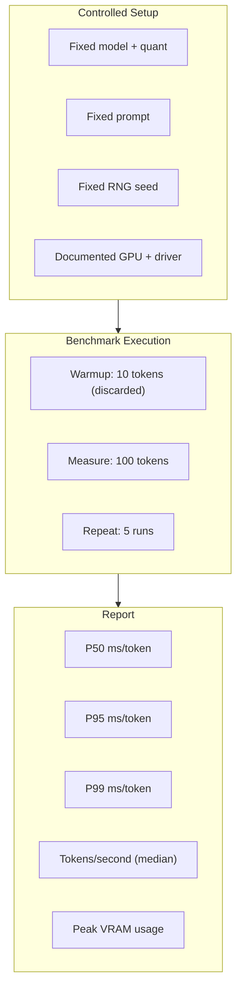

### Anti-Patterns

| Anti-Pattern | Why It Is Harmful |
|---|---|
| "Up to X tokens/sec" | Peak performance is not representative. Report median. |
| Cherry-picked prompt lengths | Short prompts inflate throughput; long prompts deflate it. Report at standard lengths. |
| Omitting quantization format | Q4_0 vs Q8_0 vs FP16 produce wildly different throughput. Always specify. |
| Comparing across GPU generations | A benchmark on RTX 4090 is not comparable to one on GTX 1080. Always report hardware. |
| First-run benchmarks | First tokens incur mmap page faults and JIT warmup. Discard warmup tokens. |

---

## 23 · Definition of Done

### M2 Completion Criteria

M2 is considered **complete** when all of the following conditions are met:

| Criterion | Verification Method |
|---|---|
| `glcuda` executes a full forward pass for a LLaMA-family model | End-to-end inference test producing coherent text output. |
| Output matches `glproc` within defined per-operation ε | Automated numerical parity test suite comparing `glcuda` and `glproc` output tensor-by-tensor. |
| Backend buffer reuse is implemented | Zero `cudaMalloc` calls after engine initialization, verified by CUDA profiler (`nsys`). |
| mmap loading is functional | Model loads via memory mapping; verified by absence of `std::fs::read` on weight data. |
| Benchmarks are reproducible | 5 consecutive runs produce token-level identical output and P50 latency within ±5%. |
| No VRAM leaks | `cudaMemGetInfo` reports identical free VRAM before and after 100-token generation. |
| Architecture remains understandable | Any single engineer can read and explain every kernel within the codebase. |
| All SIMT kernels pass unit tests | Per-kernel tests comparing output against `glproc` reference for random inputs. |

### M2.1 Completion Criteria

| Criterion | Verification Method |
|---|---|
| Tensor Core GEMM produces parity with SIMT GEMM | Numerical comparison within ε on identical inputs. |
| Auto-fallback works correctly | Disabling TC path produces identical output via SIMT path. |
| Throughput improvement is measured | TC path shows ≥ 2× throughput improvement over SIMT on supported hardware. |
| No regression on non-TC hardware | GTX 10-series GPUs continue to function via SIMT path. |

---

## 24 · Future Research

The following topics are identified as potential future work. Inclusion in this
list does not constitute a commitment to implementation. Each topic requires its
own architecture proposal before work begins.

### 24.1 Speculative Decoding

Generate multiple candidate tokens in parallel using a smaller draft model,
then verify against the full model. Potential for 2–3× throughput improvement
on memory-bound workloads. Requires careful design to maintain numerical parity.

### 24.2 KV Cache Quantization

Quantize KV cache entries from FP16 to Q8/Q4 to reduce VRAM consumption.
Enables longer context lengths on the same hardware. Requires analysis of
numerical impact on attention output quality.

### 24.3 Flash Attention

Tiled, IO-aware attention computation that reduces memory traffic from O(n²) to
O(n) in sequence length. Significant implementation complexity. Requires
understanding of SRAM hierarchy on target GPUs.

### 24.4 Continuous Batching

Serve multiple requests concurrently by batching tokens from different sequences
into the same kernel launch. Relevant only if GwenLand AI evolves toward a
serving use case. Currently out of scope due to the local-first constraint.

### 24.5 Weight Pre-Tiling for Tensor Cores

Re-arrange weight matrices at model load time into tile-friendly layouts (e.g.,
16×16 blocks for WMMA). Eliminates runtime layout transformation overhead.
Relevant for M2.1.

### 24.6 Custom Memory Allocator for KV Cache

Replace fixed KV cache allocation with a page-based allocator (similar to
PagedAttention) that allocates KV pages on demand. Enables variable-length
sequences without worst-case VRAM reservation. Adds complexity to the memory
model.

---

## 25 · References

### GPU Architecture and Programming

1. NVIDIA. *CUDA C++ Programming Guide.* Version 12.x. https://docs.nvidia.com/cuda/cuda-c-programming-guide/
2. NVIDIA. *CUDA Driver API Reference.* https://docs.nvidia.com/cuda/cuda-driver-api/
3. NVIDIA. *Parallel Thread Execution ISA (PTX).* https://docs.nvidia.com/cuda/parallel-thread-execution/
4. NVIDIA. *CUDA Warp-Level Primitives.* https://developer.nvidia.com/blog/using-cuda-warp-level-primitives/
5. NVIDIA. *WMMA API for Tensor Cores.* https://docs.nvidia.com/cuda/cuda-c-programming-guide/index.html#wmma

### Inference Engines (Comparative)

6. Gerganov, G. et al. *llama.cpp.* https://github.com/ggerganov/llama.cpp
7. Kwon, W. et al. *Efficient Memory Management for Large Language Model Serving with PagedAttention.* SOSP 2023.
8. NVIDIA. *TensorRT-LLM.* https://github.com/NVIDIA/TensorRT-LLM

### Memory Management

9. Kerrisk, M. *The Linux Programming Interface.* Chapter 49: Memory Mappings. No Starch Press, 2010.
10. Microsoft. *Memory-Mapped Files.* https://learn.microsoft.com/en-us/windows/win32/memory/file-mapping

### Numerical Precision

11. Goldberg, D. *What Every Computer Scientist Should Know About Floating-Point Arithmetic.* ACM Computing Surveys, 1991.
12. Higham, N. *Accuracy and Stability of Numerical Algorithms.* 2nd ed. SIAM, 2002.

### Rust and Systems Programming

13. The Rust Programming Language. *The Rust Reference.* https://doc.rust-lang.org/reference/
14. Matsakis, N. and Klock, F. *The Rust Language.* ACM SIGAda Ada Letters, 2014.

### Quantization

15. Dettmers, T. et al. *GPTQ: Accurate Post-Training Quantization for Generative Pre-trained Transformers.* ICLR 2023.
16. Frantar, E. et al. *Optimal Brain Compression.* NeurIPS 2022.

### Design Document Style References

17. Rust RFC Process. https://rust-lang.github.io/rfcs/
18. LLVM Design Documents. https://llvm.org/docs/
19. OpenXLA Design Proposals. https://github.com/openxla/xla/tree/main/docs

---

## Appendix A · Semantic Translation Table

This table documents how `glproc` CPU operations map to `glcuda` GPU operations.
The **intent** is identical; the **mechanism** is different.

| Operation | glproc (CPU SIMD) | glcuda (GPU SIMT) |
|---|---|---|
| Dot product | `row_dot_q8` — single-thread, SIMD lanes (AVX2 `_mm256_dpbusd_epi32`) | Warp-level dot product — 32 threads, `__shfl_down_sync` reduction |
| SwiGLU | Sequential fused loop — gate × silu(up) per element | Fused kernel — one warp per output element, gate and up consumed in registers |
| Memory allocation | Arena allocator — CPU-side bump alloc with `mmap` backing | Backend buffer — VRAM pre-allocated pool, bump sub-allocation |
| GEMV (decode) | Register-tiled GEMV — one row per thread, SIMD-parallel within row | One warp per output row — memory-coalesced loading, warp-shuffle reduction |
| GEMM (prefill) | Tiled GEMM — outer loop over tiles, inner SIMD dot products | Thread block tiles — shared memory staging, warp-level accumulation |
| Reduction (RMSNorm) | Sequential accumulation with SIMD partial sums | Parallel reduction — warp shuffle tree, then cross-warp via shared memory |
| Element-wise (RoPE) | One thread, SIMD lanes operate on dimension pairs | One CUDA thread per dimension pair — embarrassingly parallel |
| Softmax | Two-pass sequential (max, then exp-normalize) | Two-pass parallel — block-level max reduction, then exp + sum reduction |

**Numerical parity between these columns is the proof that the semantic
translation is correct.**

---

## Appendix B · Comparison: GwenLand vs llama.cpp

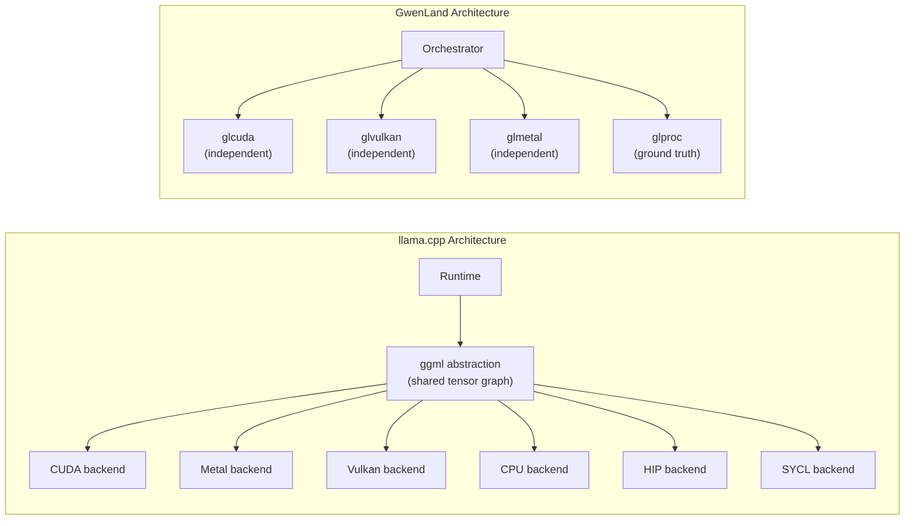

| Dimension | llama.cpp | GwenLand AI |
|---|---|---|
| Runtime model | Single runtime, many backends | Many engines, one orchestrator |
| Backend coupling | Shared `ggml` tensor graph | Independent, engine-owned |
| CPU baseline role | Fallback + approximate reference | Ground truth oracle with explicit ε |
| Numerical tolerance | Implicit, backend-specific | Explicit per-operation contract |
| Layer-level offload | Supported (`--n-gpu-layers`) | Out of scope (single engine owns entire pass) |
| Optimization strategy | Shared abstraction, per-backend specialization | Full per-engine ownership |
| Primary language | C/C++ | Pure Rust |
| Hardware coverage | Extremely broad (CUDA, Metal, Vulkan, HIP, SYCL, MUSA, ...) | Intentionally focused (4 backends) |
| Philosophy | Portability-first, correctness-approximate | Correctness-first, portability-by-engine |

Neither approach is universally superior. llama.cpp's approach is correct for a
project with thousands of contributors targeting every GPU ever manufactured.
GwenLand's approach is correct for a project where maintainability, correctness,
and architectural clarity are primary constraints — and hardware coverage is
deliberately bounded.

---

## Appendix C · Fallback Chain

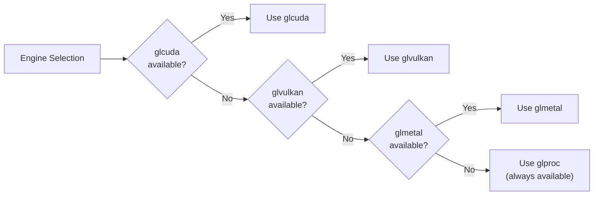

The orchestrator attempts each engine in priority order at startup. Once an
engine is selected, it owns the entire forward pass for the duration of the
session.

**No mid-inference switching.** No layer splitting across engines. This
eliminates an entire class of state synchronization bugs that plague engines
with mixed-backend execution.

---

## Appendix D · VRAM Budget Calculator

Given a model with parameters:

| Symbol | Meaning |
|---|---|
| L | Number of layers |
| H | Number of attention heads |
| D | Head dimension |
| V | Vocabulary size |
| S | Maximum sequence length |
| Q | Quantization bytes per weight element |

VRAM budget:

```
Weight Buffer     = Σ(layer_weight_bytes) ≈ L × (4 × H × D × H × D × Q) + V × H × D × Q
KV Cache          = L × H × D × S × 2 × sizeof(f16)
Activation Buffer = max(layer_activation_sizes)
Scratch Buffer    = max(reduction_workspace_sizes)

Total VRAM        = Weight Buffer + KV Cache + Activation Buffer + Scratch Buffer
```

If `Total VRAM > available VRAM`, the engine reports failure at load time. No
partial execution. No silent OOM during generation.

---

> *This proposal favors long-term architecture over short-term optimization.
> Every optimization introduced must satisfy one question:*
>
> **Does this improve throughput without making the architecture significantly
> harder to understand or maintain?**
>
> *If the answer is no, the optimization belongs to a future milestone.*
>
> *Numerical parity is not a separate test target. It is the natural
> consequence of correct semantic translation from `glproc`.*

---

*Document version: X2-draft · Status: Experimental · Author: GwenLand AI Architecture*
