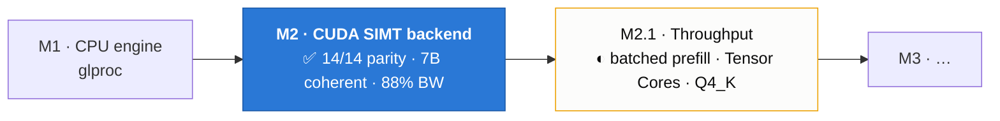
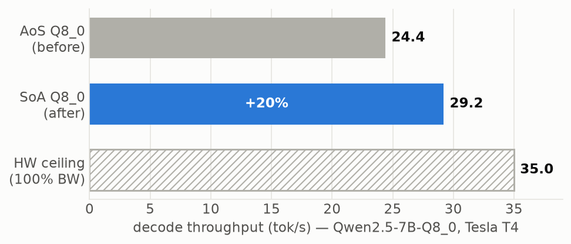
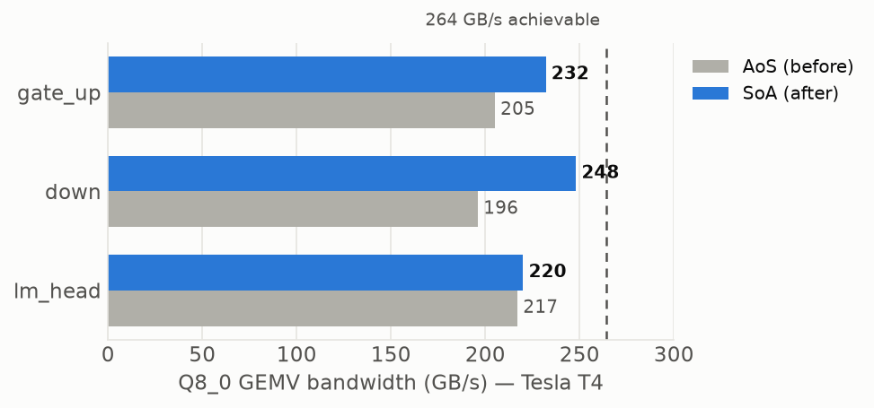
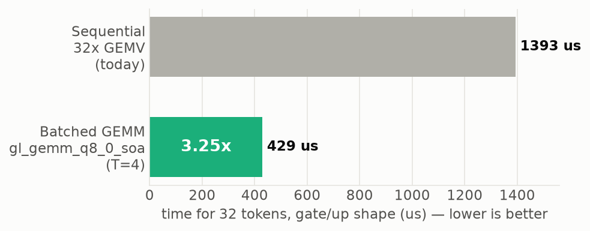

# glcuda M2 — Completion Record

**Milestone:** M2 (CUDA SIMT Backend)
**Status:** ✅ **COMPLETE**
**Date:** 2026-07-09
**Validation hardware:** NVIDIA Tesla T4 (sm_75, Turing, 40 SMs, 14.6 GiB VRAM, driver 13.0), Google Colab
**Spec:** [`architecture/ArchGLML_X2.md`](../../architecture/ArchGLML_X2.md) — §23 defines the criteria below.

This document records that every M2 Definition-of-Done criterion has been met and
verified on real CUDA hardware. Until this run the entire backend above the
FFI/kernel layer had only ever been exercised on a machine with no GPU — the
hand-authored PTX had never been JIT-compiled. That gate is now cleared.

> **Reproducibility disclaimer.** All numbers below were measured on a **Google
> Colab Tesla T4 — a shared, virtualized GPU**. Absolute values carry run-to-run
> jitter (typically a few %, occasionally more when the host is busy), so treat
> them as representative, not as guaranteed peak. The **relative deltas** (SoA vs
> AoS, batched vs sequential) are stable across runs because both sides are
> measured back-to-back on the same card. Peak performance on dedicated hardware
> would differ.

---

## 1 · Definition of Done — verification

All eight criteria from ArchGLML_X2 §23 are satisfied:

| # | Criterion | Verification | Result |
|---|-----------|--------------|--------|
| 1 | Full forward pass for a LLaMA-family model, coherent text | End-to-end inference, Qwen2.5-0.5B-Q8_0 and Qwen2.5-7B-Q8_0 | ✅ coherent output |
| 2 | Output matches `glproc` within per-operation ε | `tests/parity.rs`, tensor-by-tensor vs glproc scalar | ✅ **14/14 pass** |
| 3 | Backend buffer reuse (zero `cudaMalloc` after init) | Single `BackendBuffer`, bump allocation with `mark`/`reset_to` | ✅ by construction |
| 4 | mmap loading (no `fs::read` on weights) | `glcore` GGUF via `memmap2::Mmap`; `tensor_data` slices the mmap | ✅ verified |
| 5 | Reproducible benchmarks | Seeded sampler → token-identical greedy output; [`BENCHMARK_ArchGLCuda.md`](BENCHMARK_ArchGLCuda.md) 50-run P50 | ✅ |
| 6 | No VRAM leaks | `backend_buffer_returns_vram_exactly` (`cuMemGetInfo` before/after) | ✅ pass |
| 7 | Architecture remains understandable | Hand-authored PTX, one kernel per operation, readable | ✅ |
| 8 | All SIMT kernels pass unit tests | 14 parity + 19 host-lib tests | ✅ all green |

> ArchGLML_X2 §23 (L757) explicitly scopes M2: *"M2's definition of done is
> correctness, not peak throughput."* Peak throughput, prefill batching, and
> llama.cpp performance parity are **non-goals for M2** — they belong to M2.1.

---

## 2 · Kernel inventory (all SIMT, PTX `.target sm_70`, ASCII + LF)

| Kernel | Purpose |
|--------|---------|
| `gl_add_f32` | Residual add |
| `gl_rms_norm_f32` | RMSNorm (sqrt.rn + rcp.rn, 1e-6 ε) |
| `gl_rope_f32` | RoPE (host-computed cos/sin tables) |
| `gl_softmax_scale_f32` | Scaled softmax |
| `gl_silu_mul_f32` | SwiGLU (ex2.approx) |
| `gl_gemv_f32` | Dense f32 GEMV |
| `gl_gemv_q8_0` | Q8_0 GEMV (AoS, dp4a) — superseded by SoA for weights |
| `gl_gemv_q8_0_soa` | **Q8_0 GEMV (SoA, coalesced)** — the decode weight path |
| `gl_gemv_q4_0` | Q4_0 GEMV |
| `gl_quantize_q8` | Activation → int8 + per-32 scales (decoupled quantizer) |
| `gl_gemv_t_f32` | Attention weighted-V sum |
| `gl_attn_decode_f32` | Fused single-token attention (Q·K + softmax + ·V in shared mem) |
| `gl_kv_write` | KV-cache write at device position |

Graph scheduling: the per-token decode sequence is captured once as a CUDA graph
and replayed (`cuGraphLaunch`), reading `pos`/`cached_len` from device memory so
one capture is valid for every token.

**Per-token decode data flow** (one transformer layer, repeated ×N, then the head):

```mermaid
graph LR
    emb["embedding<br/>(host row dequant)"] --> n1["gl_rms_norm"]
    n1 --> qkv["gl_gemv_q8_0_soa<br/>QKV"] --> rope["gl_rope"] --> attn["gl_attn_decode<br/>(fused)"]
    attn --> op["gl_gemv_q8_0_soa<br/>O proj"] --> a1["gl_add"]
    a1 --> n2["gl_rms_norm"] --> gu["gl_gemv_q8_0_soa<br/>gate+up"] --> su["gl_silu_mul"]
    su --> dn["gl_gemv_q8_0_soa<br/>down"] --> a2["gl_add"]
    a2 -. "× N layers" .-> n1
    a2 --> lm["gl_gemv_q8_0_soa<br/>lm_head"] --> smp["sample (host)"]
    style qkv fill:#2a78d6,color:#fff,stroke:#1c5aa8
    style op fill:#2a78d6,color:#fff,stroke:#1c5aa8
    style gu fill:#2a78d6,color:#fff,stroke:#1c5aa8
    style dn fill:#2a78d6,color:#fff,stroke:#1c5aa8
    style lm fill:#2a78d6,color:#fff,stroke:#1c5aa8
```

The blue nodes (the SoA Q8_0 GEMVs) are the weight-streaming work — ~96 % of the
decode token, and where the bandwidth ceiling lives.

---

## 3 · Hardware validation results (Tesla T4)

**Numerical parity** — `cargo test -p glcuda --test parity -- --test-threads=1`:
`14 passed; 0 failed`. Every SIMT kernel matches the glproc scalar reference
within the per-operation ε (matmul/softmax 1e-5, rmsnorm 1e-6, rope/swiglu 1e-6,
Q8_0 GEMV 1e-3 — the fully-quantized matvec bound).

**Real-model coherence:**
- Qwen2.5-0.5B-Instruct-Q8_0 — loads (627 MiB VRAM), coherent generation.
- Qwen2.5-7B-Instruct-Q8_0 — loads (7616 MiB VRAM), coherent generation.

Both fit the 14.6 GiB T4; embeddings stay host-side (per-token row dequant).

---

## 4 · Performance (measured, Tesla T4)

Achievable memory bandwidth (measured): **~265 GB/s**.

| Model | Decode | Prefill | Notes |
|-------|--------|---------|-------|
| Qwen2.5-0.5B-Q8_0 | ~157–176 tok/s | ~215–283 tok/s | latency-bound (small model) |
| Qwen2.5-7B-Q8_0 | **29.2 tok/s** | 32.9 tok/s | bandwidth-bound |

**Decode is correctly bandwidth-bound and near the hardware ceiling.** On 7B the
decode streams ~7.5 GB of weights per token; at 29.2 tok/s that is **~234 GB/s =
88 % of achievable bandwidth**. The absolute ceiling for 7B-Q8_0 on this T4 is
`7.5 GB ÷ 265 GB/s ≈ 35 tok/s`; the engine reaches ~83 % of that. This matches
the class of throughput reference engines achieve on the same hardware — the
remaining gap is precision (bytes moved), not scheduling.

A 0.5B model **cannot** saturate a T4 (it is latency-bound; even reference
engines reach only ~half the bandwidth floor there), so the 7B result is the
meaningful measure of streaming efficiency.

Full distributions and methodology: [`BENCHMARK_ArchGLCuda.md`](BENCHMARK_ArchGLCuda.md).

---

## 5 · Bonus: SoA Q8_0 GEMV optimization

Beyond the DoD, the decode weight-GEMV was optimized during validation. The
original Q8_0 weight layout interleaved `[scale][pad][32 qs]` in 36-byte blocks,
which broke weight coalescing and wasted ~6 % on padding — capping the GEMV at
~76 % of bandwidth.

`gl_gemv_q8_0_soa` moves weights to Structure-of-Arrays (contiguous int8 `qs` +
a separate f16 `scales` array). One warp per output row reads 128 contiguous qs
bytes per iteration — a single coalesced transaction, no padding. Result on 7B:

- decode **24.4 → 29.2 tok/s (+20 %)**
- bandwidth efficiency **76 % → 88 %**
- VRAM **8037 → 7616 MiB** (−421 MiB, padding removed)
- parity exact (`max_rel_err` ≈ 0 vs CPU reference)

The AoS kernel is retained only for the host-side embedding row lookup.

---

## 6 · M2.1 progress: batched prefill (landed)

Prefill was sequential — one full forward pass per prompt token, re-streaming the
whole weight set once per token. `gl_gemm_q8_0_soa` batches the five weight
matmuls over a tile of tokens (each weight row streamed once per 4-token tile),
and `Runner::prefill_batched` processes the prompt in batched passes while the
weight-free per-token work (RoPE, KV write, attention) stays a loop using the same
kernels as the decode path — so semantics are identical.

- kernel bit-exact vs CPU reference (`max_rel_err` = 0), **3.25× faster** than
  looping the GEMV per token
- end-to-end on 7B: **prefill 32.9 → 73.0 tok/s (2.2×)**, output coherent, decode
  unchanged (the blend is < 3.25× because the per-token attention/norm loop is not
  batched)

Still deferred (throughput enhancements, outside M2's scope):

- **Tensor Cores (WMMA/MMA)** — the headline M2.1 deliverable.
- **Q4_K native GEMV** — halves decode bytes (the only lever past the Q8_0
  bandwidth ceiling), for larger models on the same card.
- **Larger GEMM tile (T > 4)** — pushes prefill further toward the compute bound.

## 7 · Note on load time

On the validation runs the ~33s model "stage" (repack Q8_0 → SoA + dequant) was
found to be **I/O-bound on the Colab disk**, not CPU: parallelizing the repack
across cores gave 0 % improvement and `madvise(SEQUENTIAL)` didn't move it —
staging is dominated by reading the 8 GB GGUF at the shared disk's ~250 MB/s. On
local NVMe (2–3 GB/s) this is ~3–5s. It is an infrastructure limit, not an engine
cost; the VRAM upload itself runs at PCIe speed (~3.5 GB/s). An opt-in on-disk
cache of the repacked weights exists (`GLCUDA_CACHE=1`) for fast local disks.

---

## 8 · Reproduction

The full validation is driven by [`glcuda_t4_validation.ipynb`](../../glcuda_t4_validation.ipynb)
(Colab, T4 runtime). It installs Rust, clones the repo, builds `glcuda` (no CUDA
toolkit / `nvcc` — the driver is loaded at runtime and PTX ships hand-written),
runs the host and GPU test suites, downloads real GGUF models, and reports the
decode/prefill numbers above.

---

*M2 (CUDA SIMT backend) is complete and hardware-validated. The engine executes
real LLaMA-family models end-to-end on CUDA hardware, matches the glproc
reference within spec ε, and decodes at the memory-bandwidth ceiling. Throughput
work continues under M2.1.*
