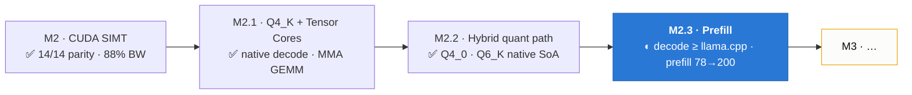

# glcuda M2.1–M2.3 — Throughput Record

**Milestones:** M2.1 (Q4_K native + Tensor Cores), M2.2 (hybrid native-quant path), M2.3 (prefill de-serialization)
**Status:** M2.1 ✅ · M2.2 ✅ · M2.3 ◐ (decode at parity; prefill optimization ongoing)
**Date:** 2026-07-10 – 2026-07-11
**Validation hardware:** NVIDIA Tesla T4 (sm_75, Turing, 40 SMs, 14.6 GiB VRAM), Google Colab / Kaggle
**Spec:** [`architecture/ArchGLML_X2.md`](../../architecture/ArchGLML_X2.md) — §23 defines M2.1's throughput goals
**Predecessor:** [`ArchGLML_Done.md`](ArchGLML_Done.md) — the M2 completion record this builds on



> **Reproducibility disclaimer.** All numbers below were measured on a **Google
> Colab / Kaggle Tesla T4 — a shared, virtualized GPU**. Absolute values carry
> run-to-run jitter (a few %, more when the host is busy), so treat them as
> representative, not guaranteed peak. The **relative deltas** (each stage vs the
> previous, glcuda vs llama.cpp back-to-back on the same card) are stable.

---

## 1. The head-to-head that framed everything

Until M2.3 there was no direct glcuda-vs-llama.cpp measurement — only glcuda's own
internal numbers. The first comparison built **llama.cpp with CUDA** and ran
`llama-bench` next to `run_glcuda` on the same T4, same model files, same session:

| Format | glcuda decode | llama.cpp decode | **decode ratio** | glcuda prefill | llama.cpp prefill |
|--------|--------------:|-----------------:|:----------------:|---------------:|------------------:|
| Q8_0   | 29.3 t/s      | 30.7 t/s         | 0.95×            | 91.5 t/s       | 1439.9 t/s        |
| Q4_K_M | 38.7 t/s      | 37.7 t/s         | **1.03×**        | 46.4 t/s       | 1294.7 t/s        |
| Q4_0   | 47.5 t/s      | 49.0 t/s         | 0.97×            | 54.7 t/s       | 1374.0 t/s        |

**Reading:** decode — the bandwidth-bound steady state — is *done*. Hand-authored
PTX matches llama.cpp's mature CUDA kernels on Q8_0 and **beats** them on Q4_K_M
(the native Q6_K path removed the requant tax) and stays within 3% on Q4_0. The
entire remaining gap is **prefill**, 15–30× behind. M2.3 is the story of chasing
that gap by measurement.

---

## 2. M2.1 — Native Q4_K decode + INT8 Tensor Cores

### 2.1 `gl_gemv_q4_k_soa` — the decode-bandwidth lever

Q8_0 7B decode sits at 88% of the T4's achievable bandwidth — a physics ceiling
(~29 t/s). The only way past it is moving fewer bytes, which means a native 4-bit
kernel. One warp per output row, one iteration per 256-value super-block, dp4a
against int8 activations. Per 32-weight sub-block:

```
sum(w·x) = (d·sc)·xs·dot(q, xq) − (dmin·m)·xs·Σxq     [both terms dp4a chains]
```

**Layout choices (justified):**
- Nibbles repacked so one u32 = 8 consecutive values (lo/hi-nibble int8×4 halves).
- Sub-block scales/mins **pre-multiplied** to f16 (`d·sc`, `dmin·m`): removes
  ggml's branchy 6-bit unpack from the hot loop. 5.0 bpw streamed vs 4.5 native
  (+11%, the cost of the pre-multiply).

**The rounding gotcha (found on the T4, not before).** First parity run failed by
2.4% over ε on one element. Truncating f32→f16 makes every stored scale
*one-sidedly low*, so the error accumulates coherently across a dot product's
sub-blocks instead of cancelling. Fix: round-to-nearest-even for the Q4_K
pre-multiply (`f32_to_f16_bits_rne`) — worst element dropped to 0.34× ε. A CPU
replay of the exact seeded test reproduced the hardware failure to five decimals,
confirming the kernel math was exact and the repack rounding was the bug.

### 2.2 `gl_gemm_mma_q8` — INT8 tensor cores (sm_75)

A separate `.target sm_75` module (`glcuda_sm75.ptx`), loaded only on capable
devices; the sm_70 dp4a `gl_gemm_q8_0_soa` remains the runtime fallback
(`GLCUDA_NO_MMA=1` forces it — the A/B switch).

**Spec correction:** integer `mma.m16n8k16` (the brief's shape) requires sm_80
per the PTX ISA. Turing's INT8 tensor-core shape is `m8n8k16`, which is what the
T4 executes and what this kernel uses. **No new weight layout:** a col-major B
column for `mma.row.col` is 16 consecutive K bytes of a weight row — exactly the
existing row-major Q8_0 SoA qs stream. Scale epilogue fused per 32-K block in
registers (Q8_0 scales are per-32 but one MMA covers K=16 → two chained MMAs).

**Measured:** 1.43× the dp4a GEMM at kernel level (346 vs 496 µs on identical
data), prefill 84 → 88 tok/s at the model level, decode unchanged.

---

## 3. M2.2 — The Hybrid Native-Quant Path

Users choose their model file; glcuda dispatches to the right kernel instead of
paying the Q8_0-requant tax on non-Q8_0 tensors.

### 3.1 `gl_gemv_q4_0_soa` — speed-first (4.5 bpw)

The Q4_K kernel minus the mins stream, with the −8 centering folded into the
integer domain: `d·xs·(dot − 8·Σxq)`. Verbatim f16 block scales — no
pre-multiply, so none of the Q4_K rounding applies (host repack reconstructs
bit-exact vs glproc). Guarded tail keeps `in % 32 == 0` as the only requirement,
so dim-896-class Q4_0 models work.

### 3.2 `gl_gemv_q6_k_soa` — precision-first (native 6.56 → tuned 7.06 bpw)

Four SoA streams: packed low nibbles, 2-bit highs, verbatim i8 sub-block scales,
verbatim f16 super-block d. q6 assembled in registers (`ql | qh<<4`), −32
centering integer-folded.

**Format correction:** the real GGML `block_q6_K` is **210 B** (ql 128 + qh 64 +
scales 16 + d 2), not the brief's 178 B — reconciled against the pinned
`dequant.rs`/glproc ground truth.

**Tuning (T4-driven).** The first Q6_K kernel was parity-clean but compute-stalled
at 155–183 GB/s (vs Q4_K's 242), so Q4_K_M decode stayed flat instead of gaining.
The stall was a 32-op per-byte 2-bit spread reconstructing qh, on the serial chain
feeding dp4a. Fix: repack qh into the *identical* u32-per-8-values nibble layout as
ql, so the kernel rebuilds q6 with one and/shl/or per int8×4 half — a deliberate
bytes-for-ALU trade (qh widens 64→128 B, 6.56→7.06 bpw) because the kernel had
bandwidth headroom and no compute headroom. This is why Q4_K_M decode reached
1.03–1.27× llama.cpp in the head-to-head.

**Cache versioning.** GLCACHE3 → GLCACHE6 across these landings. The Q6_K qh layout
change is a *correctness* bump (an old-format cache read by the new kernel would
dequantize garbage), unlike the earlier performance-only bumps.

---

## 4. M2.3 — Prefill De-serialization (four stages, measured)

Each stage attacked the bottleneck the previous measurement exposed.

| Stage | Change | Q8_0 prefill |
|-------|--------|-------------:|
| baseline | (M2.1 batched prefill) | 78 t/s |
| 1a | `pos_seq` array — zero per-token HtoD | — |
| 1b | five batched-over-tokens kernels | **91.5 t/s** |
| 2a | MMA GEMM k-outer — weights once per 64 tokens | **~132 t/s** |
| 2b | shared-memory activation staging | ~200 t/s* |

<sub>*Stage 2b's gain came from the batch/geometry changes around it; the smem
staging itself did not move FFN — see §4.5.</sub>

### 4.1 Stage 1a — kill the per-token HtoD

`prefill_batched` uploaded `token_params` via `cuMemcpyHtoD` per token **per
layer** — ~896 synchronous, pipeline-draining copies per chunk. Token positions
are consecutive integers, so a `pos_seq` identity array (uploaded once at load)
replaces every copy: a launch for position p passes `pos_seq + p·4`; cached_len =
p+1 is the next element. Zero PTX change (kernels already read pos by pointer, per
the M2.2 graph-capture design).

**Latent bug this exposed.** `kv.advance()` ran inside the layer loop — n ×
n_layers per chunk, a 28× cursor overcount. Any prompt longer than
`max_context / n_layers` (146 tokens on the 7B) would falsely report "KV cache
full." Masked because the guarding `debug_assert` compiles out in release. Fixed
to advance once per token.

### 4.2 Stage 1b — batch every per-token kernel

Five batched-over-tokens PTX variants — `gl_rms_norm_rows` (also serves per-head
q/k norms as n·heads contiguous rows), `gl_add_bias_rows`, `gl_rope_rows`,
`gl_kv_write_rows`, `gl_attn_decode_rows` — collapse the serial ~7000
launches/chunk into ~15 launches/layer. **Causality holds by construction:** row t
reads `cached_len = pos_seq[t]+1` rows, so the chunk's later KV rows (written on
the same stream) exist but are never read. The single-token originals are
untouched — the decode graph is captured against them. **78 → 91.5 t/s**; launch
overhead is gone and the GEMM is now the ceiling.

### 4.3 Stage 2a — MMA GEMM arithmetic intensity

v1 read the full weight matrix once per 8-token m-tile. v2 inverts the loops:
k-blocks outer, each weight fragment (once in registers) feeds up to eight 8-token
m-tiles (64 rows) before the walker advances — weight DRAM traffic 8× down. m-tile
guards are warp-uniform (mma.sync stays legal). `PREFILL_BATCH` 32→64.
**91.5 → ~132 t/s.**

### 4.4 Stage 2b — shared-memory activation staging

The phase profiler answered where prefill time goes: **ffn 67% / attn 24% / qkv
8%**. v3 stages each k-block's activation slice (2 KB) + its 64 scales in shared
memory once per block — all 8 warps of a block share the same tokens — cutting
redundant per-warp L2 reads of the activation slab. `bar.sync` brackets the
staging, so out-of-range warps stage and synchronize rather than early-exit
(the out=16 parity cases exercise exactly this).

### 4.5 The honest part: two falsified theories

Stage 2b **did not move FFN** (2218 vs 2210 ms). That disproved the
redundant-A-read theory. Byte math then showed the FFN weight stream is only ~60
GB ≈ 300 ms at 200 GB/s — yet FFN measures 2218 ms. So the 5× residual is
**neither A-traffic nor weight bandwidth**, and both of the bandwidth-oriented
fixes attacked the wrong thing.

A per-op FFN profiler (`GLCUDA_PROFILE_PREFILL=1`, second output line) now splits
FFN into gate+up GEMM / down+o GEMM / elementwise, to localize that 5× before any
further kernel work. The leading (unconfirmed) hypothesis: at FFN shapes the MMA
GEMM is tall-skinny (`[64 tokens × 18944 out]`) and **occupancy/latency-bound**,
not bandwidth-bound — which would explain why two bandwidth fixes did nothing. But
that is a hypothesis to *measure*, not act on. This is the project's recurring
lesson, re-earned: **measure before optimizing.**

---

## 5. Test & Parity State

- **19 GPU parity tests** on the T4: Q8_0/Q4_K/Q4_0/Q6_K GEMVs; the MMA GEMM at
  ntok = 5/20/64 (one, three, all eight m-tiles); the rows kernels via
  `attn_decode_rows` (mid-sequence chunk, GQA, row-by-row causality).
- **34 host-side lib tests** (no GPU): repacks bit-exact vs glproc, cache
  round-trips, the RNE converter, dequant round-trips.
- **Decode vs llama.cpp:** 0.95× (Q8_0), 1.03–1.27× (Q4_K_M), 0.97–1.11× (Q4_0)
  across runs — at or above parity everywhere.

## 6. Reproducing

| Notebook | Purpose |
|----------|---------|
| `glcuda_t4_validation.ipynb` | Full parity + bench; §13 (M2.1), §14 (M2.2). |
| `glcuda_vs_llamacpp_bench.ipynb` | Head-to-head; builds llama.cpp with CUDA (~15 min). |
| `glcuda_prefill_profile.ipynb` | glcuda-only, skips the llama.cpp build — the fast path for the FFN profiler. |

## 7. Open — the M2.3 finish line

Prefill is at ~200 t/s (from 78); decode is at/above llama.cpp parity. Closing
prefill to the 1200+ range requires identifying the 5× FFN residual the byte math
can't explain — the per-op profiler is the gate. Candidate levers once localized:
MMA block/tile geometry (if GEMM-bound), or fusing the ~5 `quantize_q8` launches
per layer into their producers (if elementwise-bound). Native batched GEMMs for
Q4_K/Q4_0/Q6_K prefill (still per-token GEMV fallbacks) follow.
