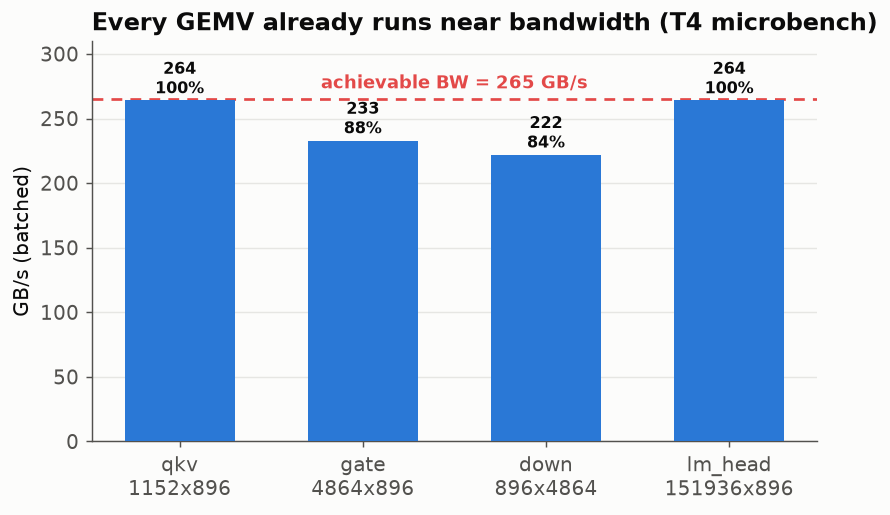

# glcuda Benchmark — ArchGLML X2 (M2 CUDA SIMT)

Real-hardware performance of the GwenLand **glcuda** engine, measured on a
Google Colab **Tesla T4** (sm_75, driver 13.0, 15 GB VRAM), running
**Qwen2.5-0.5B-Instruct Q8_0** end-to-end through `init -> load_model ->
stream`.

All numbers here are measured, not modelled. Graphs are regenerated from the
raw data by `gen_graphs.py`:

```bash
python docs/ArchGLCuda/gen_graphs.py
```

> **Status:** M2 correctness is validated (all kernel-parity and end-to-end
> forward-parity tests pass on the T4). This document tracks the M2.1
> performance work. Decode is **not yet at its ceiling** — see
> [Headroom](#headroom) and [Next](#next-what-moves-the-needle).

---

## Setup

| Variable | Value |
|---|---|
| GPU | NVIDIA Tesla T4 (Turing, sm_75, 40 SMs) |
| Memory | 15 GB GDDR6, 320 GB/s peak bandwidth |
| Driver | 13.0 |
| Model | Qwen2.5-0.5B-Instruct, **Q8_0** quant |
| VRAM reserved | 598 MiB (single backend-buffer allocation) |
| Load time | ~0.76 s (tokenizer 0.10 + stage 0.41 + upload 0.18) |
| Prompt | 29 tokens (ChatML-wrapped) |
| Sampling | temperature 0.7, top-k 40, top-p 0.95, repeat-penalty 1.1 |
| Protocol | 50 runs of 128-token generation, run 1 discarded as warmup |
| Build | `--release` |

Reproduce with `glcuda_t4_validation.ipynb` (§8 runs the model, §9 the
microbenchmark).

---

## Throughput

### Decode: 50-run distribution

Reported as a distribution, not a peak (ArchGLML_X2 §22). Warmed T4, 50 runs of
128-token generation, run 1 discarded as warmup:

| Metric | Decode | Prefill |
|---|---|---|
| **P50 (median)** | **147.1 tok/s** | **221.7 tok/s** |
| P95 | 149.9 | 224.5 |
| P99 | 150.2 | — |
| min | 132.4 | 216.4 |
| max | 150.4 | 230.9 |
| stdev | 5.1 | 2.2 |


Decode is tight (σ 5.1) around **147 tok/s**, except a dip to ~133 across runs
15–21 — a thermal/clock throttle on the shared Colab T4 that recovers on its
own. Prefill is rock-steady (σ 2.2). A cold GPU starts nearer 105–110; always
discard warmup.

### Prefill vs decode


Prefill (~222 tok/s) outpaces decode (~147 tok/s): prompt tokens run with the
weights already warm and skip the per-token host round-trip that decode pays.
Reported separately on purpose — blending them hides the real decode speed.

---

## Headroom

Single-token decode is **memory-bandwidth-bound**: every token streams the full
weight set from VRAM once (~0.5 GB in Q8_0) and does roughly one multiply-add
per weight. So the honest ceiling is not "% of the T4's TFLOPS" — it is **% of
memory bandwidth**.


| Ceiling | tok/s | Basis |
|---|---|---|
| Peak bandwidth | ~640 | 320 GB/s / 0.5 GB per token |
| Achievable (~80%) | ~512 | GDDR6 rarely sustains peak |
| **Measured (P50)** | **147** | steady-state decode |

That puts decode at roughly **29% of achievable bandwidth** — about a **3.5x**
headroom remaining. `nvidia-smi` reports ~22% GPU utilization during decode,
consistent with the GPU being **idle most of the time**: the bottleneck is
latency / serialization, not throughput.

---

## What we learned (and un-learned)

The first optimization attempt targeted **kernel-launch overhead** — decode
issues ~1500 kernel launches per token, ~2/3 of them the per-head attention
loop. Fusing all attention heads into a single kernel
(`gl_attn_decode_f32`) cut that to ~600 launches/token.

**Result: no change to steady-state decode.** That is a genuine negative
result, and it is informative: it rules out per-launch host overhead as the
bottleneck. If launches were the wall, removing 900 of them would have moved
the number. It did not.

The fusion still stands — it is correct, it is a prerequisite for CUDA Graphs,
and it removes real work — but it was not the bottleneck. The lesson: **measure
before optimizing.** The microbenchmark below then disproved the *next* guess
too (GEMV geometry), and pointed at the real answer: inter-kernel
serialization. Two wrong hypotheses, one measurement that settled it.

---

## Bottleneck analysis

Measured with `examples/bench.rs` (notebook §9) on the T4, at Qwen2.5-0.5B
decode sizes. **The result overturned the working hypothesis** — the GEMV
kernels are *not* the problem.

| Kernel | shape | batched | GB/s | % of achievable | stall |
|---|---|---|---|---|---|
| achievable BW | `gl_add` stream | — | **265** | 100% | — |
| gemv qkv | 1152×896 | 15.6 µs | 264 | ~100% | 5.5 µs |
| gemv gate | 4864×896 | 74.7 µs | 233 | 88% | 5.3 µs |
| gemv down | 896×4864 | 78.5 µs | 222 | 84% | 5.4 µs |
| gemv lm_head | 151936×896 | 2062 µs | 264 | ~100% | 0 µs |
| KV writes | 96 copies/tok | — | — | — | 0.36 ms/tok |



**Every matvec already runs at 84–100% of memory bandwidth**, the per-launch
`stall` is ~5 µs (negligible), and the 96 KV-cache copies cost only 0.36
ms/token total. The earlier theories — 1-warp-per-row GEMV starving the SMs,
and synchronous KV copies stalling the host — are **both disproved by the
data.** The kernels are good.

### So why is decode only 29% of bandwidth?

Because the kernels do not **overlap.** Decode issues ~600 kernel launches per
token on a single serial stream: each runs to completion, then the next starts.
Each matvec's input depends on the previous op's output, so there is no overlap
of one kernel's compute with the next kernel's weight fetch, and a small gap
sits between every launch. Per-kernel bandwidth is excellent; the *pipeline* is
serial. `nvidia-smi` at ~22% during decode is the direct symptom — the GPU sits
idle between ops.

Per-token weight stream (why decode is bandwidth-work in the first place):

| Category | streamed/token | share |
|---|---|---|
| 24 transformer layers | 380 MB | 72% |
| LM head (full vocab) | 145 MB | 28% |
| **total** | **525 MB** | 100% |

The LM head alone is 28% of every token and runs at full bandwidth — it is big,
not slow. At 265 GB/s the *back-to-back* ceiling is ~505 tok/s; we get 147
because of the serial gaps, not because any kernel is slow.

---

## Next: what moves the needle

In expected order of payoff:

| Step | Expected | Status |
|---|---|---|
| Fuse attention over all heads | (prerequisite for graphs) | **done** — no direct gain |
| Microbenchmark to locate the wall | (diagnosis) | **done** — it is serialization, not the kernels |
| **CUDA Graphs (M2.2): replay ~600 launches as one** | 147 -> toward ~300–450 | **next — this is the lever** |
| Native q4_0 / q4_k GEMV kernels | smaller stream/token | later |
| KV-cache f16 | 2x less KV traffic | later |

The bench redirected the roadmap: since every kernel already runs near
bandwidth and the loss is inter-kernel serialization, **CUDA Graphs is the
correct next step**, not a GEMV rewrite. Collapsing the per-token launch
sequence into a single graph replay removes the gaps that keep the GPU ~78%
idle. The attention fusion done earlier is a prerequisite (fewer, more uniform
nodes to capture). Target: above 50% of achievable bandwidth (~250+ tok/s),
with 70–90% reachable if capture overhead is low.

---

*Measured on Tesla T4 · Qwen2.5-0.5B Q8_0 · glcuda M2.1 · regenerate graphs
with `gen_graphs.py`.*
