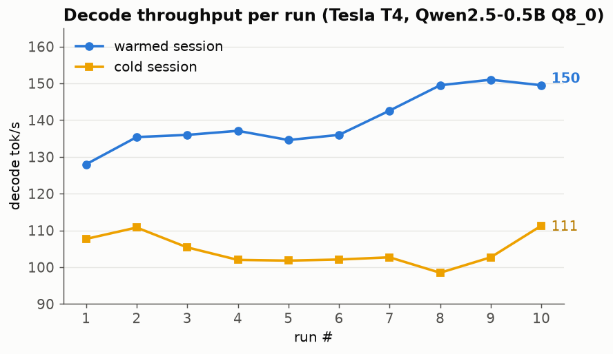
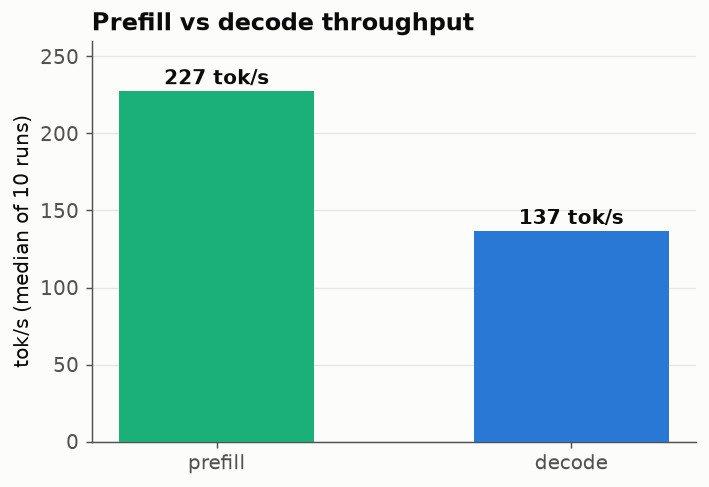
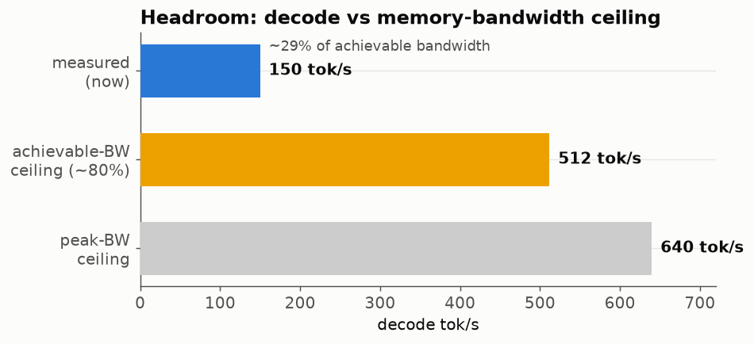

# glcuda Benchmark — ArchGLML X2 (M2 CUDA SIMT)

Real-hardware performance of the GwenLand **glcuda** engine, measured on a
Google Colab **Tesla T4** (sm_75, driver 13.0, 15 GB VRAM), running
**Qwen2.5-0.5B-Instruct Q8_0** end-to-end through `init -> load_model ->
stream`.

All numbers here are measured, not modelled. Graphs are regenerated from the
raw data by `gen_graphs.py`:

```bash
python docs/ArchGLCuda/gen_graphs.py
```

> **Status:** M2 correctness is validated (all kernel-parity and end-to-end
> forward-parity tests pass on the T4). This document tracks the M2.1
> performance work. Decode is **not yet at its ceiling** — see
> [Headroom](#headroom) and [Next](#next-what-moves-the-needle).

---

## Setup

| Variable | Value |
|---|---|
| GPU | NVIDIA Tesla T4 (Turing, sm_75, 40 SMs) |
| Memory | 15 GB GDDR6, 320 GB/s peak bandwidth |
| Driver | 13.0 |
| Model | Qwen2.5-0.5B-Instruct, **Q8_0** quant |
| VRAM reserved | 598 MiB (single backend-buffer allocation) |
| Load time | ~0.76 s (tokenizer 0.10 + stage 0.41 + upload 0.18) |
| Prompt | 29 tokens (ChatML-wrapped) |
| Sampling | temperature 0.7, top-k 40, top-p 0.95, repeat-penalty 1.1 |
| Build | `--release` |

Reproduce with `glcuda_t4_validation.ipynb` (§8 runs the model, §9 the
microbenchmark).

---

## Throughput

### Decode warms up

Decode tok/s is not flat run-to-run — it ramps over the first several runs as
caches and clocks warm, then settles. The two sessions below are the same
binary on the same T4; the "warmed" session had the GPU already hot.



Steady-state decode lands around **150 tok/s**; a cold GPU starts nearer
**105–110 tok/s**. Always discard warmup runs when quoting a number (the
benchmark protocol in ArchGLML_X2 §22 says exactly this).

### Prefill vs decode



Prefill (~227 tok/s) is faster than decode (~150 tok/s) because prompt tokens
are processed with the weights already resident and warm, and prefill does not
pay the per-token host round-trip that decode does. Reported separately on
purpose — blending them hides the real decode speed.

---

## Headroom

Single-token decode is **memory-bandwidth-bound**: every token streams the full
weight set from VRAM once (~0.5 GB in Q8_0) and does roughly one multiply-add
per weight. So the honest ceiling is not "% of the T4's TFLOPS" — it is **% of
memory bandwidth**.



| Ceiling | tok/s | Basis |
|---|---|---|
| Peak bandwidth | ~640 | 320 GB/s / 0.5 GB per token |
| Achievable (~80%) | ~512 | GDDR6 rarely sustains peak |
| **Measured (now)** | **~150** | steady-state decode |

That puts decode at roughly **29% of achievable bandwidth** — about a **3.4x**
headroom remaining. `nvidia-smi` reports ~22% GPU utilization during decode,
consistent with the GPU being **idle most of the time**: the bottleneck is
latency / serialization, not throughput.

---

## What we learned (and un-learned)

The first optimization attempt targeted **kernel-launch overhead** — decode
issues ~1500 kernel launches per token, ~2/3 of them the per-head attention
loop. Fusing all attention heads into a single kernel
(`gl_attn_decode_f32`) cut that to ~600 launches/token.

**Result: no change to steady-state decode.** That is a genuine negative
result, and it is informative: it rules out per-launch host overhead as the
bottleneck. If launches were the wall, removing 900 of them would have moved
the number. It did not.

The fusion still stands — it is correct, it is a prerequisite for CUDA Graphs,
and it removes real work — but it was not the bottleneck. The lesson: **measure
before optimizing.** Hence `examples/bench.rs` and the section below.

---

## Bottleneck analysis

> **Pending T4 measurement** (`examples/bench.rs`, notebook §9). This section
> is filled in from the microbenchmark, not from speculation. The prime
> suspects it tests, in order of likelihood:

1. **GEMV geometry.** The decode matvec kernels launch **one warp (32 threads)
   per output row**. A T4 SM wants ~1024 resident threads to hide memory
   latency; 32 leaves it starved, so each warp stalls on memory with nothing to
   overlap — exactly the "GPU idle 78%" signature. Likely fix: multiple warps
   per row with a block-level reduction.
2. **KV-cache writes.** The runner issues **96 synchronous `cuMemcpyDtoD`
   copies per token** (one per KV head per layer, x2). Synchronous memcpy on the
   default stream blocks the host on each call. Likely fix: a single
   write-into-cache kernel per layer.
3. **Per-op serialization** on the default stream.

The bench reports achievable bandwidth, GEMV throughput (batched vs
per-call-synced — the gap is the stall), and the KV-copy cost, so the fix
targets the measured wall rather than a guessed one.

---

## Next: what moves the needle

In expected order of payoff:

| Step | Expected | Status |
|---|---|---|
| Fuse attention over all heads | (prerequisite) | **done** — no direct gain |
| Microbenchmark to locate the wall | (diagnosis) | **pending T4 run** |
| Fix the measured bottleneck (likely GEMV geometry) | 150 -> ~300+ | next |
| CUDA Graphs (M2.2): one replay per token | -> ~70–90% of BW | later |
| Native q4_0 / q4_k GEMV kernels | smaller stream/token | later |

Above 50% of bandwidth (~256 tok/s) is the near-term target; CUDA Graphs is the
path to 70–90%.

---

*Measured on Tesla T4 · Qwen2.5-0.5B Q8_0 · glcuda M2.1 · regenerate graphs
with `gen_graphs.py`.*
